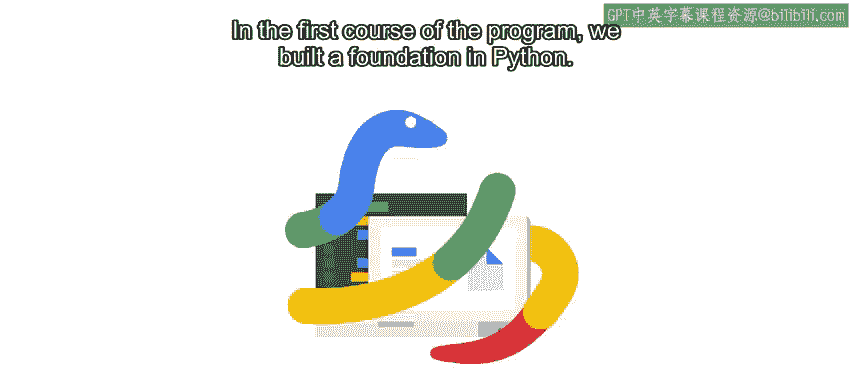

#  075：Python编程入门与环境搭建 🐍

在本节课中，我们将学习如何开始使用Python进行编程，包括设置开发环境、运行Python脚本，并初步了解自动化概念。我们将从基础开始，逐步引导你配置本地环境，为后续的自动化任务打下坚实基础。

---

## 环境配置：安装Python与设置开发工具

上一节我们概述了本课程的目标，本节中我们来看看如何配置Python开发环境。拥有本地Python环境能帮助你理解如何运行程序、安装额外模块，以及如何整合所有工具。

以下是配置环境的几个关键步骤：

*   在计算机上安装Python解释器。
*   学习如何运行Python脚本。
*   探索如何将代码组织到不同的文件中。
*   了解代码编辑器的作用以及如何选择合适的工具。

完成环境配置并熟悉基本操作后，我们将深入探讨一些自动化概念。

---

## 深化自动化理解与实践

在Python入门课程中，我们多次讨论了自动化。我们看过一些自动化示例，并探讨了学习编程带来的各种可能性。在本课程中，我们将在此基础上继续扩展。

我们将学习如何判断某项任务是否适合自动化，以及实施自动化所需的条件。为了在实践中应用这些知识，在整个课程中，你将使用**Quicklas**工具在远程Linux机器上编写Python脚本。

这个工具能让你体验真实场景，模拟你在IT工作中可能遇到的编程问题。如果在学习过程中的任何时刻感到困惑，请不要担心。你可以根据需要多次观看视频以理解概念。此外，你还可以在讨论区提问，这是获取额外信息并与其他学习者联系的最佳方式之一。

---

## 总结与展望

本节课中，我们一起学习了开始Python编程之旅的初始步骤，重点是配置本地开发环境并理解自动化的重要性。我们准备好工具和基础概念，以便在接下来的课程中深入探索更强大的编程工具和自动化解决方案。