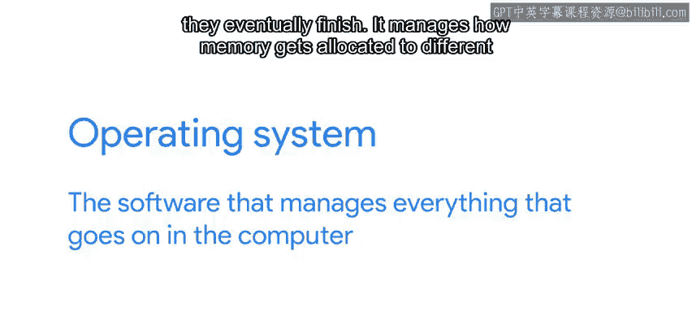
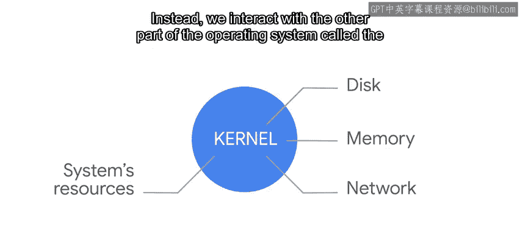
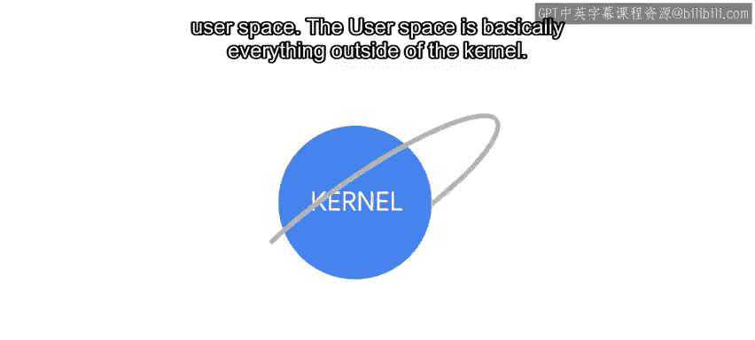
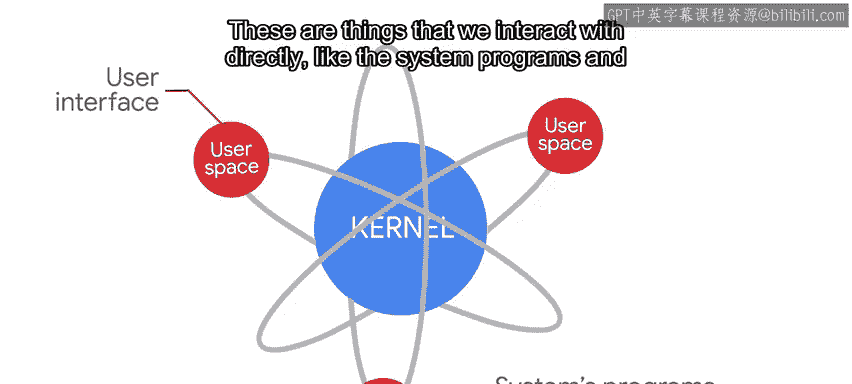
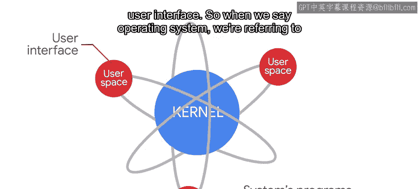
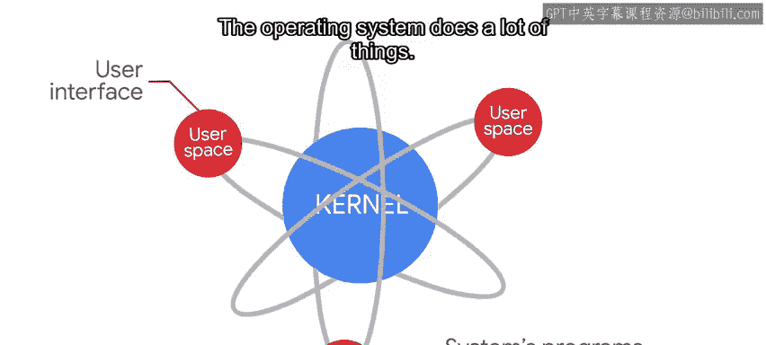
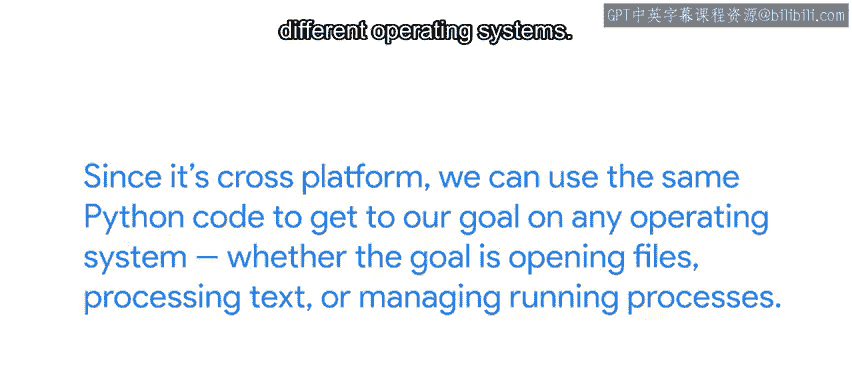

#  076：认识操作系统 🖥️

在本节课中，我们将学习操作系统的基本概念、主要组成部分以及常见的操作系统类型。理解这些基础知识，将帮助我们更好地使用Python与计算机系统进行交互。

## 概述

操作系统是管理计算机所有活动的核心软件。在本节中，我们将介绍操作系统的定义、主要功能以及它的两个核心部分：内核与用户空间。

## 什么是操作系统？

操作系统是一种软件，它管理计算机中发生的一切。它从硬盘驱动器读取、写入和删除文件。

它处理进程如何启动、如何相互交互以及如何最终结束。它管理内存如何分配给不同的进程、网络数据包如何发送和接收，以及每个程序如何访问不同的硬件组件。简而言之，操作系统是总管一切的核心。

## 操作系统的两个主要部分

操作系统实际上包含两个主要部分：内核和用户空间。

### 内核

内核是操作系统的核心。它直接与我们的硬件对话并管理系统资源。

### 用户空间

作为用户，我们不直接与内核交互。相反，我们与操作系统的另一部分——用户空间——进行交互。

用户空间基本上是内核之外的一切。这些是我们直接交互的东西，比如系统程序和用户界面。

因此，当我们说操作系统时，我们指的是内核和用户空间两者。

## 操作系统的功能与我们的焦点

操作系统执行许多任务。它做的事情如此之多，以至于我们需要很多课程才能涵盖所有内容。但对于本课程，我们将专注于管理文件和进程。

在我们计算机上运行的操作系统中，我们编写的脚本都将在用户空间中运行。不过，在某些情况下，我们的脚本可能会与操作系统的内核交互，以获取额外信息或要求它执行某些操作。

## 常见的操作系统类型

你可能已经知道，市面上有许多不同的操作系统。当今IT领域使用的主要操作系统是Windows、macOS和Linux。

*   **Windows**：由微软开发，广泛应用于商业和消费领域。大多数个人电脑都预装Windows作为默认操作系统。
*   **macOS**：由苹果公司开发，主要用于消费领域。如果你购买任何苹果电脑，它都会预装macOS。
*   **Linux**：是一个开源操作系统。开源软件可以自由分享、修改和分发。Linux被大量用于商业基础设施。当今世界上大多数服务器都运行Linux。它也可用于消费领域，尽管不那么常见。

Linux本身实际上是林纳斯·托瓦兹最初开发的内核的名称。由于操作系统其余部分的演变，我们通常用Linux来指代内核和整个操作系统。如今，Linux已经发展成为一个巨大的社区努力，世界各地的开发者为它的成功做出了贡献。

因为Linux是开源的，许多不同的组织打包了他们自己的版本。这与仅由各自公司开发的Windows或macOS不同。我们将这些不同风格的Linux称为发行版。

一些常见的Linux发行版有Ubuntu、Debian和Red Hat。如果你听说过Chrome OS，你可能知道它是另一个基于Linux内核的操作系统，但与其他发行版不同，Chrome OS通常被视为一个独立的操作系统。最后，在智能手机上广泛使用的Android操作系统也运行Linux内核。

## Unix与Linux的关系

你可能也听说过Unix。Unix是贝尔实验室在70年代开发的一个操作系统。在其最初发布之后，该操作系统经历了许多不同的版本，不同的公司发布了它的变体。

当今Linux工作原理的基本思想是基于Unix原则。我们用来与操作系统交互的许多工具都是最初为Unix开发的工具的开源版本。这就是为什么这些工具和操作原则通常被称为Unix，即使我们使用的操作系统叫做Linux。所以，林纳斯基于Unix创造了Linux，这基本上是一个编程绕口令。

macOS内核及其部分用户空间也基于Unix家族中称为BSD的内核和用户空间工具。因此，尽管两者的图形界面差异极大，但命令行实际上非常相似。

## Python的跨平台优势

就像我们之前在本课程中提到的，我们将使用Python与操作系统交互。Python是一种跨平台语言，你可以在Windows、macOS、Linux甚至像FreeBSD这样不太知名的Unix变体上使用它。它甚至在手机上也可用。

由于它是跨平台的，我们可以使用相同的Python代码在任何操作系统上实现我们的目标，无论是打开文件、处理文本还是管理运行中的进程。这使得Python成为需要与不同操作系统交互的IT专家的绝佳工具。你可以将从一个平台学到的技能应用到所有其他平台上。这非常有用。

## 本课程的操作系统选择

正如我们之前指出的，在本课程的练习中，我们将使用Linux计算机进行实践。我们选择Linux是因为在远程管理和通过自动化管理的服务器方面，它是行业标准。在相关的时候，我们也会讨论相同的概念如何适用于Windows或macOS。

## 个人经验分享

在我作为系统管理员的工作中，我主要使用Linux操作系统。我从小使用Windows电脑，并通过图形界面与它们交互。我第一次使用Linux是在我十几岁的时候，当时我的个人电脑崩溃了，无法启动到用户环境。我有很多不同的文件和文档，我不想放弃。于是我做了一些研究，在朋友的电脑上，我将一个名为Slax的便携式Linux操作系统刻录到一张CD上。我用它启动了我的电脑，并成功抢救了大部分文件。

学习Linux为我打开了一个定制和配置的全新世界。当我刚开始时，我发现它非常有趣、迷人，甚至有点吓人。今天，Linux是我每天工作的主要操作系统。

## 总结

本节课我们一起学习了操作系统的基础知识。我们了解了操作系统的定义、内核与用户空间的区分，以及Windows、macOS和Linux等主流操作系统的特点。我们还探讨了Unix与Linux的历史渊源，并理解了Python作为跨平台工具在与不同操作系统交互时的巨大优势。最后，我们明确了本课程将主要使用Linux进行实践。如果你觉得这些不同的名字让你感到困惑，请不要担心，随着课程的深入，你会逐渐掌握它们。

现在我们已经对“操作系统”一词达成了共识，在下一个视频中，我们将准备好我们的计算机，开始使用Python。