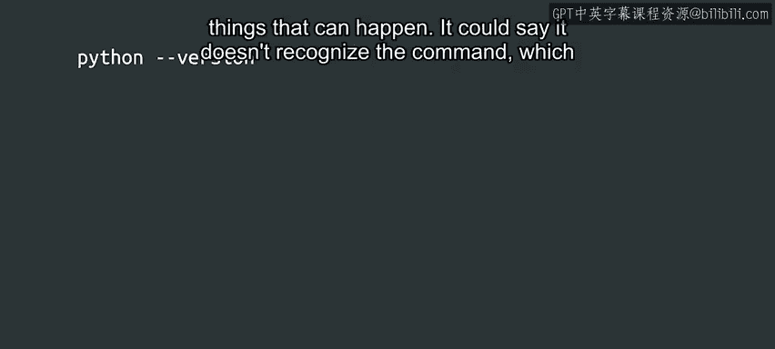
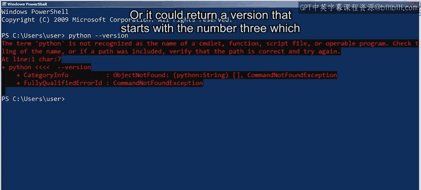
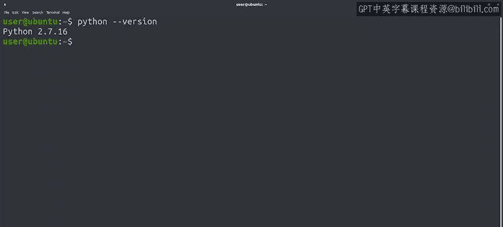
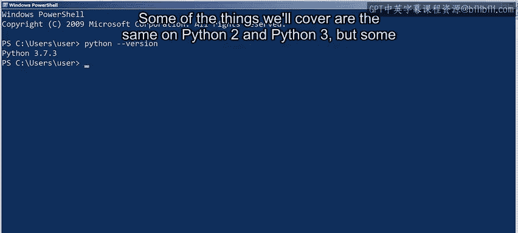
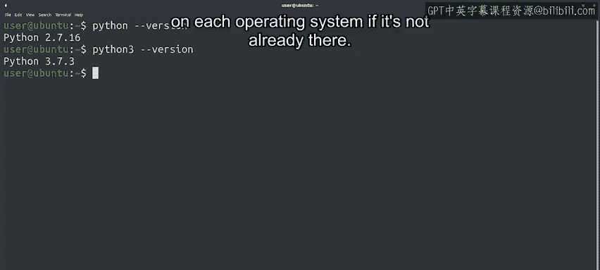

#  077：为Python准备计算机 🖥️


在本节课中，我们将学习如何在本地计算机上准备Python编程环境。这包括检查Python是否已安装、安装Python 3（如果尚未安装），以及了解如何管理Python的外部模块。作为IT专家，掌握在不同操作系统中安装和管理软件是一项重要技能。

---

## 实践是最好的学习方法

人们常说，学习的最佳方法是不断练习。因此，我们鼓励你通过在自己的计算机上运行脚本来完成本课程的练习。这样做能帮助你尽可能磨练编程技能，并可能激发你通过编程实现新事物的想法。

## 检查Python是否已安装

正如上一节视频所说，Python可以在所有主流操作系统上运行。无论你使用的是Windows、Mac OS还是Linux，都应该能在本地计算机上运行Python。它甚至可能已经安装在你的系统中。

要检查计算机上是否已安装Python，请打开终端或命令提示符，并执行以下命令，将`--version`作为参数传递：

```bash
python --version
```



根据计算机上已安装的内容，可能会出现几种不同的情况。



*   它可能提示无法识别该命令，这意味着你没有安装Python。
*   它可能返回一个以数字2开头的版本号，这表示你安装的是Python 2。
*   它可能返回一个以数字3开头的版本号，这意味着你安装的是Python 3。

## 确保使用Python 3





在本课程中，我们将使用Python 3。我们涵盖的某些内容在Python 2和Python 3上是相同的，但有些可能截然不同。因此，请确保你安装了Python 3。

如果运行`python --version`返回以2开头的版本，请尝试运行`python3 --version`。你的计算机可能会提示该命令不存在，这意味着你需要安装Python 3。或者，如果返回以数字3开头的版本，则表示你已经安装了Python 3。

在接下来的几个视频中，我们将讨论如何在每个操作系统上安装和设置Python（如果尚未安装的话）。



## 了解Python模块

在确认安装了Python 3之后，我们还将学习安装不属于Python标准库的额外模块。本课程中的一些特定练习将需要这些额外模块。

那么，我们所说的这些额外模块是什么呢？在Python入门课程中，我们讨论过Python标准库。它作为Python安装的一部分，包含了用Python可以完成的最常见任务的模块。

但是，你的脚本中可能想做很多事情，而并非所有功能都在标准库中。这时就需要外部模块了。我们可以使用外部模块来完成一系列任务，例如生成PDF、提供网页服务、创建压缩文件、处理电子邮件以及许多其他事情。

## 如何查找可用模块

当开发者编写了一个他们认为可能对他人有用的Python模块时，他们会将其发布到PyPI，也称为Python包索引。我们可以浏览这个Python模块仓库来找到所需的模块。它包含了成千上万个项目，并按主题、开发状态和目标受众等不同类别进行分类。

这些外部模块通常使用一个名为`pip`的命令行工具进行管理。这是一个跨平台工具，因此你可以使用它在计算机运行的任何操作系统上安装、更新和删除外部模块。

## 后续内容预告

接下来，我们将讨论如何在Windows、Mac OS和Linux上安装主要的Python包以及外部模块。这些视频都是可选的。你可以观看与你最相关的部分，或者，如果你的计算机上已经安装了Python并且已经知道如何安装外部模块，可以随时跳过。

---

**本节课总结**

在本节课中，我们一起学习了为Python编程准备本地环境的关键步骤。我们了解了检查Python安装状态的方法，明确了本课程需要使用Python 3，并认识了Python标准库与外部模块的区别。我们还介绍了用于管理外部模块的工具`pip`以及查找模块的资源PyPI。掌握这些基础知识，将为你后续的编程实践铺平道路。