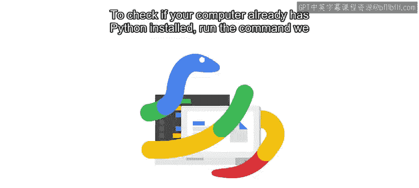
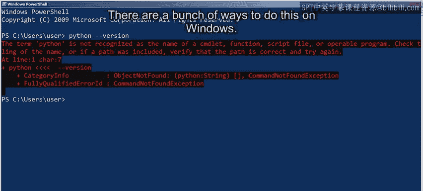
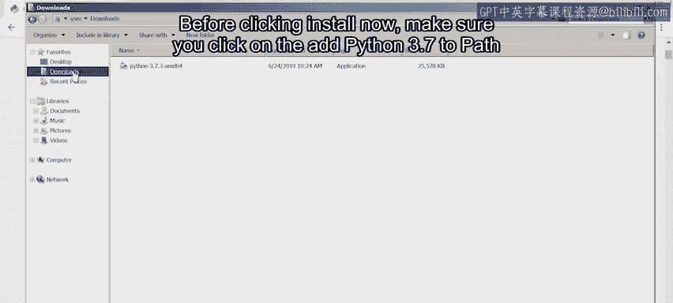
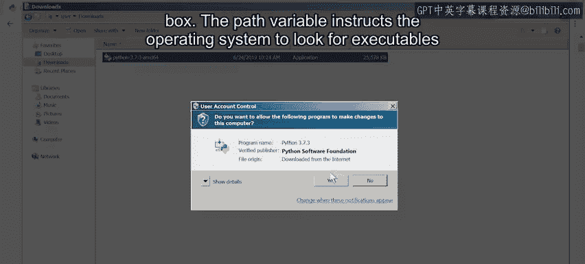
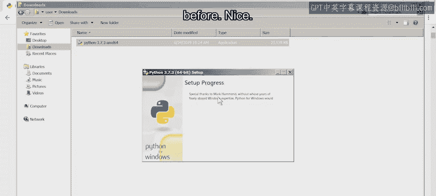
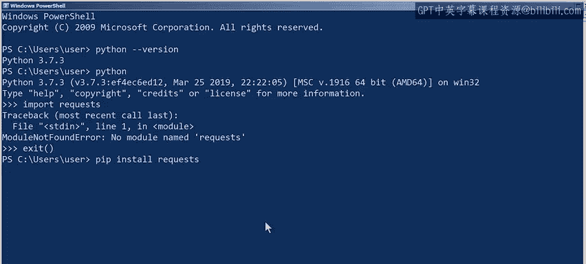

#  078：在 Windows 上配置 Python 环境 🛠️



在本节课中，我们将学习如何在 Windows 操作系统上安装和配置 Python 环境，并安装一个常用的外部模块。这是开始使用 Python 进行自动化工作的第一步。

## 检查 Python 是否已安装

Windows 计算机通常不会预装 Python。




要检查您的计算机是否已安装 Python，请运行我们之前讨论过的命令：

```bash
python --version
```

如果命令未返回 Python 版本信息，则说明 Python 未安装在这台计算机上，我们需要安装它。

## 选择安装方法

在 Windows 上有多种安装 Python 的方法。我们可以从官方网站下载可安装包进行安装；如果使用 Windows 10，也可以从应用商店获取；或者使用名为 Chocolatey 的包管理系统来管理安装。

在本视频中，我们将直接从官方网站安装软件包。但如果您想尝试 Chocolatey，可以自行查看并下载。

## 下载官方安装程序

要找到安装程序，请访问 Python 的官方 Windows 下载页面。

在该页面上，我们可以下载适用于 64 位架构的 Python 3.6.4 可执行安装程序。如今大多数计算机都安装的是 64 位系统。如果您不确定选择哪个，就选择 64 位版本。除非您确定您的计算机运行的是 32 位系统。

## 运行安装程序

可执行安装程序下载完成后，我们需要运行它。这将在我们的机器上安装新软件，因此我们需要以管理员身份运行它。

在点击“立即安装”之前，请确保勾选“Add Python 3.7 to PATH”复选框。



PATH 变量指示操作系统在从终端运行命令时，在系统的特定目录中查找可执行文件。您需要选中该框，以便当我们从命令行调用 Python 时，能够执行 Python 解释器。



安装过程可能需要一些时间。

## 验证安装

安装完成后，我们可以测试它是否成功。

我们通过打开一个新的 PowerShell 窗口并执行与之前相同的命令来验证：



```bash
python --version
```

很好，我们现在有了一个可执行的 Python 解释器，可以用来测试我们编写的脚本。

## 安装外部模块

正如我们所指出的，仅仅安装了 Python 3，并不意味着我们拥有所有可能脚本所需的模块。

假设我们的任务是编写一些从网站提取信息的自动化脚本。为了在 Python 中获取网站内容，我们可以选择用于与 Web 服务交互的 `requests` 模块。

首先，让我们检查是否已经拥有这个模块。在 Python 解释器中尝试导入：

```python
import requests
```

如果解释器提示模块不可用，我们需要使用 PIP 安装它。为此，我们从命令行（而不是解释器）调用：

```bash
pip install requests
```



现在我们已经安装了该模块。让我们再次从解释器中尝试导入它：

```python
import requests
```

成功了。为了再次确认，让我们尝试用这个模块做点什么。例如，我们可以使用 `get` 函数来获取网站的内容：

```python
response = requests.get('https://www.example.com')
```

`get` 函数处理了网站，现在 `response` 对象包含了其内容。我们可以用它做很多事情。例如，使用 `len` 函数检查响应文本的长度：

```python
len(response.text)
```

## 总结

本节课中，我们一起学习了如何在 Windows 环境中设置 Python。我们完成了从检查安装、下载官方安装程序、运行安装并配置 PATH，到使用 PIP 安装外部模块（如 `requests`）的完整流程。现在，您的 Windows 环境已经准备好运行 Python 脚本了。请自由探索并尝试一些操作。

接下来，我将向您展示如何在 Mac OS 上安装 Python。您可以选择观看，也可以跳过，这取决于您。