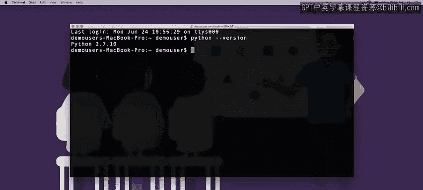
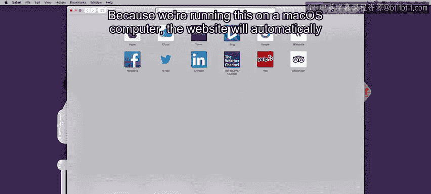
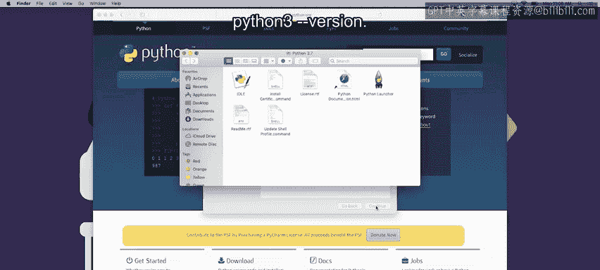
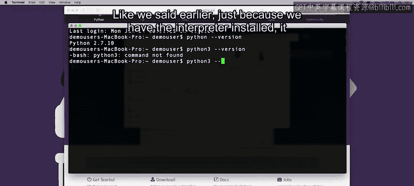
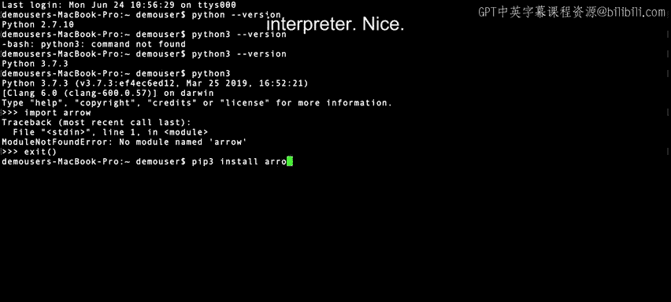

#  079：在macOS上配置Python环境（可选） 🍎

在本节课中，我们将学习如何在macOS操作系统上配置Python 3开发环境。我们将从检查系统自带的Python版本开始，逐步完成Python 3的安装、验证以及第三方模块的管理。

---

默认情况下，macOS系统预装了一个Python版本，但它是Python 2，而不是Python 3。

让我们来验证这一点。虽然这台电脑上安装了Python，但它只是Python 2。

我想知道我们是否将Python 3作为另一个不同的命令安装了。让我们检查一下。

所以，这台电脑没有预装Python 3。让我们来安装它。

在macOS上安装Python有两种方法。我们可以从官方网站下载可安装的软件包进行安装，或者使用一个名为Homebrew的包管理系统来管理安装。

在本视频中，我们将从官方网站安装软件包，但你可以自行了解Homebrew。

要在macOS上安装Python，请访问Python官方网站 python.org。

现在我们将点击“Downloads”菜单。因为我们在macOS电脑上运行，网站会自动为我们提供macOS版Python 3的安装链接。

我们正在下载macOS版的Python 3可执行安装程序。下载完成后，我们将执行它，浏览许可协议和使用条款页面，最后完成安装。

根据你的机器设置，你可能需要输入密码以使用管理员权限执行实际安装。

很好，现在我们有了一个可执行的Python 3解释器，可以用来测试我们将要编写的脚本。

让我们执行与之前相同的命令来检查它是否正常工作：`python3 --version`。

太好了，现在我们已经安装了Python 3。正如我们之前所说，仅仅安装了解释器并不意味着我们拥有执行所有可能脚本所需的所有模块。

假设我们需要编写一个用于处理事件安排的自动化脚本。为此，我们需要管理许多不同的日期和截止日期操作，例如计算两周后的日期。为了让所有这些日期操作变得更简单，我们可以使用arrow模块，它使得处理各种日期变得容易。

首先，让我们检查是否已经拥有这个可用的模块。解释器提示没有可用的arrow模块。为了获取该模块，我们将使用`pip3`命令来安装。

请注意，在Windows上该命令叫`pip`，而在macOS上它叫`pip3`。因此，要从命令行（而不是解释器）安装arrow模块，我们将调用`pip3 install arrow`。

现在我们已经安装了该模块，让我们再次尝试从解释器中导入它。很好，看起来成功了。为了检查我们能否使用它，让我们尝试用这个模块做点什么。

我们如何使用模块中的`get`函数从字符串创建日期对象呢？很好，arrow按照我们指定的格式从字符串中解析出了一个日期。现在，这个日期对象包含了那个日期。我们可以对这个对象进行操作。例如，我们可以要求使用`shift`方法将其增加六周，然后使用`format`方法打印它。

我们刚刚使用的`format`方法可以接收许多参数。这些参数让我们能够直观地格式化要打印的字符串。

我们的macOS环境已经准备就绪。现在，我们可以使用Python并开始用它做一些有趣的事情了。你可以自由探索，尝试其他一些操作。

接下来，我将向你展示如何在Linux上安装Python。你可以查看那一部分，或者直接跳过，这取决于你。

---

## 总结

本节课中，我们一起学习了在macOS上配置Python 3环境的完整流程。我们从检查系统自带的Python 2开始，然后通过官方网站下载并安装了Python 3。接着，我们验证了安装，并学习了如何使用`pip3`来安装和管理第三方Python模块（以arrow模块为例）。最后，我们通过一个简单的日期操作示例，实践了新安装模块的使用。现在，你的macOS环境已经准备好用于Python自动化脚本开发了。