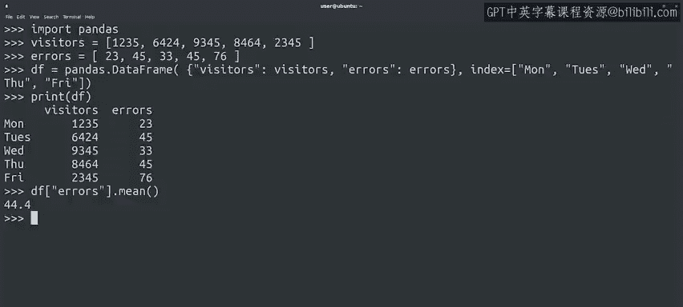

#  080：在 Linux 上配置 Python 环境（可选） 🐧


## 概述

在本节课中，我们将学习如何在 Linux 操作系统上检查和配置 Python 3 环境。课程内容包括验证 Python 安装、安装缺失的模块，以及使用系统包管理器和 `pip` 两种方式来管理 Python 包。掌握这些技能是使用 Python 进行自动化工作的基础。

---


## 检查 Python 安装情况

如果你的计算机运行 Linux 系统，那么你的发行版极有可能已经预装了 Python。

你可以通过打开终端并运行以下命令来验证这一点：

```bash
python --version
```

运行后，你可能会发现系统安装的是 Python 2。这是一个旧版本的 Python，而我们需要使用 Python 3。

接下来，让我们检查系统是否安装了 Python 3：

```bash
python3 --version
```

在某些 Linux 发行版中，`python` 命令可能已经指向 Python 3。但在其他发行版（例如演示中使用的这个）中，你可能需要使用 `python3` 命令来访问 Python 3。

本系列所有课程都将使用 Python 3，因此请确保你为你的发行版运行了正确的命令。

---

## 安装 Python 3

如果由于某些原因，你的 Linux 系统没有安装 Python 3，你需要使用包管理系统来安装它。

用于管理本地软件包的工具名称取决于你使用的发行版：
*   在 Debian、Ubuntu 和 Linux Mint 上，它叫做 `apt`。
*   在 Red Hat 或 CentOS 上，它叫做 `yum`。
*   在 Fedora 上，它叫做 `dnf`。

如果你不确定你的发行版使用什么命令，最好做一些研究来找出答案。我们在下一份阅读材料中提供了更多信息的指引。

---

## 安装 Python 模块

即使我们的计算机已经安装了 Python 3，我们可能仍然没有执行所有脚本所需的全部模块。因此，我们仍然需要学习如何将这些模块添加到系统中，以充分利用我们的 Python 安装。

在本示例中，我们将使用一台 Ubuntu 计算机和 `apt` 工具来安装 Python 包。我们将讨论两种不同的安装包方式：第一种是通过系统包管理器，第二种是通过 `pip`。

### 方法一：使用系统包管理器

正如之前所说，Linux 发行版通常都有一个包管理系统，使用它来在计算机上安装额外的软件是一个好主意。

发行版通常为不同的可用 Python 模块提供单独的软件包。

假设我们的任务是编写一些自动化软件，用于将图像调整到特定尺寸。我们可以通过使用 Python 图像库（即 `PIL` 模块）来实现这一点。该库包含了大量图像处理功能。

要在你的 Ubuntu 计算机上安装此模块，我们可以使用 `apt` 工具来安装 `python3-pil` 包：

```bash
sudo apt install python3-pil
```

使用包管理系统安装软件包的一个优点是，我们可以设置系统自动升级到新版本。包管理系统确保任何依赖项也被安装，从而使模块可以立即使用。

让我们测试一下刚刚安装的模块。`PIL` 模块非常庞大，因为它包含了许多我们可以对图像进行的操作。

对于这个例子，我们想打开一张图片并检查其尺寸和格式。我们从 `PIL` 模块中导入了 `Image` 子模块。

现在，让我们使用 `open` 方法打开家目录中的一个文件：

```python
from PIL import Image
img = Image.open('example.jpg')
```

很好，我们已经打开了图像。现在我们可以检查它的尺寸和格式属性：

```python
print(img.size)
print(img.format)
```

模块运行正常。

### 方法二：使用 PIP 安装模块

在这种情况下，我们想要的模块是由包管理系统提供的，因此使用 `apt` 安装很容易。但在其他情况下，我们可能希望安装比发行版中提供的版本更新的模块，或者发行版中根本没有的模块。

对于这类情况，我们可以使用与 Windows 和 macOS 相同的命令：`pip` 命令。

对于这个场景，我们首先需要确保安装了 Python 3 版本的 `pip`，它被称为 `pip3`，由 `python3-pip` 包提供。我们将通过包管理系统安装这个包：

```bash
sudo apt install python3-pip
```

安装 `pip3` 后，我们就可以使用各种各样的外部模块来解决问题了。

例如，想象一下你的任务是创建一个自动化程序，用于处理我们 Web 服务的错误日志，然后生成关于错误数量或错误最常发生时间的统计数据。要进行这种数据处理，我们可以使用我们听起来最可爱的模块之一：`pandas`，它在数据分析领域被广泛使用。

让我们使用 `pip3` 安装 `pandas` 模块：

```bash
pip3 install pandas
```

现在我们已经安装了 `pandas` 模块，让我们用一些示例数字来试试看。

首先，导入模块。显然，由于这是一个数据分析工具，我们需要一些数据来使用它。

让我们从与网站相关的数据中生成几个示例列表。例如，一个过去五天访问者数量的列表：

```python
visitors = [1235, 6420, 8570, 5390, 2050]
```

让我们再添加一个列表，包含同五天内生成的错误数量：

```python
errors = [23, 45, 33, 45, 76]
```

现在我们有了这两个列表，可以用它们来生成一个 `DataFrame`，这是 `pandas` 模块用于数据分析的主要数据结构。

我们将使用列表生成 `DataFrame`，并添加星期几作为索引：

```python
import pandas as pd
df = pd.DataFrame({'visitors': visitors, 'errors': errors}, index=['Mon', 'Tue', 'Wed', 'Thu', 'Fri'])
```

这样，我们就有了一个可以用于操作的 `DataFrame`。例如，我们可以以一种格式美观的方式打印它：

```python
print(df)
```

打印东西总是很有趣，但这并不是真正的数据分析。`pandas` 模块允许我们对每列的数字进行操作。例如，我们可以使用 `mean` 方法计算其中一列的平均值：

```python
print(df['errors'].mean())
```

---

## 总结

在本节课中，我们一起学习了如何在 Linux 系统上配置 Python 环境。我们首先检查了 Python 2 和 Python 3 的安装情况，并强调了使用 Python 3 的重要性。接着，我们探讨了两种安装和管理 Python 模块的方法：通过发行版自带的包管理系统（如 `apt`、`yum`）和通过 Python 专属的包管理工具 `pip`（具体是 `pip3`）。我们通过安装 `PIL` 模块处理图像和安装 `pandas` 模块进行数据分析两个实例，演示了这两种方法的具体操作。掌握这些技能将帮助你为后续的 Python 自动化编程准备好所需的环境和工具。



---

你已经准备好用它来玩点有趣的东西了吗？在下一个视频中，我们将讨论解释型语言和编译型语言，期待与你相见。