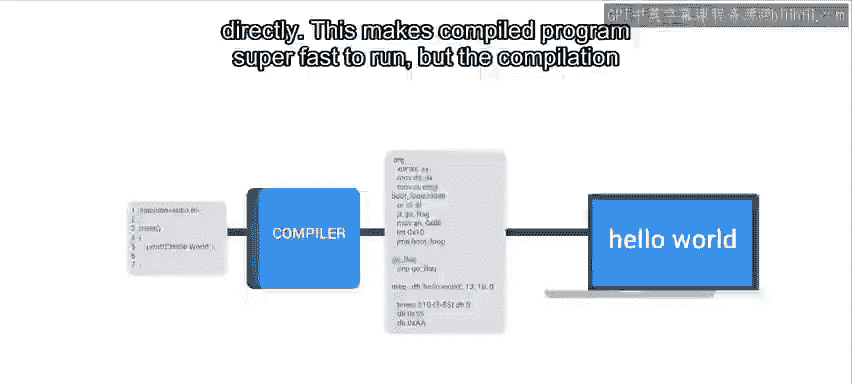
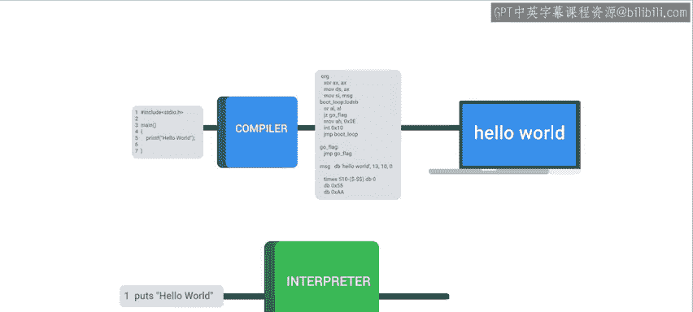
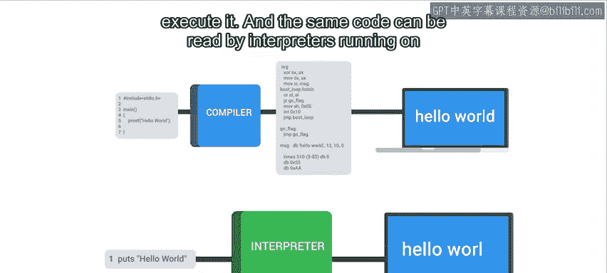
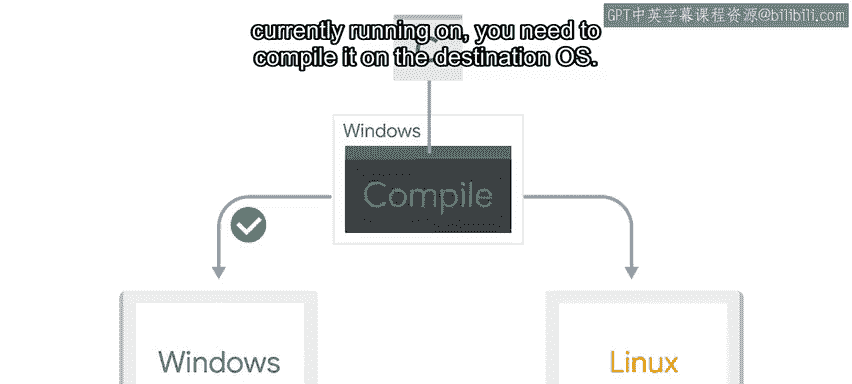
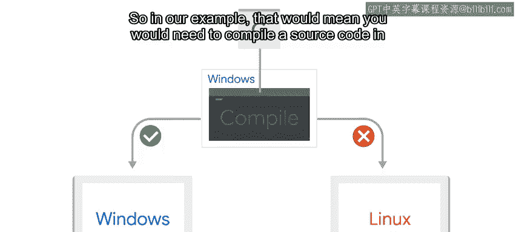
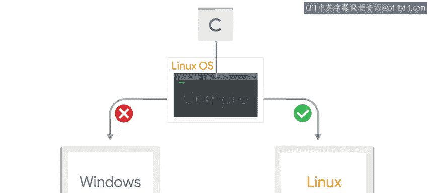
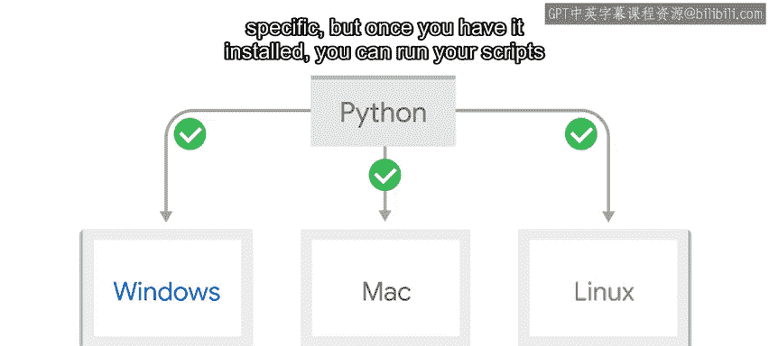
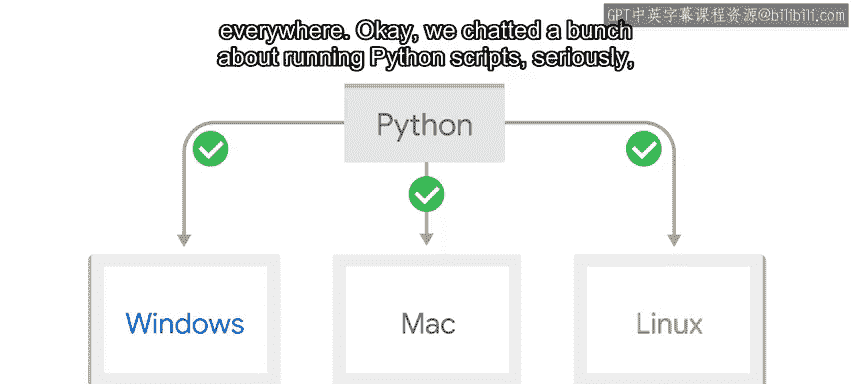
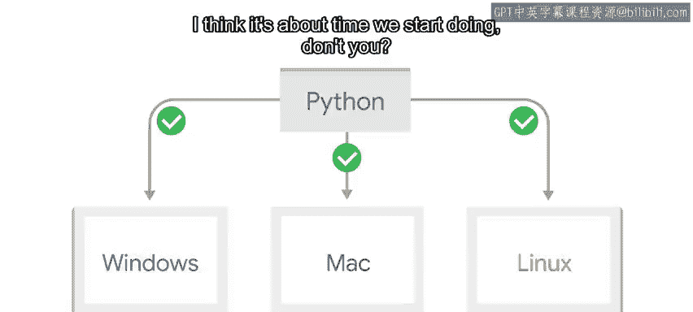

#  081：解释型与编译型语言 🧠

在本节课中，我们将要学习编程语言的两大主要类别：解释型语言与编译型语言。理解它们的区别，能帮助我们明白为何Python脚本能在不同操作系统间轻松运行，以及不同语言在开发效率和执行速度上的权衡。

---

我们之前提到过，可以在Windows电脑上用Python编写脚本，然后在Linux电脑上运行同一个脚本，反之亦然。对于许多其他解释型语言编写的脚本，情况也是如此。

你可能会问，什么是解释型语言？要理解它，我们需要先看看传统的编程语言（如C语言）是如何工作的。

## 编译型语言的工作原理 ⚙️

当你想要运行一个用C这类传统编程语言编写的程序时，源代码会被输入到一个叫做**编译器**的软件中。

编译器将此代码翻译成**机器语言**。这意味着生成的语言是针对其运行的计算机底层架构（如特定的CPU指令集）而特定的。

**公式表示：**
`源代码` -> **编译器** -> `机器码（特定于平台）`

计算机可以直接读取和执行机器码。这使得编译后的程序运行速度**极快**，但编译过程本身可能需要一些时间。

以下是一些常用的编译型编程语言示例：
*   C
*   C++
*   Go
*   Rust

## 解释型语言的工作原理 🐍

与编译型语言相反，用解释型语言编写的程序通常依赖于一个叫做**解释器**的中间程序。

这些程序使用解释器来执行代码中指定的指令，而不是先通过编译器进行编译。

**公式表示：**
`源代码` -> **解释器（逐行读取并执行）** -> `运行结果`

这使得用解释型语言编写的程序开发周期**更快**，因为开发者无需等待代码编译完成即可执行它。

并且，相同的代码可以被运行在不同操作系统上的解释器读取，而无需进行任何额外修改。

其代价是，解释型语言的运行速度通常**慢于**编译型语言。

以下是一些解释型编程语言的示例：
*   Python
*   Ruby
*   JavaScript
*   Bash
*   PowerShell

## 混合型方法：两全其美？ 🔄

上一节我们介绍了纯粹的解释和编译，本节中我们来看看一种折中的方法。Java和C#是采用混合方法的语言。

代码需要先被编译，但它被编译成**中间代码**。这意味着它不是被编译成针对当前操作系统的特定机器语言，而是被编译成可以在不同平台上执行的**可移植代码**。

我们使用一个特定于操作系统的程序来执行这段中间代码：对于Java是**Java虚拟机**，对于C#是**公共语言运行时**。

**流程表示：**
`源代码` -> **编译器** -> `中间码（如Java字节码）` -> **平台特定运行时（如JVM）** -> `运行结果`

## 跨平台运行的实践意义 💻

让我们通过一个例子来理解这些概念的实际影响。假设你有一个用C语言编写的程序，并且你在Windows上运行它。

但你想在Linux服务器上运行这个程序。要在与你当前运行环境不同的操作系统上运行该程序，你需要在**目标操作系统**上重新编译它。

在我们的例子中，这意味着你需要在Linux操作系统上编译源代码，最好是在与目标服务器安装了相同版本库的Linux系统上进行编译。

相反，如果你用Python编写程序源代码，情况就不同了。无论你是在Windows、macOS还是Linux上运行，你都可以在本地编写和测试程序，然后直接将脚本复制到服务器上，无需修改即可使用。

这是因为Python解释器本身是一个针对特定平台编译的可执行文件。但一旦你安装了它，就可以在任何地方运行你的脚本。

---

本节课中我们一起学习了编程语言的两种主要类型。**编译型语言**（如C）通过编译器生成高效的机器码，运行速度快，但依赖特定平台。**解释型语言**（如Python）通过解释器逐行执行，跨平台性好，开发周期快，但运行速度相对较慢。此外，我们还了解了像Java这样的**混合型语言**，它结合了编译和解释的特点。

好了，我们已经讨论了很多关于运行Python脚本的内容。是时候开始动手实践了！请继续观看下一个视频，我将带你一步步创建并运行一个Python脚本。😊