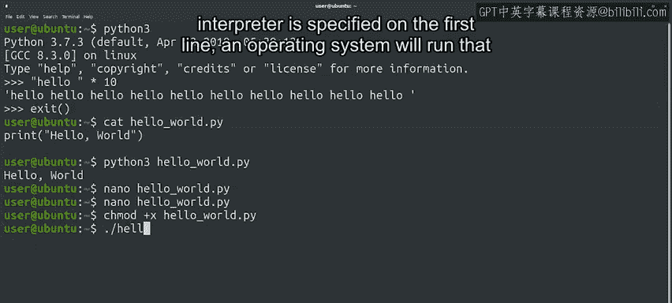
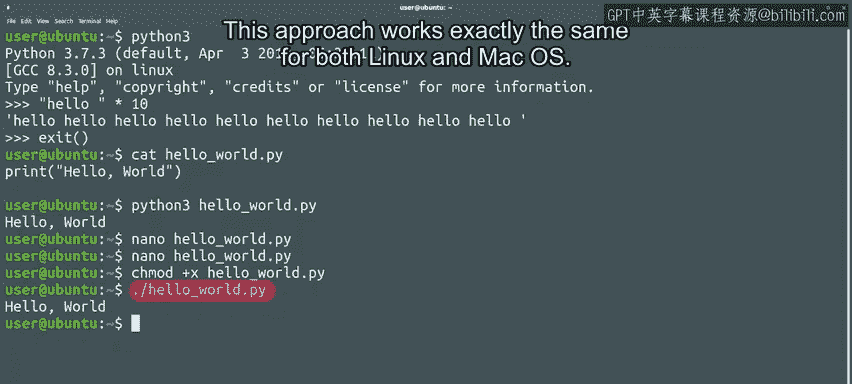

#  082：如何运行Python脚本 🚀


在本节课中，我们将学习如何运行Python脚本。我们将介绍几种不同的运行方式，并重点讲解如何在命令行中执行Python脚本。通过本课，你将掌握如何创建和运行可执行的Python脚本。

---

## 概述

Python脚本可以通过多种方式运行。本课程将重点介绍在基于Linux的环境中从命令行运行脚本的方法。虽然我们使用Ubuntu作为示例，但这些技巧稍作调整后也适用于Windows或Mac OS。

---

## 运行Python交互式解释器

当我们运行`python3`命令时，会启动一个交互式解释器。该解释器会显示Python版本信息、编译器详情以及一些使用建议。

在交互式解释器中，我们可以执行所有在Python入门课程中学到的操作。例如，打印“hello”10次：

```python
print("hello" * 10)
```

这种方式适合实验和尝试新概念，但代码在关闭解释器后不会被保存。

---

## 创建和运行Python脚本文件

为了使代码持久化，我们可以将其存储在文件中。Python脚本通常以`.py`扩展名结尾，例如`hello_world.py`。

在Linux系统中，可以使用`cat`命令查看文件内容：

```bash
cat hello_world.py
```

要运行保存在Windows系统中的Python脚本，只需键入脚本名称，操作系统会根据文件扩展名识别为Python可执行文件。

在Linux和MacOS上，可以通过调用Python解释器后跟文件名来执行脚本：

```bash
python3 hello_world.py
```

这里，`python3`命令会读取`hello_world.py`的内容，并指示计算机执行文件中的指令。

---

## 使用Shebang行简化脚本执行

每次运行脚本时都输入`python3`可能会很繁琐。我们可以通过在文件开头添加一行特殊的注释（称为Shebang行）来避免这种情况。Shebang行告诉操作系统使用哪个命令来执行该脚本。

以下是添加Shebang行的步骤：

首先，在编辑器中打开文件。在Linux系统中，可以使用`nano`编辑器：

```bash
nano hello_world.py
```

然后，在文件开头添加以下魔法行：

```python
#!/usr/bin/env python3
```

这行代码告诉操作系统我们希望使用`python3`来运行脚本。

保存并退出编辑器（在nano中按`Ctrl+X`，然后确认保存并接受原文件名）。

现在，系统知道应该使用Python解释器执行该文件。

---

## 使脚本文件可执行

为了能够直接运行脚本而无需每次调用解释器，我们需要使用`chmod`命令使文件可执行。该命令允许我们更改文件权限。



文件的可能权限包括读、写和执行。为了直接运行文件，我们需要使其可执行：

```bash
chmod +x hello_world.py
```

将脚本标记为可执行后，我们现在可以通过在脚本前加上`./`来运行它：

```bash
./hello_world.py
```

因为脚本已被标记为可执行，并且解释器的路径已在第一行指定，操作系统将运行该解释器并将脚本名称传递给它。这意味着运行`./hello_world.py`等同于运行`python3 hello_world.py`。这种方法在Linux和Mac OS上完全相同。



---

## 为什么需要`./`前缀？

你可能会好奇为什么我们需要在脚本前加上`./`，而不是直接写脚本名称。原因是脚本不在`PATH`变量列出的任何目录中。`PATH`变量告诉操作系统在哪里查找要执行的程序。

`./`表达式中的点代表当前目录，因此我们基本上是告诉操作系统在当前目录中找到脚本并执行它。

---

## 总结

本节课中，我们一起学习了如何运行Python脚本。我们介绍了从交互式解释器执行代码、创建和运行脚本文件、使用Shebang行简化执行过程，以及使脚本文件可执行的方法。掌握这些基础技能对于后续的Python编程至关重要。

现在，你可以尝试在自己的机器上练习运行脚本。如果有任何不清楚的地方，建议回顾本视频并多次练习。接下来，我们将进入更令人兴奋的内容：创建自己的Python模块。