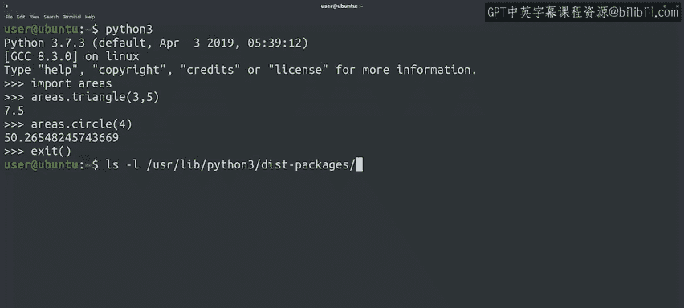

#  083：创建你自己的Python模块 🧩

在本节课中，我们将要学习如何创建和使用Python模块。模块是组织和重用代码的强大工具，它能让你将函数、类和其他代码块保存在独立的文件中，并在不同的脚本中轻松调用。

---

## 概述

我们已经学会了安装Python、运行本地脚本以及创建可执行文件。在编程中，我们经常需要重用自己或他人编写的代码，这被称为**代码重用**。函数是实现代码重用的基础，它允许我们将代码分组为逻辑块，以便后续多次执行。然而，随着脚本变得越来越大、越来越复杂，我们可能需要重用整个脚本或其他程序。

---

## 代码重用的挑战

假设你编写了一个脚本，用于向经理发送每日完成工单的摘要邮件。该脚本有两个主要任务：首先，通过与公司的问题跟踪系统交互，组装你关闭的工单列表；其次，使用该列表创建邮件并发送给经理。

在另一个项目中，假设你需要自动解析系统日志并搜索其中的特定事件。如果在日志中找到该事件，你希望触发邮件通知自己。


你能发现这两个脚本之间的功能重叠吗？两个自动化项目都需要发送邮件消息。

最直接的方法是复制邮件发送代码，从一个Python文件复制到另一个。


整体来看，这似乎很简单。但以这种方式复制代码有一些明显的缺点。

以下是主要问题：

*   每次需要对任一脚本进行更改时，你必须记住在两个地方都进行修改。这意味着你需要进行两次更新和错误修复。
*   如果你的同事想在他们自己的项目中使用你编写的相同邮件代码，他们可能也需要创建新的副本。
*   跟踪所有代码被复制的位置会很快变得棘手，共享不同版本也是如此。


---

## 解决方案：创建Python模块

为了避免维护多个代码副本的麻烦，我们可以将想要重用的代码放入一个单独的**模块**中。这样，我们的脚本和同事的脚本就可以导入我们的代码，而无需创建多个副本。

首先，我们需要创建自己的Python模块。方法是将想要成为模块一部分的内容放入一个单独的文件中。要使用该模块，我们将使用文件名导入它。

我们可以使用**点表示法**访问文件中定义的每个函数、类和变量。


让我们通过一个例子来实践。我们有一个名为 `areas.py` 的文件，其中包含计算不同几何图形面积的函数。

我们可以使用 `cat` 命令查看该文件的内容。

以下是该模块定义的三个函数：

```python
import math

def triangle(base, height):
    return base * height / 2

def rectangle(length, width):
    return length * width

def circle(radius):
    return math.pi * (radius ** 2)
```

`circle` 函数使用了 `math.pi` 常量，这就是为什么我们在顶部导入了 `math` 模块以便使用它。

我们已经看到函数定义在 `areas.py` 文件中。要在解释器或脚本中使用它们，我们可以通过输入 `import areas` 来导入模块。

让我们实际操作一下。

```python
import areas
```

完美，我们现在已经加载了 `areas` 模块，并可以使用它来计算面积。

让我们计算一个三角形和一个圆的面积来测试一下。

```python
print(areas.triangle(3, 5))  # 输出：7.5
print(areas.circle(2))       # 输出：12.566370614359172
```

---

## 更复杂的模块结构

我们的 `areas` 模块非常小巧简单，因此可以很好地放在一个文件中。在某些情况下，我们处理的代码可能变得更加复杂，将其拆分为**子模块**可能更有意义。



在这种情况下，我们会创建一个以模块命名的目录，并为每个子模块创建单独的 `.py` 文件。

为了理解这一点，让我们使用 `ls -l` 命令查看这台计算机上安装的一个模块——`requests` 模块的文件列表。


这个模块非常复杂，因此它所做的所有事情都被拆分到单独的文件中。

请注意那个 `__init__.py` 文件。这是一个特殊文件。当模块被导入时，解释器会读取它，并用它来检查一个包含Python文件的目录是否应该被视为一个模块。

因此，如果你有一个被拆分成多个文件的模块，并且你希望解释器将该目录识别为一个模块，你需要创建 `__init__.py` 文件。即使你没有任何内容要放入这个文件，你也需要创建它。你可以让它保持为空，但它必须存在，解释器才能将该目录识别为Python模块。

---

## 总结

本节课我们一起学习了如何创建和使用Python模块。我们了解了简单复制代码的缺点，并学会了通过创建模块来优雅地实现代码重用。我们还探讨了模块的基本结构，以及对于更复杂的代码，如何通过创建包含 `__init__.py` 文件的目录来组织子模块。

虽然这些概念一开始可能有点复杂，但通过持续练习，你会逐渐掌握它们，直到能够熟练运用。