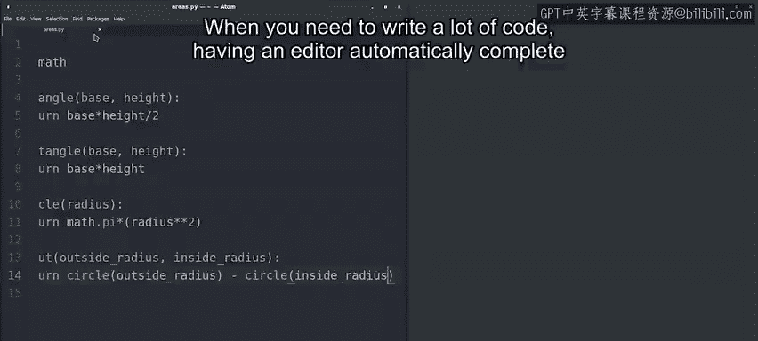
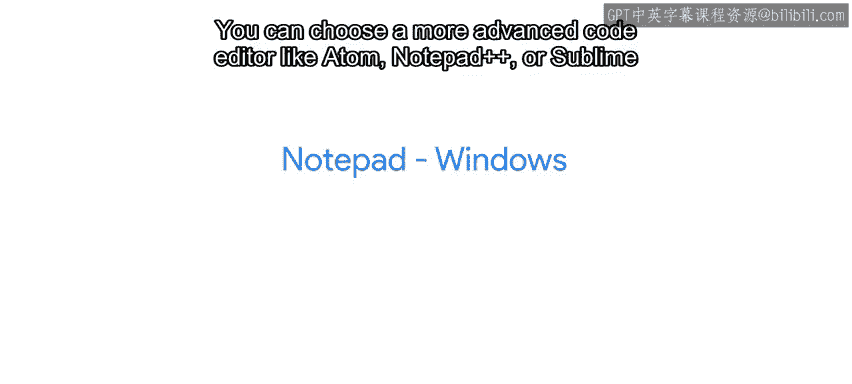

#  084：什么是IDE？ 🖥️

## 概述

在本节课中，我们将要学习什么是集成开发环境（IDE），以及它如何帮助我们更高效地编写Python脚本。我们将探讨代码编辑器的基本功能，如语法高亮和代码补全，并了解如何选择适合自己的开发工具。

---

当你开始编写自己的脚本时，最终会遇到一些提及IDE的网站。

这个术语代表集成开发环境，通常指一个带有一些便捷额外功能的代码编辑器，这些功能使编写脚本变得容易得多。

我们大部分编程工作都在代码编辑器和IDE中完成。

因此，找到一个让你感到最舒适和最高效的工具非常重要。

现在花些时间了解几个编辑器和IDE，以找到你最喜欢的那一个，这是一个好主意。

市面上有很多不同的编辑器。有些只有少量附加功能。

而另一些则有很多功能。代码编辑器中最基本的额外功能之一是**语法高亮**。

这意味着编辑器能识别我们编写代码所用的语言，并高亮显示构成该语言语法的代码片段。

让我们在Linux上可用的一个名为Vim的文本编辑器中看看这个功能。

Vim包含语法高亮功能，所以如果我们在Vim中打开之前展示过的`areas.py`文件。

我们将看到代码包含了用于高亮语法的颜色。

我们可以看到，像`def`或`return`这样的保留关键字以一种颜色显示，函数名称以另一种颜色显示，甚至数字也以另一种颜色显示。要退出Vim，输入`:q`。

代码编辑器提供的另一个常见功能叫做**代码补全**。

让我们在另一个名为Atom的编辑器中查看这个功能的使用。

这里我们在Atom中打开了我们的`areas`模块。我们看到它也使用了语法高亮。

颜色不同，但理念相同。现在，让我们编写一个名为`donut`的新函数。

该函数将计算一个二维甜甜圈的面积为两个圆的面积之差。`donut`。

当我输入`def`时，编辑器告诉我这是一个用于编写新函数的关键字。

输入函数名后，我输入左括号，编辑器知道后面会有一个右括号。

所以它为我写上了。定义函数后，当我按下回车键时。

编辑器知道代码需要向右缩进。

所以它自动将光标定位在那里。很有帮助，对吧？😊

现在，当我输入`ret`时。

编辑器建议我可能想输入`return`。就像它能读懂我的心思一样。按下Tab键。

我接受了建议，于是我的`ret`被补全为`return`。很好。

让我们用`Ctrl+S`保存，并用`Ctrl+Q`关闭我们的程序。

这就是代码补全的力量。当你需要编写大量代码时。

有一个能自动补全变量和函数名的编辑器可以节省你大量时间。

你如何编写源代码取决于你的个人品味、偏好。

以及你的平台可用的应用程序。你可以使用计算机上已经安装的任何工具，比如Windows上的Notepad。

Mac OS上的TextEdit，或Linux上的Nano。

你可以选择更高级的代码编辑器，如Atom、Notepad++或Sublime Text。

或者选择功能齐全的图形化IDE，如Eclipse或PyCharm。

一旦你找到了最喜欢的工具，花时间熟悉编辑器的功能是值得的，这样你就能充分利用它。

请随意尝试编写一些脚本并执行它们，直到你感到编辑Python脚本很自如为止。

现在提醒一句。作为一名IT专家，你不想完全只依赖一个编辑器。

你可能需要在一台安装了不同编辑器的计算机上调试问题，而你不想浪费时间安装你偏爱的编辑器。

所以请确保你对如何使用你工作计算机上默认安装的编辑器有一个基本的了解。

像Atom或Eclipse这样具有额外功能的图形化代码编辑器非常方便，可以节省我们大量时间。

但你也应该至少学会使用一个命令行编辑器，比如Vim、Emacs或Nano，以备无法使用图形化编辑器之时。例如。

你可能需要连接到一个运行在云端的远程服务器，在那里你将无法使用图形化编辑器。我们已经讨论了很多关于设置环境的内容，你现在可以编写和运行你自己的Python脚本和Python模块了。接下来。

我们有一篇补充阅读材料，提供更多信息。然后有一个测验，以再次确认你掌握了所有这些新概念。

😊

---

## 总结

本节课中我们一起学习了集成开发环境（IDE）的概念及其核心功能。我们了解了**语法高亮**和**代码补全**如何提升编码效率，并探讨了从简单文本编辑器到功能齐全的IDE等多种工具的选择。重要的是，作为IT专家，我们应灵活掌握多种编辑器，包括命令行工具，以适应不同的工作环境。现在，你可以更自信地选择和使用工具来编写和运行Python脚本了。