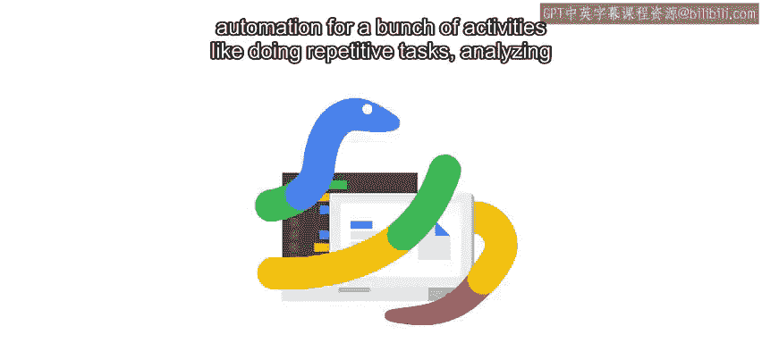
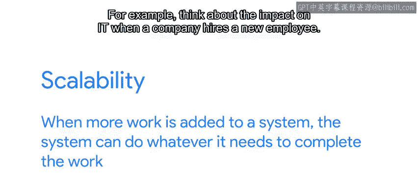
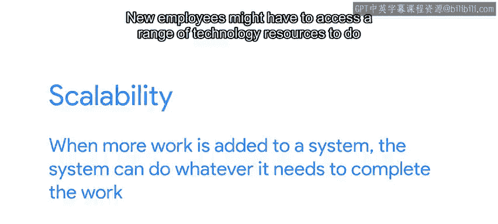
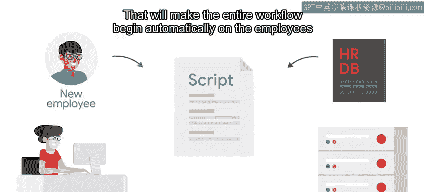
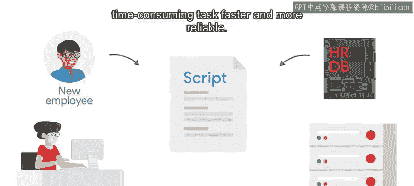

#  085：自动化的好处 🚀

在本节课中，我们将探讨自动化在IT工作中的核心价值，理解它如何提升效率、可靠性与可扩展性，并初步认识自动化可能带来的风险。

---

在Python课程的介绍中，我们讨论了自动化对一系列活动的好处，例如执行重复性任务、分析文本、生成报告等。本课程中，我们将通过将自动化应用于越来越多的任务来深化这些概念。

作为一名IT专家，经过深思熟虑应用的自动化可以在你的工作中发挥重要作用。

你可以将自动化视为IT的“力量倍增器”——一种无需增加团队成员数量，就能提升IT团队效能的工具。

换句话说，自动化可以使IT基础设施实现**扩展**，从而跟上增长和需求的步伐。**可扩展性**意味着当系统被赋予更多工作时，系统能够完成所需的一切以处理这些工作。

---

## 自动化如何提升可扩展性 📈

上一节我们介绍了自动化作为力量倍增器的概念，本节中我们通过一个具体例子来看看它如何提升可扩展性。

例如，思考一下公司雇佣新员工时对IT部门的影响。

新员工可能需要访问一系列技术资源来完成工作。入职任务可能包括创建用户账户、邮箱和主文件夹，以及设置适当的权限以控制对各种系统和资源的访问。

如果公司在特定时期内雇佣的员工不多，每次有新员工加入时，可以有人手动执行这些任务，尽管我敢打赌这很快就会变得非常乏味。

但随着新员工数量的增加，在系统中为他们所有人进行设置所需的时间也会增加。

如果公司在一周内雇佣的新员工数量是平时的10倍，负责的IT人员可能会发现自己除了设置新员工账户外什么都做不了，同时也会感到抓狂。

他们可能不得不将一堆其他项目搁置，直到设置完所有账户。作为人类，他们也可能会在配置过程中犯一些错误，比如拼错名字、忘记某个步骤，或者给用户账户分配错误的权限。然后他们必须修复这些错误，这意味着更多的工作。

现在，想象一下如果公司继续以这个速度招聘。他们可能需要指派另一名IT专家来处理因所有新账户设置而被忽视的工作。或者，工作量可能大到需要两名IT专家来负责账户设置。

基本上，这在财务资源、精力投入或可靠性方面都无法很好地扩展，尤其是当公司持续增长时。如果新员工的雇佣率翻倍、翻三倍，甚至增长得更大呢？仅仅投入更多人力来解决问题很快就会变得不切实际。

---

## 从手动到自动：改进流程 🔄

既然我们都认识到手动入职流程存在问题，那么让我们思考一下如何通过自动化来改进这个过程。

与其让一个人与每个独立的系统交互来创建新用户账户、邮箱、共享文件夹和权限，更高效的做法是让IT专家编写一个脚本来完成所有这些工作。

我们可以让计算机在每次雇佣新员工时执行这些任务。当给定初始信息，如新员工的姓名和职位时，该脚本可以自动执行每个步骤，因此人类只需要在任务因某种原因失败时才进行干预。

计算机会按照脚本中给定的顺序，以完全相同的方式执行每个步骤，永远不需要偏离这些指令。

我们甚至可以进一步改进脚本：与其每次运行时都让IT专家将新员工的信息输入脚本，不如让脚本直接从公司的人力资源系统中读取数据。

这将使整个工作流程在员工入职日期自动开始。

在这个自动化示例中，我们使一项重复且耗时的任务变得更快、更可靠。我们还释放了人力资源，让IT专家能够专注于更具战略性或创造性的工作。

---

## 自动化的额外优势：集中化错误处理 ✅

自动化另一个微妙但极其有用的好处是**集中化错误**。

这意味着如果你在脚本中发现一个错误，你可以一劳永逸地修复它，这当然与人类犯的错误不同。

希望你现在比之前更加确信自动化的好处了。

---

## 总结与前瞻 📝

本节课中我们一起学习了自动化的核心好处：它作为力量倍增器提升团队效能，通过脚本处理重复任务实现可扩展性，提高工作速度与可靠性，释放人力资源，并能集中化处理错误。

但正如我们之前所说，自动化并非万能药。如果执行不当，自动化造成的问题可能和它解决的问题一样多。为了避免这种情况，我们需要了解它可能出错的方式。因此，接下来，让我们探讨一些自动化可能失败的情形。