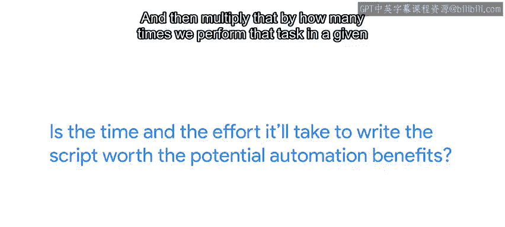
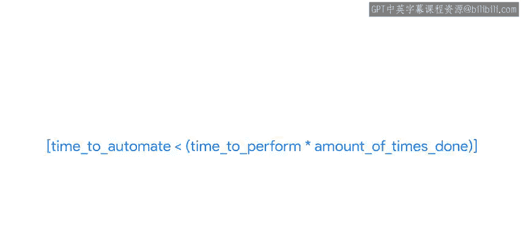
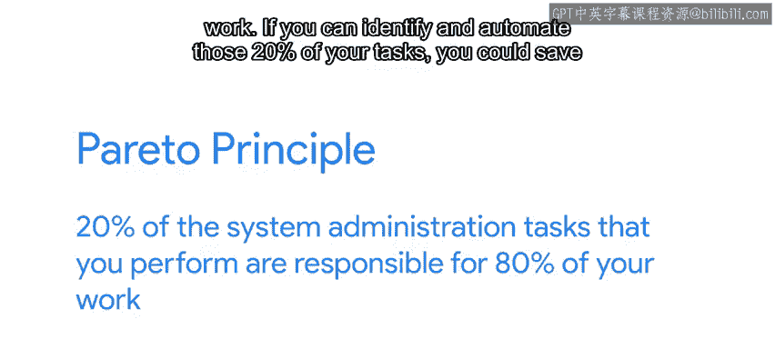
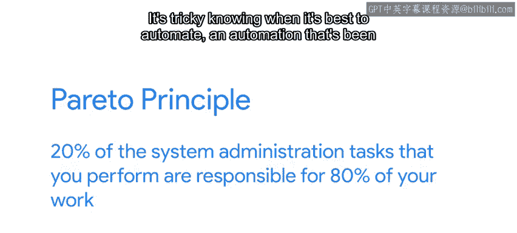
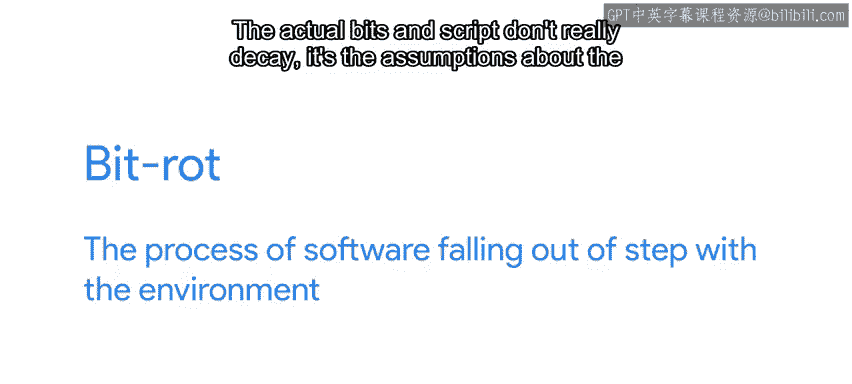
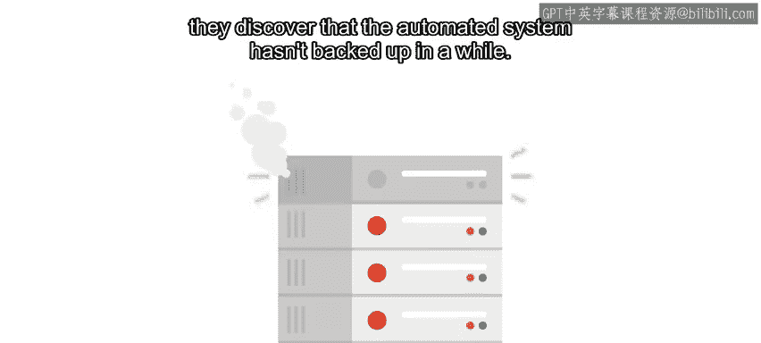
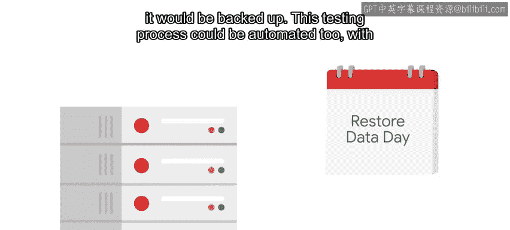

#  086：自动化的缺陷 🚧

在本节课中，我们将探讨自动化在带来巨大便利的同时，可能引发的一些严重问题。我们将学习如何评估是否应该自动化一个任务，以及如何设计自动化流程以避免常见的陷阱，如静默失败和错误操作。

---

毫无疑问，自动化让我们的生活轻松许多。尽管它有很多好处，但如果实施时缺乏深思熟虑的设计，也可能导致一些严重问题。

让我们看看自动化可能失败的几种方式，以及我们可以采取哪些措施来避免它们。

## 权衡：是否值得自动化？⚖️

我们自动化的任何任务或流程都需要权衡利弊。编写脚本所需的时间和精力，是否值得潜在的自动化收益？

一个简单的启发式方法可以帮助我们做决定：估算完成某项任务所需的时间，然后乘以在给定时间窗口内执行该任务的次数。如果我们估计自动化该任务所需的时间少于手动完成的时间，那么它很可能是一个适合自动化的候选任务。

**公式**：`自动化时间 < (单次任务时间 × 执行次数)`

让我们看一个现实世界的例子。假设你每天生成一份系统使用报告，每天需要花费5分钟。

如果自动化这个任务需要你1小时，那么在12天后，你就已经节省了创建自动化所花费的60分钟。这将是一个很好的时间利用方式，因为它每天能为你腾出那5分钟去做其他事情。

相反，如果创建自动化需要你10小时，那么就需要120天或24个工作周才能开始在该任务上节省时间。这几乎是六个月，你才能开始收获自动化的好处。甚至有可能到那时，报告的要求已经改变，需要你投入更多时间。

通常，是否自动化的决定并不那么直接。如果一个任务很复杂且不常执行，自动化可能看起来比它的价值更麻烦。但请记住，一旦任务被自动化封装，任何人都可以执行它。对于一个复杂且容易出错的任务，如果确保其正确执行至关重要，即使它不经常执行，自动化也非常有用。

关于何时自动化没有硬性规定，但成本与时间的权衡可以帮助指导你的决策。

## 帕累托原则的应用 📊

一个称为帕累托原则的概念，也可以作为决定自动化哪些任务的有用指南。

当应用于IT自动化时，帕累托原则指出，你所执行的20%的系统管理任务，占用了你80%的工作量。

如果你能识别并自动化那20%的任务，你就可以为自己节省大量时间。

## 自动化的脆弱性与“比特腐烂” 🧱

知道何时自动化最好是很棘手的，而一个已实施的自动化可能是脆弱的。如果底层系统发生变化，而自动化没有相应更新，工作流程就可能中断。

想象一个自动备份系统，它定期保存销售数据库的内容。假设自动备份程序使用一个磁盘标识符（如 `/dev/sda1`）来知道要保存的数据存储在哪里。

如果服务器添加了新磁盘，并且这个标识符变成了 `/dev/sdb1`，会发生什么？自动化将无法再访问它认为应该备份的磁盘，从而导致失败。

这种软件与环境脱节的过程有时被称为“比特腐烂”。脚本中的实际比特并不会真正腐烂，腐烂的是脚本所依赖的关于环境的隐含假设。

## 处理错误与静默失败 🔔

思考你的自动化将如何处理错误非常重要。自动化系统在没有人工干预的情况下执行操作，因此很容易“设置后即忘记”。如果一个自动化系统失败且未被察觉，后果可能非常严重。

让我们重新审视我们的备份示例。想象一下，备份因磁盘标识符更改而失败，但没有人注意到。一段时间后，销售数据库服务器崩溃，需要恢复数据。当IT专家发现自动化系统已经有一段时间没有备份时，他们会大吃一惊。

对自动化系统的错误信心也可能影响决策。例如，如果数据库需要升级，系统管理员可能更愿意进行有潜在风险的操作，因为他们相信可以从备份中恢复数据。

那么，我们如何避免这些静默失败呢？你可以在自动化系统中构建一种通知方法。这样，当自动化失败时，会通知人类，人类可以介入调查。

这种通知方法可以是一封电子邮件、内部问题跟踪器中的新条目、仪表板的更新，甚至是向负责该服务的值班人员发送的传呼。无论采用哪种方法，重要的是通知服务能报告错误，以便人员可以修复自动化。

## 错误的成功与定期测试 ✅

比自动化失败更糟糕的是，自动化成功执行，但执行了错误的操作。在我们之前的例子基础上，如果备份系统正确地执行了任务，但被配置为备份了错误的数据，会怎么样？

恢复错误的销售数据可能导致数据丢失甚至数据损坏，例如客户可能被收取错误的金额或被收取未购买产品的费用。

有时，任务完成了，但完成得不正确。对于这种更微妙的失败类别，我们可以使用定期测试来检查自动化系统的行为。

在我们的备份系统示例中，我们可以安排定期从销售数据库恢复数据，然后检查恢复的数据是否是你预期备份的内容。这个测试过程也可以自动化，编写脚本来安排恢复并将数据与某个主数据集进行比较。

同样，如果恢复过程的任何部分失败，自动化系统可以停止以防止进一步的数据损坏，并向可以调查问题的人员发送通知。

## 日志记录与调试 🗒️

除了标记问题，良好的自动化还会通过记录其执行的操作来简化调试。系统日志在调查问题时是非常有用的信息来源，我们说它具有取证价值。我们的脚本也可以配置为写入系统日志。这样做会创建一个有用的故障排除信息审计跟踪，有助于调试过程。

---

## 总结 📝

本节课中，我们一起学习了自动化的潜在缺陷。自动化是一个极其强大的工具，可以节省时间、减少错误并促进增长和可扩展性。但我们需要深思熟虑地应用它，以避免使用它时可能产生的一些陷阱。请记住以下几点：

*   **权衡利弊**：使用 `自动化时间 < (单次任务时间 × 执行次数)` 的公式来评估是否值得自动化。
*   **应用帕累托原则**：优先自动化那占用你80%工作量的20%的关键任务。
*   **警惕“比特腐烂”**：自动化依赖于环境假设，当环境变化时，自动化可能失效。
*   **避免静默失败**：为自动化系统构建错误通知机制，确保失败能被及时发现。
*   **进行定期测试**：验证自动化系统是否在执行正确的操作，而不仅仅是“成功”运行。
*   **记录操作日志**：为自动化过程创建审计跟踪，以便于调试和问题排查。

将这些要点牢记于心，自动化就能成为你工具箱中的一个宝贵资产。