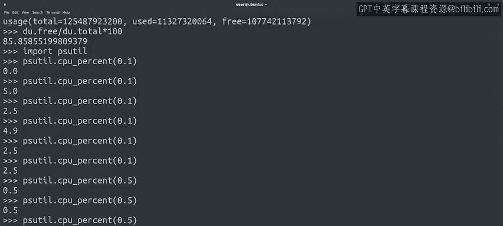
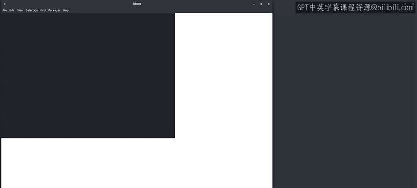
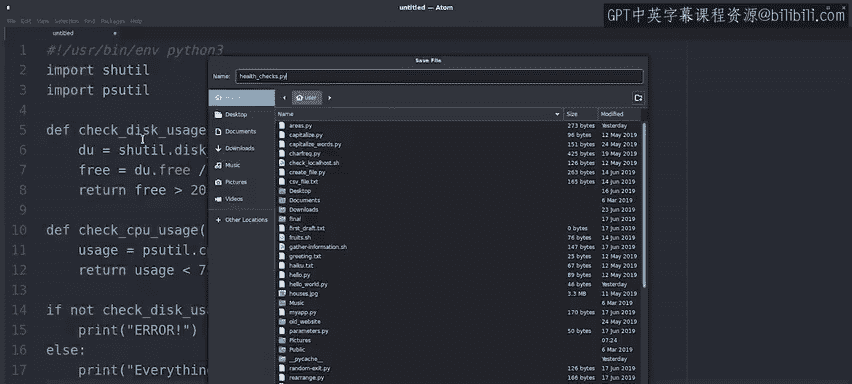
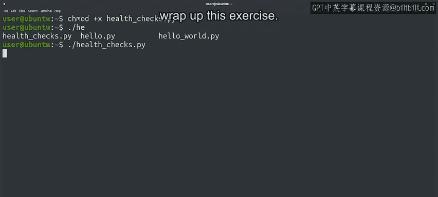

#  087：实际自动化示例 🛠️


在本节课中，我们将学习如何利用Python编写一个实际的自动化脚本，用于检查计算机的健康状态。我们将通过两个具体的检查示例——磁盘空间使用率和CPU使用率——来演示自动化脚本的编写过程。

---

## 概述

我们已经讨论了自动化的好处以及我们需要做的准备工作。现在，让我们来看一个使用Python实现自动化的具体例子。假设你需要检查计算机的健康状态，这可能涉及多种检查，例如验证磁盘空间是否充足、处理器是否过载、是否安装了最新的安全更新，以及是否运行了应有的服务。为了验证所有这些，我们需要知道如何检查每一项指标。当然，我们将利用一些方便的模块来实现这些检查。

---

## 检查磁盘空间使用率

首先，我们来看看如何检查磁盘空间使用率。为此，我们可以使用`shutil`模块中的`disk_usage`函数。这个函数能够返回磁盘的总字节数、已使用的字节数和空闲的字节数。

以下是检查磁盘空间使用率的步骤：

1.  导入`shutil`模块。
2.  调用`disk_usage`函数获取磁盘使用情况。
3.  计算空闲磁盘空间的百分比。

让我们在交互式解释器中尝试一下：

```python
import shutil
du = shutil.disk_usage("/")
print(du)
```

执行上述代码后，你将看到类似以下的输出：

```
usage(total=250685575168, used=100685575168, free=150000000000)
```

这表示磁盘的总字节数、已使用的字节数和空闲的字节数。我们可以通过以下公式计算空闲磁盘空间的百分比：

**空闲百分比 = (空闲字节数 / 总字节数) * 100**

---

## 检查CPU使用率

接下来，我们检查CPU的使用率。为此，我们可以使用`psutil`模块中的`cpu_percent`函数。这个函数返回一个数字，表示CPU的使用百分比。

由于进程随时都在启动和结束，每个瞬间的CPU使用率可能会有很大变化。因此，`cpu_percent`函数接受一个以秒为单位的时间间隔参数，并返回该时间间隔内的平均使用率百分比。

以下是检查CPU使用率的步骤：

1.  导入`psutil`模块。
2.  调用`cpu_percent`函数，并指定一个时间间隔（例如0.1秒或0.5秒）。



让我们在交互式解释器中尝试一下：

```python
import psutil
psutil.cpu_percent(0.1)
```

多次执行上述代码，你会发现每次返回的值可能不同。这是因为CPU使用率在短时间内会有波动。如果你将时间间隔设置为0.5秒，函数需要更长的时间来计算平均值，但返回的结果会更加稳定。

```python
psutil.cpu_percent(0.5)
```

---



## 编写健康检查脚本

现在我们已经完成了研究，可以开始编写我们的健康检查脚本了。我们将创建一个脚本，执行两项健康检查：磁盘空间使用率和CPU使用率。

以下是脚本的编写步骤：

1.  设置脚本使用Python解释器。
2.  导入所需的模块：`shutil`和`psutil`。
3.  定义两个函数：一个用于检查磁盘使用率，另一个用于检查CPU使用率。
4.  编写脚本的主体部分，调用这两个函数并根据结果输出相应的消息。

以下是完整的脚本代码：

```python
#!/usr/bin/env python3

import shutil
import psutil

def check_disk_usage(disk):
    """检查磁盘使用率，如果空闲空间大于20%则返回True，否则返回False"""
    du = shutil.disk_usage(disk)
    free = du.free / du.total * 100
    return free > 20

def check_cpu_usage():
    """检查CPU使用率，如果使用率小于75%则返回True，否则返回False"""
    usage = psutil.cpu_percent(1)
    return usage < 75

# 主程序
if not check_disk_usage("/") or not check_cpu_usage():
    print("错误：计算机健康状态异常！")
else:
    print("一切正常。")
```





---

## 保存并运行脚本

完成脚本编写后，我们需要保存它，使其可执行，并运行它。以下是具体步骤：

1.  将脚本保存为`health_check.py`。
2.  在终端中，使用`chmod +x health_check.py`命令使脚本可执行。
3.  运行脚本：`./health_check.py`。

如果一切正常，你将看到输出：“一切正常。” 如果磁盘空间不足或CPU使用率过高，脚本将输出错误消息。

---

## 总结

在本节课中，我们一起学习了如何编写一个实际的自动化脚本，用于检查计算机的健康状态。我们通过两个具体的例子——检查磁盘空间使用率和CPU使用率——演示了如何使用Python的`shutil`和`psutil`模块来实现自动化检查。

通过这个练习，你不仅掌握了如何检查系统资源，还学会了如何将多个检查组合成一个完整的自动化脚本。随着课程的深入，我们将探索更多实际的自动化示例，并将这些知识应用到你的工作中。

记住，学习自动化需要一些手动工作，这其中的讽刺意味我们心知肚明。所以，卷起袖子，在你的计算机上练习这些脚本吧！如果你在某些地方感到困惑，随时可以回看课程内容。无论你是需要复习，还是准备直接进入下一个练习测验，你都做得很棒，继续加油！🚀