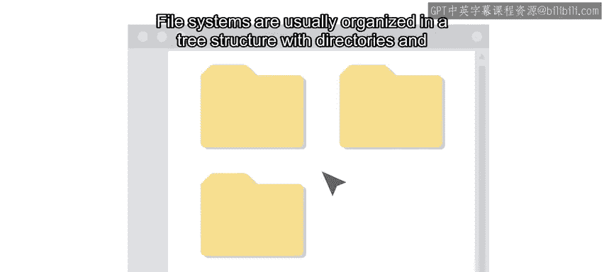

#  089：使用Python编程操作文件系统 📂

在本节课中，我们将学习如何使用Python与计算机的文件系统进行交互。作为IT专家，经常需要处理大量文件和目录，自动化可以极大地提高效率。我们将探讨文件系统的基本概念、路径表示方法，并介绍如何使用Python来操作文件和目录。

---

## 文件系统基础 🗂️

上一节我们介绍了Python环境的设置和脚本执行，本节中我们来看看文件系统的基本结构。操作系统（如Windows、Linux、macOS）使用文件系统来组织和管理数据的存储与访问。

数据通常存储在磁盘上，并保存在文件中。文件则存放在称为“目录”或“文件夹”的容器中。

文件系统通常采用树形结构进行组织，目录和文件嵌套在其父目录之下。

我们通过“路径”来确定资源（如目录或文件）在树形结构中的位置。

---

## 绝对路径与相对路径 🧭

以下是两种主要的路径表示方法：

**绝对路径**是文件系统中资源的完整路径。无论脚本在文件系统的何处运行，绝对路径总能定位到目标资源。

例如：
*   在Windows计算机上，用户Jordan文件夹的绝对路径可能是：`C:\Users\Jordan`
*   在Linux计算机上，等效目录的绝对路径可能是：`/home/Jordan`

**相对路径**仅使用路径的一部分，表示资源相对于“当前工作目录”的位置。相对路径是一种快捷方式，无需写出完整路径，但它的意义取决于当前位置。

例如，列出 `examples` 目录的内容：
*   如果当前目录是 `/home/Jordan`，则列出的是 `/home/Jordan/examples` 的内容。
*   如果当前目录是 `/usr/share/doc/python3`，则列出的是 `/usr/share/doc/python3/examples` 的内容。

---

## 后续内容预告 🚀

在接下来的视频中，我们将详细介绍如何使用Python来操作文件和目录，完成各种任务。

我们还将学习一种名为CSV的特定文件格式，用于读取和写入数据。

精彩内容即将开始，让我们继续前进。

---

本节课中我们一起学习了文件系统的基本概念，包括其树形结构、以及定位资源的两种方式：绝对路径和相对路径。理解这些概念是使用Python自动化文件操作的基础。