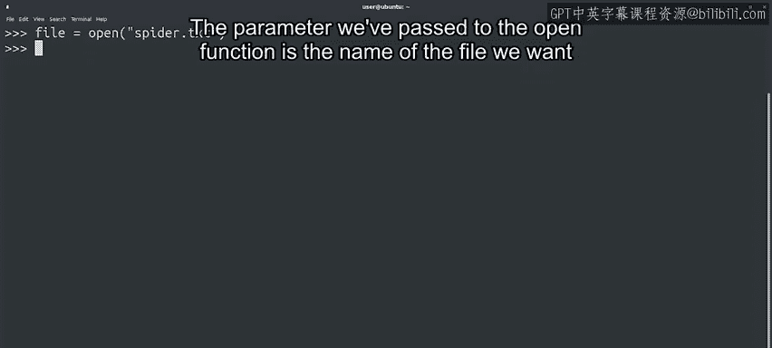
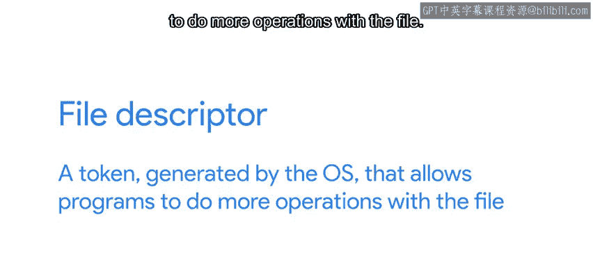
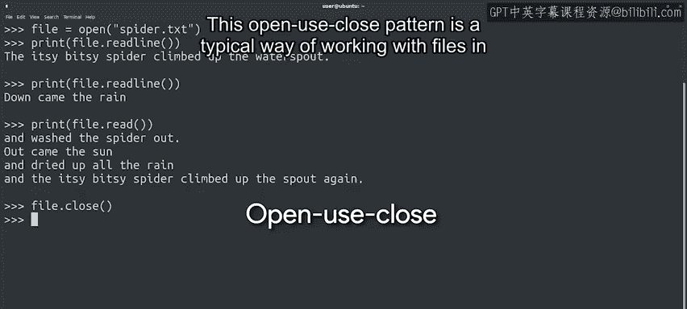
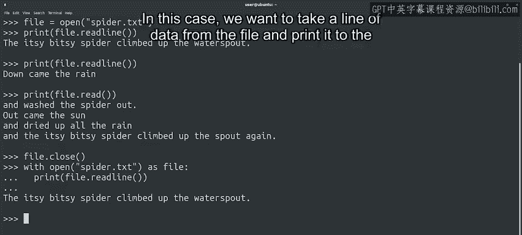

#  090：Python文件操作基础 - 第16课 📖


## 概述

在本节课中，我们将学习如何使用Python读取文件。我们将了解文件对象的基本概念，学习打开、读取和关闭文件的方法，并探讨两种不同的文件操作模式。

---

## 从变量到文件：为什么需要文件操作？ 📂

在Python入门课程中，我们通过创建变量和向函数传递参数来为脚本提供信息。这种方法适用于小型脚本，但对于处理大量数据通常不够理想。

处理大量数据时，从文件中读取数据是一个更好的选择。在编程中，我们经常需要处理文件。这项任务非常有用，以至于大多数编程语言都将文件操作功能内置在其核心特性中。

Python也不例外。它为我们提供了文件对象，我们可以使用这些对象来读取和写入文件。

---



## 打开文件：创建文件对象 🔓

要打开计算机上名为`Spidder.txt`的文件，我们可以编写以下代码：

```python
file = open("Spidder.txt")
```

我们在这里创建了一个新的文件对象，并将其赋值给名为`file`的变量。传递给`open`函数的参数是我们想要打开的文件名。

在这个例子中，我们假设要读取的文件与正在运行的脚本位于同一目录中。但我们也可以轻松地传递绝对路径来打开不同目录中的文件。



当我们打开一个文件时，操作系统会检查我们是否有权限访问该文件，然后为我们的代码提供一个文件描述符。这是操作系统生成的令牌，允许程序对文件执行更多操作。

在Python中，这个文件描述符作为文件对象的属性存储。文件对象为我们提供了许多可用于操作文件的方法。

---

## 读取文件内容：逐行与全部读取 📄

现在，有了这个文件对象，我们可以读取文件的内容并将其打印到屏幕上。

以下是使用`readline`方法的示例：

```python
print(file.readline())
```

`readline`方法允许我们读取文件的单行。如果我们再次调用它，会发生什么？

```python
print(file.readline())
```

很好，这次我们得到了文件的第二行。那么这是如何工作的呢？每次我们调用`readline`方法时，文件对象都会更新文件中的当前位置，因此它会不断向前移动。

我们还可以调用`read`方法，该方法从当前位置读取直到文件末尾，而不仅仅是读取一行。

```python
print(file.read())
```

在这个例子中，文件总共有六行。我们通过两次`readline`调用读取了前两行，然后通过一次`read`调用读取了其余四行。



与`readline`类似，`read`方法从我们当前在文件中的位置开始读取。但它不是只读取一行，而是读取直到文件末尾。

---

## 关闭文件：为什么重要？ 🔒

最后，我们将使用`close`方法关闭文件。

```python
file.close()
```

这种“打开-使用-关闭”模式是大多数编程语言中处理文件的典型方式。打开文件后关闭它们有几个重要原因：

以下是关闭文件的主要原因：

1.  **文件锁定**：当文件在脚本中打开时，文件系统通常会锁定它，因此在您完成之前，其他程序或脚本无法使用它。
2.  **文件描述符限制**：在文件系统耗尽文件描述符之前，您可以创建的文件描述符数量是有限的。尽管这个数字可能很高，但打开大量文件可能会耗尽文件系统资源。例如，如果我们在循环中打开文件，就可能发生这种情况。
3.  **避免竞态条件**：让文件保持打开状态可能导致竞态条件。当多个进程同时尝试修改和读取同一资源时，就会发生竞态条件，并可能导致各种意外行为。在竞态条件中，没有人是赢家。


---

## 使用`with`关键字：自动管理文件 🛡️

现在，我要告诉你一个小秘密：我最不擅长记住关闭文件。你可能会同意我的看法，跟踪打开了哪些文件并记住关闭它们可能相当困难。

幸运的是，Python的创建者同意这一点。因此，为了帮助我们记住在使用完文件后关闭它，Python允许我们使用`with`关键字创建一个代码块。

让我们看看这是什么样子：

```python
with open("Spidder.txt") as file:
    print(file.readline())
```

如你所见，`with`关键字允许我们创建一个代码块，其中包含我们想要对文件执行的操作。在这个例子中，我们想要从文件中读取一行数据并将其打印到屏幕上，这正是`print(file.readline())`所做的。



当我们使用`with`块时，Python会自动关闭文件，因此我们不需要自己记住关闭它。太好了，少了一件需要考虑的事情。谢谢你，Python。

---

## 两种方法的比较：`with`块与显式关闭 🔄

“打开-使用-关闭”方法和`with`方法各有优势。

使用`with`块是打开和处理单个文件的好方法，然后在块结束时自动关闭文件。另一方面，在块外使用`open`意味着我们可以在代码的其他地方使用文件对象，因此我们不仅限于单个块。但采用这种方法时，我们需要记住在完成后关闭它。

---

## 总结

在本节课中，我们一起学习了如何使用Python读取文件。我们了解了文件对象的基本概念，学习了如何打开文件、读取文件内容（包括逐行读取和全部读取），以及关闭文件的重要性。我们还探讨了使用`with`关键字自动管理文件的方法，并比较了两种不同文件操作模式的优缺点。

希望这节课能让你对如何打开、读取和显示文件感到相当舒适。在下一个视频中，我们将探讨一些遍历文件内容的方法。😊