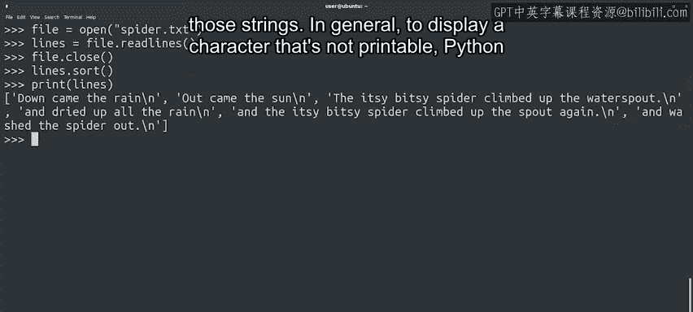

#  091：遍历文件 📂


## 概述

在本节课中，我们将要学习如何使用Python读取和遍历文件内容。我们将探索几种不同的文件读取方法，理解如何处理文件中的特殊字符，并了解如何高效地处理不同大小的文件。

---

## 文件读取方法回顾

上一节我们介绍了`read()`和`readline()`方法，它们分别用于读取整个文件内容和单行内容。本节中我们来看看如何更灵活地遍历文件。

与Python中的列表或字符串类似，文件对象也可以被迭代。这在需要逐行处理文件时非常有用。

例如，如果我们想在打印前将每一行转换为大写，可以这样做：

```python
with open('file.txt', 'r') as file:
    for line in file:
        print(line.upper())
```

## 处理换行符

执行上述代码后，你可能会注意到输出行之间出现了空行。这是因为文件中每行末尾都有一个换行符（`\n`）。

当Python逐行读取文件时，`line`变量会包含这个换行符。而`print()`函数在输出时又会添加一个换行符，这就导致了空行的出现。

为了避免这种情况，我们可以使用字符串的`strip()`方法移除每行周围的空白字符（包括换行符和制表符）：

```python
with open('file.txt', 'r') as file:
    for line in file:
        print(line.strip().upper())
```

现在，输出将不再包含多余的空行。

## 将文件内容读入列表

另一种处理文件内容的方法是使用`readlines()`方法将文件的所有行读入一个列表。

以下是具体步骤：

首先，打开文件：
```python
file = open('file.txt', 'r')
```

然后，读取所有行到列表中：
```python
lines = file.readlines()
```

最后，关闭文件：
```python
file.close()
```

即使文件对象已关闭，`lines`变量仍然保存着文件内容的列表，我们可以对其进行操作。

例如，对列表进行排序并打印：



```python
lines.sort()
print(lines)
```

这段代码有两个需要注意的地方：

1.  行已按字母顺序排序，不再保持文件中的原始顺序。
2.  Python在打印字符串列表时，会使用`\n`来显式表示字符串中的换行符。

## 转义序列

Python使用反斜杠（`\`）开头的转义序列来表示不可打印的字符。

常见的转义序列包括：
*   `\n`：换行符
*   `\t`：制表符
*   `\'` 或 `\"`：用于在字符串中转义引号

## 处理大文件的注意事项

像`read()`或`readlines()`这样一次性读取整个文件的方法虽然方便，但在处理大文件时需要谨慎。

如果文件非常大（例如几百MB的日志文件），将其全部内容读入变量可能会占用大量计算机内存，导致程序性能下降。

对于小文件（如几KB），在内存中完全读取和处理是可行的。但对于大文件，更高效的做法是逐行处理。

## 总结

本节课中我们一起学习了：
*   使用`open()`函数打开文件。
*   使用`read()`和`readlines()`方法读取文件。
*   使用`readline()`函数和`for`循环逐行迭代文件。
*   使用`strip()`方法处理换行符和其他空白字符。
*   理解转义序列（如`\n`和`\t`）的用途。
*   根据文件大小选择合适的读取策略。

下一节，我们将学习如何向文件中写入内容。