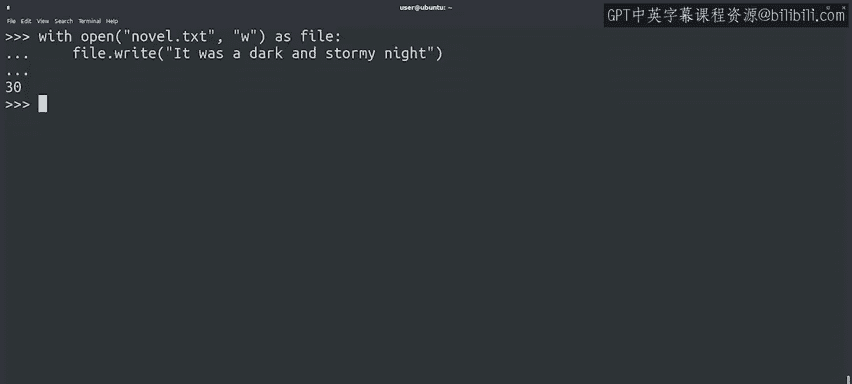
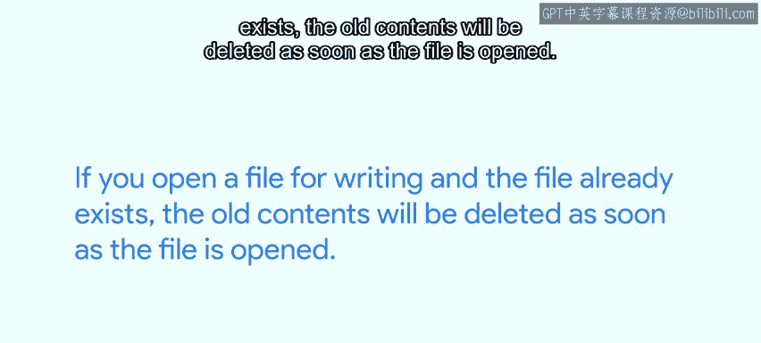
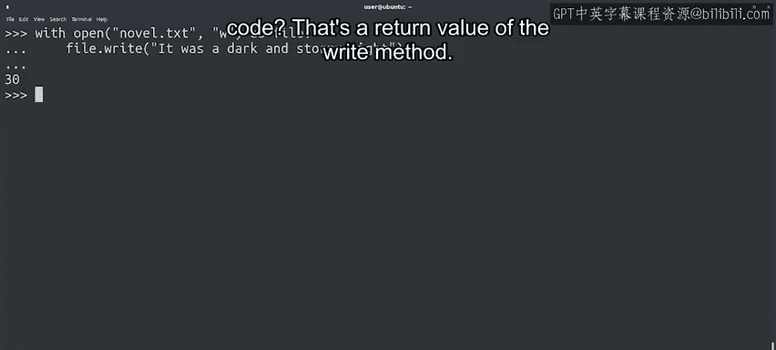

#  092：写入文件 📝


## 概述

在本节课中，我们将要学习如何使用Python向文件中写入内容。我们将了解不同的文件打开模式，特别是写入模式，并掌握如何安全地将数据写入文件，避免意外覆盖重要信息。

---

## 文件写入基础

上一节我们介绍了如何读取文件，本节中我们来看看如何写入文件。写入文件的语法与读取文件相似，但需要使用不同的模式。

```python
with open('novel.txt', 'w') as file:
    file.write("这是要写入文件的内容。")
```



在这段代码中，我们使用 `with` 块模式打开一个名为 `novel.txt` 的文件。对文件对象使用 `write` 方法可以将内容写入文件，而不是从中读取。`open` 函数的第二个参数是新的，它指定了文件的打开模式。

---

## 理解文件打开模式

文件对象可以用几种不同的模式打开。模式类似于文件权限，它决定了你可以对刚打开的文件执行什么操作。

默认情况下，`open` 函数使用 `r` 模式，代表只读。如果你尝试向以只读模式打开的文件写入内容，将会收到一个错误。

由于只读是默认模式，当我们只想读取文件时，不必将 `r` 作为第二个参数传递。然而，写入则是完全不同的情况。

`w` 字符告诉 `open` 函数，我们想以只写模式打开文件。如果文件不存在，Python 会创建它。如果文件已经存在，那么它的当前内容将被我们决定用脚本写入的任何内容覆盖。

---

## 重要注意事项

记住，当以只写模式打开文件时，你无法读取其内容。如果你尝试这样做，解释器会引发错误。

如果你想向已存在的文件添加内容，可以使用其他模式，例如 `a` 用于在现有文件末尾追加内容，或者 `r+` 用于读写模式，在这种模式下你既可以读取内容，也可以覆盖它。

这一点曾让很多人不止一次地感到困惑。所以我要再说一遍：如果你打开一个文件进行写入，并且该文件已经存在，那么文件一打开，旧内容就会被删除。

想象一下，意外删除了文件中的重要内容。

---



## 选择正确的模式

所以请记住，仔细检查你是否使用了正确的模式打开正确的文件。

以下是选择模式时的一些指导原则：

*   如果你正在生成程序遇到的事件日志文件，你可能希望使用追加 `a` 模式打开文件。以写入 `w` 模式打开意味着你将覆盖该文件中的任何先前条目，这对于日志文件来说不是一个好主意。
*   如果你正在生成报告并希望将其写入一个新文件，使用写入 `w` 模式，你可能需要检查文件是否存在，以避免丢失任何先前的内容。

我们将在接下来的视频中学习如何检查文件是否存在。

---

## `write` 方法的返回值

最后，我们代码末尾那个孤零零的 `30` 是做什么的？

```python
characters_written = file.write("这是要写入文件的内容。")
print(characters_written)  # 输出：30
```



这是 `write` 方法的返回值。当成功时，此方法返回它写入的字符数，所以在这个例子中是 `30`。

---

## 其他文件模式

除了只读、写入、追加和读写之外，`open` 函数还支持许多其他模式。你可以在官方参考文档中找到所有相关信息，我们将在下一篇阅读材料中提供链接。

---

## 总结

本节课中我们一起学习了如何使用Python向文件写入数据。我们了解了不同的文件打开模式（特别是 `w` 写入模式和 `a` 追加模式），知道了写入模式会覆盖现有文件内容，以及如何通过 `write` 方法的返回值获取写入的字符数。正确选择文件打开模式对于安全地进行文件操作至关重要。

干得漂亮！你刚刚学习了一些复杂的概念。如果一时难以理解，请查看即将提供的速查表，它将所有信息集中在一处供你参考。记住，如果你在任何时候感到困惑，你随时可以重新观看视频或在讨论区寻求帮助。

在过去的几个视频中，你学习了如何打开和读取文件、如何遍历文件，最后是如何写入文件。在处理文件时，我们经常使用这些操作，因此了解如何使用它们非常重要。

现在，请继续查看那个速查表，之后我们可以在Jupyter笔记本中动手练习所有这些内容。