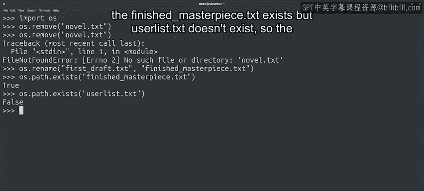

#  093：Python文件操作进阶 🗂️


在本节课中，我们将学习如何使用Python的`os`模块进行更高级的文件操作，包括删除、重命名文件以及检查文件是否存在。这些技能对于自动化处理文件任务至关重要。

## 概述

在之前的课程中，我们学习了如何读取、遍历和写入文件内容。这些是处理文件时最常见的操作。然而，在编写脚本时，我们可能还需要执行其他任务，例如删除、重命名、移动文件，或获取文件的元数据信息（如最后修改时间或文件大小）。本节课，我们将探索Python中`os`模块提供的这些功能。

## 使用`os`模块进行文件操作

`os`模块在Python和操作系统之间提供了一个抽象层。它允许我们与底层系统交互，而无需关心我们是在Windows、Mac、Linux还是Python支持的任何其他操作系统上工作。这意味着你可以在一个操作系统（如Windows）上编写和测试脚本，然后在另一个操作系统（如Linux）上运行它。

但需要注意一点：不同操作系统的文件路径可能不同。因此，在代码中使用绝对路径时，我们需要确保能为目标平台提供替代方案。

`os`模块让我们能够执行几乎所有在命令行中处理文件时可以完成的任务。我们可以通过代码更改文件权限、删除或重命名文件。这意味着你可以编写脚本来自动执行这些操作。

## 删除文件

要删除文件，我们可以使用`os`模块的`remove`函数。以下是具体步骤：

1.  首先导入`os`模块。
2.  然后调用`os.remove()`函数，并传入要删除的文件名字符串。

```python
import os
os.remove("novel.txt")
```

执行后，指定的文件`novel.txt`即被删除。如果尝试删除一个不存在的文件，该函数将引发一个`FileNotFoundError`错误。

## 重命名文件

我们可以使用`rename`函数轻松重命名文件。该函数的第一个参数是文件的旧名称，第二个参数是新名称。

```python
import os
os.rename("first_draft.txt", "finished_masterpiece.txt")
```

在Python中，重命名文件就是这么简单。同样，如果对不存在的文件执行此操作，也会引发`FileNotFoundError`错误。

## 检查文件是否存在

那么，如何检查文件是否存在呢？`os`模块内部有一个专门处理文件信息（如文件是否存在）的子模块，称为`os.path`。我们可以使用该模块中的`exists`函数来检查文件是否存在。

以下是使用示例：

```python
import os
print(os.path.exists("finished_masterpiece.txt"))  # 如果文件存在，返回 True
print(os.path.exists("useless.txt"))               # 如果文件不存在，返回 False
```



`exists`函数非常有用。我们可以在尝试读取文件之前用它来检查文件是否存在，或者在尝试写入文件之前验证文件是否已存在，这有助于避免数据丢失。

## 总结

本节课我们一起学习了如何使用Python的`os`模块进行基本的文件系统交互。我们掌握了删除文件的`os.remove()`方法、重命名文件的`os.rename()`方法，以及使用`os.path.exists()`检查文件是否存在。这些操作为自动化文件管理任务打下了基础。

在下一节视频中，我们将进一步探索如何获取文件的其他信息，例如文件大小、最后修改时间等更多元数据。敬请期待！