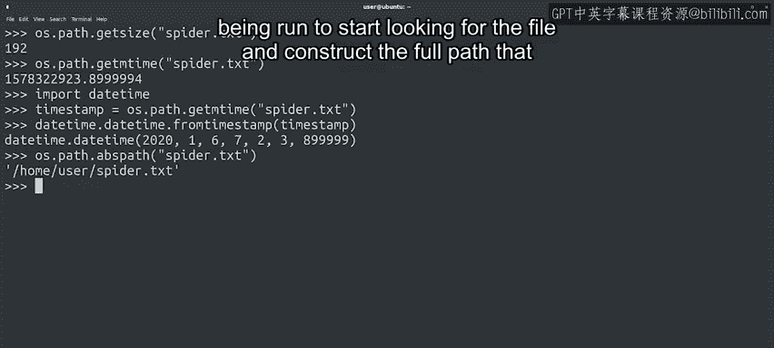

#  094：获取更多文件信息 📄


## 概述

在本节课中，我们将学习如何使用Python的`os.path`模块获取文件的详细信息，例如文件大小和最后修改时间。我们还将了解如何将相对路径转换为绝对路径，并探索时间戳的概念及其处理方法。

---

## 获取文件信息

上一节我们介绍了如何使用`os.rename`和`os.remove`等函数操作文件，以及如何使用`os.path.exists`检查文件是否存在。本节中，我们将学习如何获取文件的更多详细信息。

`os.path`模块提供了多种函数，帮助我们获取文件的各种属性。例如，要检查文件的大小，我们可以使用`getsize`函数，它返回文件大小的字节数。

```python
import os

file_size = os.path.getsize('example.txt')
print(f"文件大小: {file_size} 字节")
```

要检查文件最后一次修改的时间，`getmtime`函数非常有用。让我们看看它是如何工作的。

```python
import os

mod_time = os.path.getmtime('example.txt')
print(f"最后修改时间戳: {mod_time}")
```

---

## 理解时间戳

那个长长的数字是什么？它看起来不像时间，对吗？这是因为它是一个时间戳。具体来说，它是一个Unix时间戳。

Unix时间戳表示自1970年1月1日以来的秒数。这个日期看起来有点随机，但实际上有很好的历史原因。多年前，这个日期被采用来存储与文件和计算机相关的时间，因为那是Unix操作系统开始发布的时期。

Unix使用这个日期是因为在那个时间之前不可能有文件被创建。尽管Unix时间戳有50年的历史，但今天仍然非常普遍。文件系统使用它们来显示文件的创建、访问或修改时间，数据库等其他系统也使用它们。

作为IT专家，你在日常工作中肯定会遇到它们。但尽管如此，这个数字很难理解。我们可以使用`datetime`模块让它更容易被人阅读。

```python
import os
from datetime import datetime

mod_time = os.path.getmtime('example.txt')
readable_time = datetime.fromtimestamp(mod_time)
print(f"可读的最后修改时间: {readable_time}")
```

这里，我们使用了`datetime`模块中`datetime`类的`fromtimestamp`方法。它使日期更容易理解。

---

## 路径处理

`os.path`模块中的函数获取操作系统提供的信息，因此无论我们运行什么操作系统，都可以在脚本中使用它们。我们可以检查文件的大小或最后修改日期，而无需知道机器运行的操作系统或文件存储的文件系统类型。这很方便，对吧？

这些函数的另一个很酷的特性是，我们可以同时处理相对路径和绝对路径。在我们的例子中，我们一直使用相对文件名，而不需要指定它们的完整路径。

在某些情况下，我们可能需要确切指定文件的位置，以便在脚本中处理它。这时`abspath`函数可以派上用场。

`abspath`函数接受一个文件名，并将其转换为绝对路径。Python使用当前工作目录（即运行脚本的位置）开始查找文件，并构建标识它的完整路径。



```python
import os

abs_path = os.path.abspath('example.txt')
print(f"文件的绝对路径: {abs_path}")
```

如果我们想存储文件的完整路径，或者无论当前目录是什么都能访问文件，这非常有用。

---

## 探索更多功能

`os`和`os.path`模块中有更多函数让我们能够处理文件。但别担心，你不必全部记住。每当你需要对文件进行操作时，最好查看文档，研究有哪些可用的函数，找到你需要的函数。你会在下一节的阅读材料中找到文档的链接。

---

## 总结

本节课中，我们一起学习了如何获取文件的详细信息，包括文件大小和最后修改时间。我们了解了Unix时间戳的概念，并学会了如何使用`datetime`模块将其转换为可读格式。此外，我们还掌握了如何将相对路径转换为绝对路径，以便更灵活地处理文件。

现在是一个好时机，尝试在计算机上运行我们的例子，或者甚至自己想出一些例子，以真正掌握所有这些内容。不用着急，当你准备好的时候，在下一个视频中我们会继续学习如何在脚本中处理目录。😊