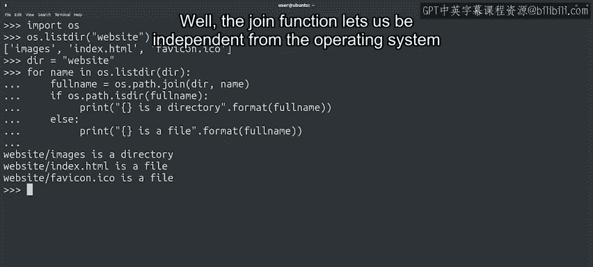
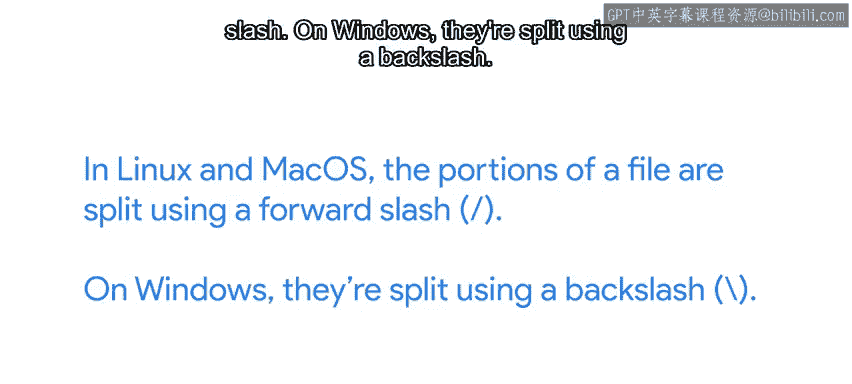
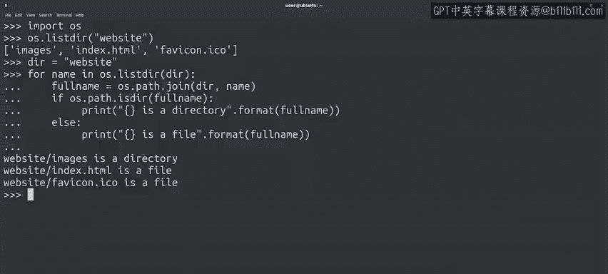

#  095：目录操作 📁


## 概述

在本节课中，我们将学习如何使用Python处理目录。脚本处理文件时，通常也需要操作目录。例如，可能需要处理特定目录中的所有文件，或为数据分析结果创建目录。与文件操作类似，Python提供了一系列函数来创建、删除和浏览目录内容。

---

## 检查当前工作目录

上一节我们介绍了文件路径的重要性，本节中我们来看看如何确定脚本的执行位置。使用相对路径定位文件时，了解当前工作目录至关重要。

要检查Python程序执行的当前目录，可以使用`os.getcwd()`方法。

```python
import os
current_directory = os.getcwd()
print(current_directory)
```

在类Unix系统中，打印工作目录的命令称为`pwd`。默认情况下，当前目录通常是用户的主目录，这是在Linux中打开终端时的起始目录。

---

## 创建目录

要创建目录，我们使用`os.mkdir()`函数。该函数名称与Windows和Linux中执行相同操作的命令一致。

```python
os.mkdir("new_dir")
```

这段代码在当前工作目录中创建了一个名为`new_dir`的目录。

---

## 更改目录

我们可以使用`os.chdir()`函数在程序中更改目录，并将目标目录作为参数传递。与其他函数一样，可以使用相对路径或绝对路径。

```python
os.chdir("new_dir")
```

执行后，当前工作目录更改为用户主目录内新创建的目录。

---

## 删除目录

我们使用`os.mkdir()`创建目录，相应地，可以使用`os.rmdir()`删除目录。

```python
os.rmdir("new_dir")
```

但`os.rmdir()`函数仅在目录为空时有效。如果尝试删除包含文件的目录，会引发错误。实际删除前，需要先删除该目录中的所有文件和子目录。

---

## 列出目录内容

要了解目录中的内容，有几种技术可以使用。`os.listdir()`函数返回给定目录中所有文件和子目录的列表。

以下是列出目录内容的示例：

```python
import os

dir_name = "website"
for name in os.listdir(dir_name):
    fullname = os.path.join(dir_name, name)
    if os.path.isdir(fullname):
        print(f"{fullname} 是一个目录")
    else:
        print(f"{fullname} 是一个文件")
```



这段代码执行了几个关键操作。首先，定义变量`dir_name`存储要检查的目录名，使代码更可读和可重用。然后，遍历`os.listdir()`返回的文件名。这些只是文件名，不包含目录路径。因此，使用`os.path.join()`将目录与每个文件名连接，创建完整的有效路径字符串。最后，使用完整路径调用`os.path.isdir()`检查它是目录还是文件。

---



## 跨平台路径处理



你可能会好奇`join`函数的作用。它似乎只是在两个字符串之间添加斜杠，但实际上，`join`函数让我们再次独立于操作系统。

在Linux和Mac OS中，文件路径部分使用正斜杠`/`分隔。在Windows中，使用反斜杠`\`分隔。

```python
# Linux/Mac示例路径
path_linux = "/home/user/documents/file.txt"

# Windows示例路径
path_windows = "C:\\Users\\user\\documents\\file.txt"
```

通过使用`os.path.join()`函数，而不是显式添加斜杠，可以确保脚本在所有操作系统上正常工作。这是另一个方便的小工具，帮助我们在不同平台上避免错误。

---

## 总结

本节课中我们一起学习了Python中目录操作的基本方法。我们介绍了如何检查当前工作目录、创建目录、更改目录、删除目录以及列出目录内容。同时，强调了使用`os.path.join()`处理跨平台路径的重要性。Python提供了许多管理目录的函数，这里只涵盖了一部分，随着课程深入，我们将根据需要学习更多。

掌握这些基础知识后，你将能更自如地处理文件和目录，为后续学习打下坚实基础。记得多加练习，巩固所学内容。