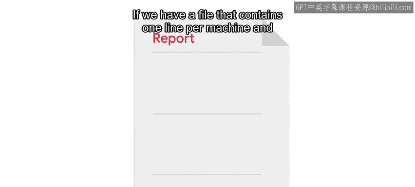
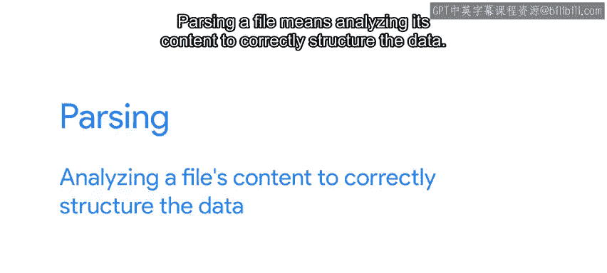
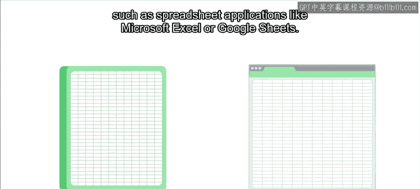

#  096：什么是CSV文件 📊

在本节课中，我们将学习一种非常常见的数据格式——CSV文件。我们将了解它的结构、用途，以及为什么在处理数据时，了解文件格式如此重要。

---

当我们最初讨论如何读取文件时，我们看的是由一行行纯文本组成的文件。这在很多情况下都很有用，因为许多程序将其状态存储在文本文件中。我们也可以将配置文件和日志文件作为文本来处理。

然而，除了纯文本，数据还以多种不同的格式存在，你可能需要在脚本中处理其中一些格式。格式赋予了数据结构，请记住，计算机喜欢结构和精确性。为了能够处理数据，提前知道数据将如何排列会很有帮助。如果你能预期数据以某种方式表示，就更容易从中提取信息。

让我们看一个非常简单的例子。如果我们有一个文件，其中每行代表一台机器以及登录该机器的用户详情，那么当我们读取该文件时，我们就知道如何解析它以获取我们想要的信息。

> 解析文件意味着分析其内容以正确地构建数据结构。

---

## 常见的文件格式

我们使用多种不同的文件格式来结构化、存储和传输数据。你可能已经熟悉其中一些。例如：

*   **HTML**：一种标记格式，用于定义网页的内容。
*   **JSON**：一种数据交换格式，常用于在网络（尤其是互联网）上的计算机之间传递数据。
*   **CSV**：即逗号分隔值，是一种非常常见的数据格式，用于将数据存储为由逗号分隔的文本段。

在Python标准库中，你可以找到用于处理许多此类数据格式（包括CSV和HTML）的类和模块。对于不太常见的文件格式或更高级的操作技术，你可以找到更多作为附加Python模块提供的库。

在接下来的几个视频中，我们将了解如何使用CSV模块来处理CSV文件。这不仅展示了我们如何使用Python处理特定的数据格式，而且掌握处理CSV文件的技能本身也非常有用。

---

## CSV文件的用途与优势

这种格式让我们可以轻松存储和检索脚本可能需要的各种信息，例如我们公司的员工或我们网络中的计算机。

在我作为系统管理员的工作中，当我希望将命令的输出转换为更易于后续解析的格式时，就会创建CSV文件。例如，`df`命令以一种易于人眼阅读的格式打印当前使用的磁盘空间，但将这些信息转换为CSV格式后，在我的脚本中处理数据就变得容易得多。

许多程序都能够将数据导出为CSV文件，例如Microsoft Excel或Google Sheets等电子表格应用程序。实际上，将CSV文件想象成一个电子表格会很有帮助：其中每一行对应一个数据行，每个逗号分隔的字段对应一个数据列。

---

## 总结

本节课中，我们一起学习了CSV文件的基本概念。我们了解到，CSV是一种用逗号分隔数据的文本格式，它结构清晰，便于计算机处理和脚本读取。许多工具和程序都支持生成或导出CSV文件，这使得它成为数据交换和存储的通用选择。既然我们已经知道了CSV文件是什么，接下来就让我们学习如何读取它们。