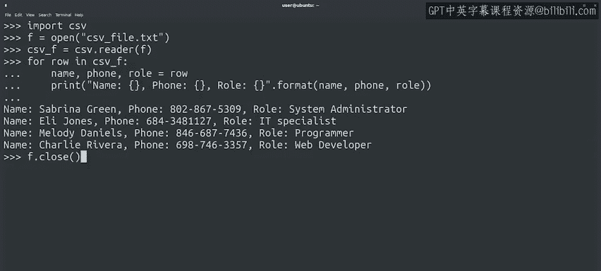

#  097：读取CSV文件 📄

## 概述


在本节课中，我们将学习如何使用Python读取CSV文件。CSV是一种常见的数据存储格式，Python的标准库提供了专门的模块来处理它。我们将从理解CSV格式的基本结构开始，逐步学习如何打开文件、使用csv模块解析数据，并最终提取和操作文件中的信息。

## CSV格式简介

正如我们所说，CSV代表“逗号分隔值”。CSV是一种相当简单的格式。

这些文件以纯文本形式存储，CSV文件中的每一行通常代表一条数据记录。

每条记录中的每个字段由逗号分隔。字段的内容存储在逗号之间。

例如，如果我们要存储公司员工的信息，我们可能会这样存储数据：

```
Sabrina Green, 802-867-5309, System Administrator
```

观察这个例子，以“Sabrina”开头的那一行是一条数据记录。“Sabrina Green”代表姓名字段，后面跟着电话号码字段和角色字段。

## 使用Python的csv模块

Python的标准库包含一个让我们可以读取、创建和操作CSV文件的模块。

你想猜猜这个模块叫什么吗？如果你猜是`csv`，那就对了。

所有这些不言自明的名字让生活变得容易多了，对吧？

所以我们将使用csv模块。为此，我们需要像导入其他模块一样导入它。

```python
import csv
```

## 打开并解析CSV文件

在解析CSV文件之前，我们需要像以前一样打开文件。

```python
file = open('employees.csv')
```

现在，我们可以使用csv模块来解析这个文件。

```python
reader = csv.reader(file)
```

好的，这给了我们一个CSV读取器类的实例。我们现在可以遍历其内容并访问它解析出的信息。

```python
for row in reader:
    # 处理每一行
```

## 访问和解析数据

现在，`row`变量将保存CSV文件中的每一行。

这个变量是一个列表，CSV中的每个字段对应列表中的一个元素。

根据前面的信息，我们知道第一个字段是姓名，第二个是电话号码，第三个是角色。

所以我们可以解包这些值，以便使用变量来引用它们。

```python
for row in reader:
    name, phone, role = row
```

请记住，要使此操作生效，我们需要在等号左侧拥有与右侧序列长度完全相同的变量数量。

## 使用解包后的数据

既然我们已经解包了这些值，让我们将它们打印到屏幕上。

```python
for row in reader:
    name, phone, role = row
    print(f"Name: 数据科学与人工智能笔记（一）, Phone: {phone}, Role: {role}")
```

正如我们提到的，我们解包行数据是为了不必使用索引来访问列表中的每个元素。

例如，我们本可以使用`row[0]`来访问员工的姓名。这是有效的，但在阅读大量代码时可能难以理解。

将列表解包到有意义的变量名中，可以使代码在后续阅读时更容易理解。

## 关闭文件

在我们忘记之前，既然我们已经处理完文件，现在让我们关闭它。



```python
file.close()
```

## 总结

本节课中，我们一起学习了如何读取和遍历CSV文件。我们了解了CSV文件的基本结构，掌握了使用Python内置的`csv`模块来打开、解析和提取数据的方法，并学习了通过解包操作使代码更清晰易读的技巧。

接下来，我们将讨论如何生成你自己的CSV文件。