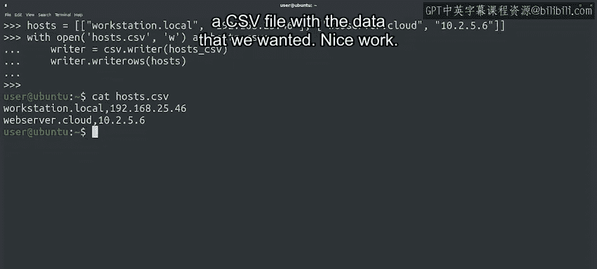

#  098：生成 CSV 文件 📄

在本节课中，我们将学习如何使用 Python 的 CSV 模块来生成和写入 CSV 文件。我们将从创建数据开始，逐步完成文件的写入过程，并最终验证生成的文件内容。


---

## 从读取到写入

上一节我们介绍了如何使用 CSV 模块的 `reader` 函数来读取 CSV 文件的内容。本节中，我们来看看如何使用 `writer` 函数向文件写入内容。

当你在脚本中处理了一些数据，并希望将其存储到文件中时，这个功能会非常有用。例如，你可能希望将数据导入电子表格，或在后续的脚本中再次使用它。

## 准备要写入的数据

我们首先需要将想要写入的数据存储在一个列表中。以下是创建列表的示例，该列表包含了我们网络中机器的名称及其对应的 IP 地址。

```python
hosts = [["workstation.local", "192.168.25.46"], ["webserver.cloud", "10.2.5.6"]]
```

## 以写入模式打开文件

准备好数据后，让我们以写入模式打开目标文件。我们将使用之前见过的 `with` 代码块，以确保文件会被正确关闭。

```python
with open('hosts.csv', 'w') as hosts_csv:
    # 写入操作将在此进行
```

## 创建 CSV Writer 对象

现在文件已为写入而打开，我们可以调用 CSV 模块的 `writer` 函数，并将打开的文件作为参数传入。

```python
    writer = csv.writer(hosts_csv)
```

此时，`writer` 变量成为了 CSV writer 类的一个实例。

## 写入数据到文件

CSV writer 对象提供了两个主要的写入方法：
*   `writerow()`: 一次写入一行数据。
*   `writerows()`: 一次性写入所有数据。

由于我们已经准备好了所有要写入的数据，因此我们将使用 `writerows()` 方法。

```python
    writer.writerows(hosts)
```

## 验证生成的文件

操作完成后，我们已经成功将数据写入了 CSV 文件。在继续之前，让我们使用 Python 之外的工具（如 `cat` 命令）来查看生成文件的内容。

文件内容应如下所示：
```
workstation.local,192.168.25.46
webserver.cloud,10.2.5.6
```

我们的代码运行成功，并生成了包含所需数据的 CSV 文件。

---



## 总结与展望

本节课中，我们一起学习了如何使用 Python 的 CSV 模块生成 CSV 文件。我们经历了准备数据、打开文件、创建写入器对象以及最终写入数据的完整流程。

我们进展顺利，让我们继续前进。在下一个视频中，我们将学习如何使用字典来读写 CSV 文件。我们下节课再见。