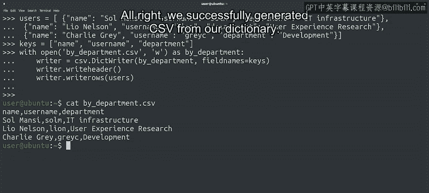

#  099：使用字典读写CSV文件 📂➡️📊


## 概述

在本节课中，我们将要学习如何使用Python的`csv`模块，以更灵活、更易读的方式处理CSV文件。我们将重点介绍`csv.DictReader`和`csv.DictWriter`这两个工具，它们允许我们使用列名（键）而非列的位置来访问和写入数据，这对于处理包含多列或列名已知的文件尤其有用。

---

## 使用`DictReader`读取CSV文件

在之前的示例中，我们学习了如何读写CSV文件，并在Python端使用列表（`list`）作为数据类型。当你知道每个字段的含义时，这种方法很有效。

但是，当CSV文件包含很多列，并且你需要记住哪一列对应哪个数据时，使用列表会变得相当繁琐。想象一下，如果你的员工列表不仅包含姓名、电话号码和角色，还包括入职日期、用户名、办公室位置、部门、首选代词等等。很快，跟踪哪一列对应行中的哪个位置就会变得困难。

对于这种情况，CSV文件通常会将列名作为文件的第一行，如下例所示。这个CSV文件列出了公司内部使用的一系列程序，包括最新版本、当前开发状态和使用人数。

我们可以利用这个额外的信息，通过使用`csv.DictReader`来读取文件。`DictReader`是`csv`模块提供的另一个读取器，它将CSV文件中的每一行数据转换成一个字典。这样，我们就可以使用列名而不是行中的位置来访问数据。

以下是使用`DictReader`的步骤：

1.  打开CSV文件。
2.  创建一个`DictReader`对象来处理CSV数据。
3.  遍历行，使用字典键（即列名）访问每行的信息。

让我们看看代码示例：

```python
import csv

with open('software.csv') as software:
    reader = csv.DictReader(software)
    for row in reader:
        print(("{} has {} users").format(row['name'], row['users']))
```

在这段代码中，我们使用`row['name']`和`row['users']`来获取程序名称和用户数量，而不是依赖列的索引位置。

执行这段代码，我们将成功打印出我们想要的两个字段的内容。

这里有两个要点需要强调：
*   第一，文件中字段的顺序无关紧要，我们可以直接使用字段名。
*   第二，从输出可以看到，程序“Chty Chicken”仍处于Alpha测试阶段，所以只有4个用户。不过，这个名字听起来很有潜力。

---

## 使用`DictWriter`写入CSV文件

类似地，我们可以使用`csv.DictWriter`，根据一个字典列表的内容来生成CSV文件。这意味着列表中的每个元素将成为文件中的一行，而每个字段的值将来自每个字典。

为了使写入器正常工作，在创建`DictWriter`对象时，我们还需要传递一个我们想要存储到文件中的键（列名）的列表。

让我们通过一个例子来了解其工作原理。首先，我们需要一个包含要存储数据的字典列表。在这个例子中，我们希望存储公司用户及其所在部门的数据。

以下是我们的字典列表，每个字典包含`name`、`username`和`department`这些键：

```python
users = [{'name': 'Sol Mansi', 'username': 'solm', 'department': 'IT infrastructure'},
         {'name': 'Lio Nelson', 'username': 'lion', 'department': 'User Experience Research'},
         {'name': 'Charlie Grey', 'username': 'greyc', 'department': 'Development'}]
```

现在，我们想将这个列表写入文件，代码如下：

```python
import csv

keys = ['name', 'username', 'department']
with open('by_department.csv', 'w') as by_department:
    writer = csv.DictWriter(by_department, fieldnames=keys)
    writer.writeheader()
    writer.writerows(users)
```

代码执行步骤如下：
1.  首先，定义要写入文件的键（列名）列表。
2.  然后，以写入模式（`'w'`）打开目标文件。
3.  接着，创建`DictWriter`对象，并传入之前定义的键列表。
4.  最后，在写入器上调用两个方法：
    *   `writeheader()`方法会根据我们传入的键创建CSV文件的第一行（标题行）。
    *   `writerows()`方法会将字典列表转换为文件中的行。

让我们检查一下是否成功生成了CSV文件。运行代码后，我们成功地从字典数据生成了CSV文件。

---

## 总结与回顾



在本节课中，我们一起学习了如何使用Python高效地处理CSV文件。

我们首先回顾了使用列表处理CSV的局限性，特别是在列数众多时。接着，我们引入了`csv.DictReader`，它允许我们通过列名（字典键）来读取数据，使代码更清晰、更易维护。

然后，我们学习了`csv.DictWriter`，它使我们能够轻松地将一个字典列表写入CSV文件，并自动生成标题行。

通过掌握这些工具，你现在可以更灵活地读写结构化的表格数据，这是IT自动化任务中处理日志、配置或报告文件的必备技能。

---

你已经掌握了文件管理的核心知识，包括读取、写入文件和目录，以及读写CSV文件。你从Python基础知识起步，并在短短几节课中取得了巨大进步。请记住，我们不要求你死记硬背所有内容，通过实践，你会逐渐掌握它们。

接下来，我们为你准备了另一份速查表，其中总结了本节课涵盖的所有内容。你可以在需要回顾CSV文件操作时随时查阅。

看完速查表后，请前往测验，用你新学的知识来检验一下学习成果吧。