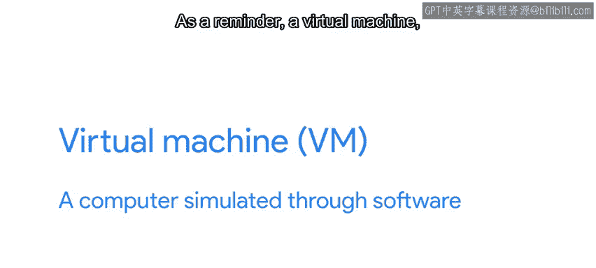
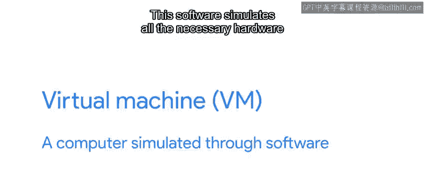
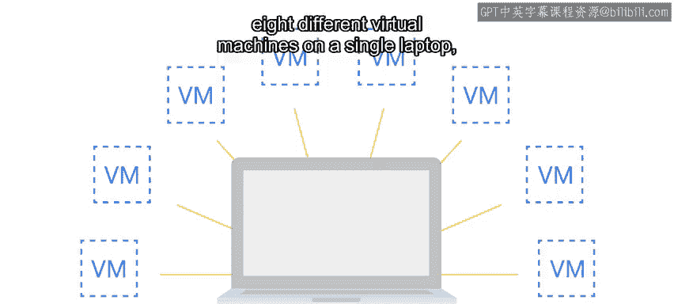
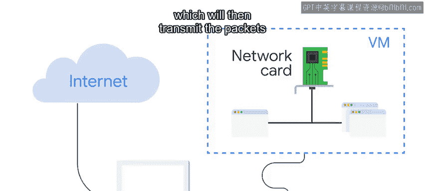
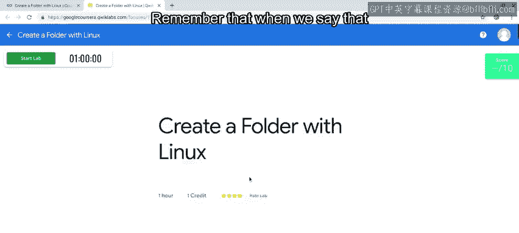
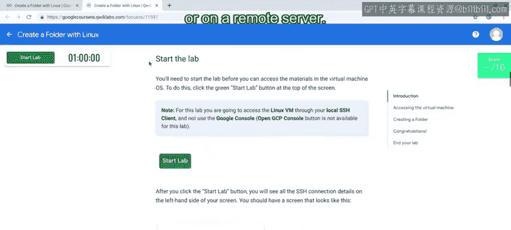
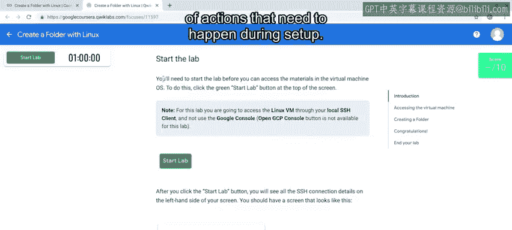
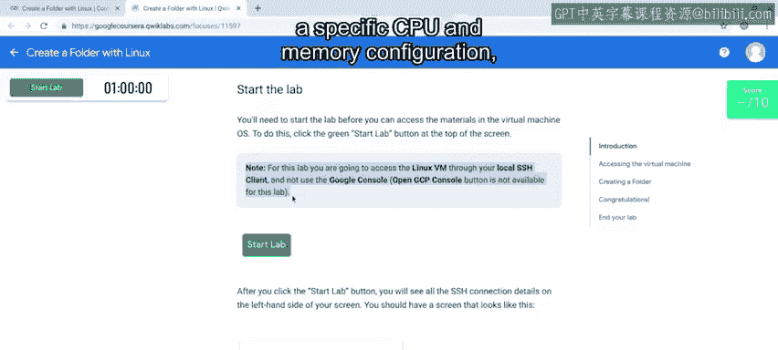

#  100：什么是Qwiklabs？ 🖥️

在本节课中，我们将学习Qwiklabs在线学习平台。这个平台是本课程及后续项目中用于完成分级评估的核心工具。我们将了解什么是Qwiklabs、它如何工作，以及为什么选择它来帮助我们学习Python脚本和IT自动化。

---

## 概述：Qwiklabs简介

在本课程的评估环节，我们将使用Qwiklabs在线学习平台。在开始第一个实验之前，让我们先深入了解Qwiklabs。

Qwiklabs是一个在线学习环境，它能引导你体验IT专家可能遇到的真实场景。

Qwiklabs与谷歌云控制台协同工作，以启动和创建虚拟机。

---

## 什么是虚拟机？

虚拟机，简称VM，是通过软件模拟的计算机。

这个软件为运行在机器内部的操作系统模拟所有必要的硬件。

对于某些模拟硬件，虚拟机将使用底层硬件的一部分进行模拟。

例如，你可以在单台笔记本电脑上运行八个不同的虚拟机，甚至更多。

每个虚拟机都分配一部分磁盘空间、内存和CPU时间。

在其他情况下，它会通过与物理机器上运行的操作系统通信来模拟硬件。

例如，虚拟机将使用一个模拟网卡与外部世界通信。

流经该模拟网卡的网络数据包将在运行虚拟机的软件和物理机器的操作系统之间传输。

然后，操作系统会通过物理网络传输这些数据包。

虚拟机已成为许多IT部门的主要工具，因为它们允许我们按需创建新的虚拟计算机。

我们也可以在不再需要时回收它们使用的资源。

例如，如果你想使用仅在某特定操作系统上可用的软件，那么创建一个新虚拟机、使用该软件，然后在使用完毕后删除虚拟机，会更容易。

回想起来，我真希望在我最初学习Python时就有虚拟机可以练习。

我主要通过书籍和在线视频学习。为了练习，我会找一些数学例题，并尝试通过编写代码来解决它们。

模拟真实世界的应用几乎是不可能的，比如在没有一堆服务器的情况下，寻找练习编写自动化脚本的方法。

如果当时有虚拟机可以练习，那该多酷啊。

---

## Qwiklabs如何工作？ ☁️

于是，Qwiklabs登场了。这些虚拟机运行在云端，因此无论你在哪里，都可以通过互联网访问它们。

请记住，当我们说某项服务运行在云端时，意味着它运行在数据中心或远程服务器上。

每个实验在设置期间都有一个预配置的操作列表。

这包括启动一个具有特定CPU和内存配置的虚拟机，并为该虚拟机安装特定的操作系统。

实验还将配置练习所需的任何其他云资源。

这可能包括为虚拟机添加额外的虚拟磁盘，或者第二台机器。

在实验过程中，你可以使用SSH命令访问为你创建的Qwiklabs实例，该命令允许你与远程Linux计算机交互。

你可以像使用运行Linux的物理机器一样操作虚拟机。

一旦实验完成，Qwiklabs会销毁这台虚拟机。这样，虚拟机使用的任何CPU、内存和存储资源都会返回到提供商的可用资源池中。

这些资源也可以被其他执行不同工作的虚拟机使用。

---

## 如何使用Qwiklabs？

在本视频之后，我们将提供关于如何访问和完成实验的详细说明。

你将在这个项目以及本课程的其他部分使用Qwiklabs，因此花些时间熟悉它是很有必要的。

Qwiklabs是一个强大的工具，我们将在这个课程以及项目的其余部分使用它。

通过Qwiklabs，你将获得通过脚本解决现实世界任务的经验。

当然，你需要知道Qwiklabs如何工作，但同样重要的是记住我们为什么选择这个工具。

它将让你在Python脚本学习的旅程中不断建立信心。

在下一个视频和阅读材料中，我们将提供更多关于如何登录Qwiklabs以完成本课程评估的信息。如果你需要帮助，随时可以回顾这些内容。

---

## 总结

本节课中，我们一起学习了Qwiklabs在线学习平台。我们了解到它是一个基于云端的实践环境，通过提供预配置的虚拟机，让我们能够安全、便捷地体验真实的IT任务和编写自动化脚本。理解虚拟机的工作原理以及Qwiklabs如何管理这些资源，是有效利用这个强大工具的第一步。准备好，我们即将开始动手实践。