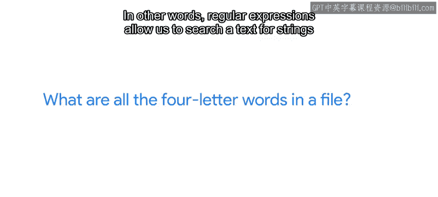
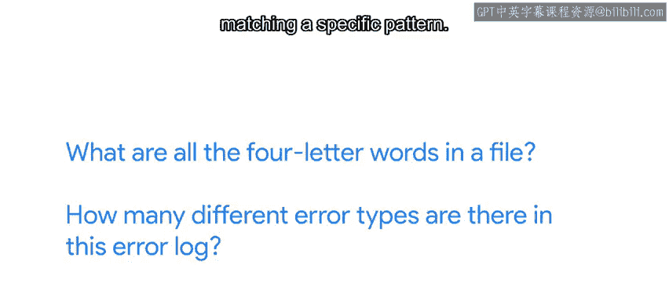
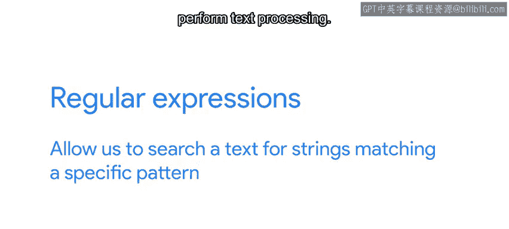

#  103：什么是正则表达式？🔍

在本节课中，我们将要学习正则表达式的基本概念、用途及其在IT自动化中的重要性。正则表达式是一种强大的文本处理工具，能帮助我们高效地搜索、匹配和处理字符串。

---

我们之前提到会讨论正则表达式。那么，这些表达式是什么？为什么它们被称为“正则”？正则表达式，常缩写为RegEx或RegX，本质上是一种用字符串模式表达的文本搜索查询。当你针对特定文本运行搜索时，任何与你指定的正则表达式模式匹配的内容都会作为搜索结果返回。

正则表达式让你能够回答诸如“文件中所有四个字母的单词是什么？”或“这个错误日志中有多少种不同的错误类型？”等问题。

换句话说，正则表达式允许我们根据特定模式搜索文本中的字符串。

---

了解正则表达式对任何需要执行文本处理的人都非常有用。从IT专家到软件工程师、系统管理员和数据分析师，掌握正则表达式的基础知识都是一项方便的工具。作为一名系统管理员，当我需要从包含其他信息的文件中提取信息时，就会使用正则表达式。例如，如果我有一个列出NFS挂载和选项的文件，并且我只想提取服务器名称，我可以编写一个正则表达式来去除每行的多余数据，只返回我需要的信息列表。

正则表达式在IT领域是一个相当广泛的话题。在本课程中，我们将涵盖最重要的部分，但不会涉及所有内容。对于你的脚本编写，基本的正则表达式通常足以让你入门，并且它们将增强你的程序处理文本的能力。随着时间和练习，你将掌握更高级的技术。

---

我们可以通过多种方式应用正则表达式。我们可以在各种编程语言中使用它们，当然也包括Python。我们也可以使用支持正则表达式的命令行工具，如`grep`、`sed`或`awk`。我们甚至可以在文本处理工具（如代码或文档编辑器）中使用正则表达式。与其他广泛使用的技术一样，有许多工具都集成了正则表达式，实现细节可能因工具或语言而异，但幸运的是，其基本原理始终相同。一旦我们学会了基础知识，就可以很快地将相同的概念应用到不同的应用程序中。

---

在接下来的几个视频中，我们将探索处理正则表达式的Python模块。我们将了解如何将正则表达式应用于脚本读取的文本的处理、解析和意义提取。我们还将查看一系列不同的示例，在这些示例中，我们可以使用正则表达式来解决一些实际问题。

---

本节课中我们一起学习了正则表达式的定义、核心用途及其在IT自动化中的广泛应用。正则表达式是一种通过模式匹配来搜索和处理文本的强大工具，掌握它将极大提升你处理文本数据的效率。在接下来的课程中，我们将深入实践，学习如何在Python中使用正则表达式。