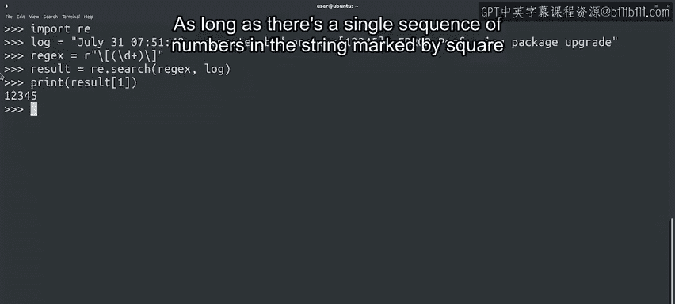

#  104：为什么使用正则表达式？🔍

在本节课中，我们将要学习正则表达式的基本概念，并理解为什么在处理文本时，正则表达式比简单的字符串查找更强大、更灵活。


---

此时，你可能会想：为什么我需要比在文本中查找字符串更强的处理能力？毕竟，我已经知道如何在Python中查找字符串了。

答案在于正则表达式的强大功能和灵活性。

---

## 从具体问题出发

例如，假设我们有一些日志条目，其典型的日志行格式如下所示：

```
Jan 31 00:09:39 ubuntu.local ticky: INFO Created ticket [#12345] (username)
```

我们想从这一行中提取进程标识符，即方括号之间的数字 `12345`。

在这条日志行中，有很多我们不需要的额外文本，比如日期、计算机名和其他信息。

---

## 尝试使用字符串索引方法

我们可以使用字符串的 `index` 方法来查找字符串中的第一个方括号，从而提取进程ID。

请记住，访问字符串时，字符的索引是该字符在字符串中的位置，从零开始计数。

在这个例子中，第一个方括号的索引是 **39**。

如果我们不想捕获方括号本身，我们将从下一个位置开始，并包括其后的五个字符。

让我们试一试。

```python
log_line = "Jan 31 00:09:39 ubuntu.local ticky: INFO Created ticket [#12345] (username)"
first_bracket_index = log_line.index('[')
process_id = log_line[first_bracket_index + 1: first_bracket_index + 6]
print(process_id)  # 输出：12345
```

---

## 潜在的问题

虽然我们得到了想要的文本，但未来可能会遇到一些问题。你能发现它们吗？

以下是可能遇到的问题：

1.  **长度不确定**：我们无法确定在所有情况下进程ID字符串的长度。在这个例子中，我们看到它是五个字符长，但随着计算机或进程数量的增加，这个长度将来可能会改变。
2.  **格式变化**：如果由于任何原因，该行在进程ID之前包含了另一个方括号，这种方法也会失效。

所以，这是一个解决方案，但非常脆弱。

---

## 更强大的解决方案：正则表达式

还有其他想法吗？

我们可以使用正则表达式以更健壮的方式提取进程ID。

为此，我们将导入 `re` 模块，它允许我们使用 `search` 函数在字符串中查找正则表达式。

```python
import re

log_line = "Jan 31 00:09:39 ubuntu.local ticky: INFO Created ticket [#12345] (username)"
pattern = r"\[(\d+)\]"
match = re.search(pattern, log_line)
if match:
    process_id = match.group(1)
    print(process_id)  # 输出：12345
```

---

## 正则表达式的优势

只要字符串中有一个由方括号标记的单一数字序列，这个正则表达式就会为我们提取出这些数字。



无论进程ID出现在哪里，或者日志行是长是短，这个正则表达式都能工作。

如果此时存储在 `pattern` 变量中的正则表达式看起来像天书，请不要担心，这是正常的。

我们将在接下来的视频中探索其语法以及如何使用这些表达式。

---

## 本节小结

本节课中，我们一起学习了正则表达式的基本动机。

目前的关键要点是：**正则表达式是既强大又灵活的工具**。

到本模块结束时，你将能够阅读和解析像本例中这样的语句。

我们有了一个良好的开端。接下来，我们将学习如何使用 `grep` 命令进行一些非常基础的匹配。