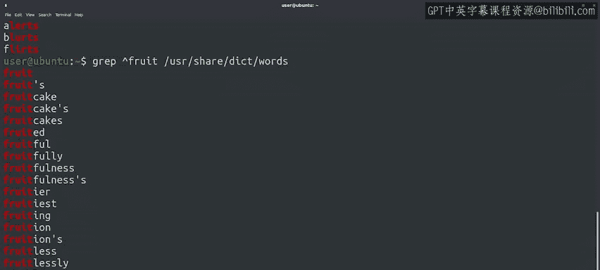

#  105：使用 grep 进行基本匹配 🎯


在本节课中，我们将学习如何使用 `grep` 命令进行基本的文本匹配。`grep` 是一个功能强大且易于使用的命令行工具，它允许我们使用正则表达式来搜索和匹配文本。通过本节课的学习，你将掌握 `grep` 的基本用法，并了解如何使用简单的正则表达式进行文本匹配。

---

## 基本匹配示例

在上一节中，我们通过一个复杂的正则表达式从 Python 程序中查找处理过的 ID。这只是我们在处理 Python 脚本文本时可能遇到的一个例子。除了 Python，我们还可以在命令行工具中使用正则表达式。`grep` 是一个特别容易使用且功能强大的工具，适用于应用正则表达式。它是尝试和熟悉正则表达式的绝佳方式。

接下来，我们来看看如何使用 `grep` 进行基本匹配。

### 最简单的匹配：搜索字符串是否存在

记住，`grep` 的工作原理是打印出任何匹配我们传入查询的行。因此，最简单的查询是传入一个普通的字符串。`grep` 会打印出文件中包含该字符串的所有行。

让我们尝试使用 `grep` 在 `/usr/share/dict/words` 文件中查找单词。这个文件是一些拼写检查程序用来验证单词是否存在。该文件每行包含一个单词。

我们将从查找包含字符串 "thawn" 的单词开始。看看会发生什么。

```bash
grep "thawn" /usr/share/dict/words
```

当我们以 "thawn" 作为匹配模式调用 `grep`，并传入单词列表作为文件时，我们会看到它匹配了许多不同的单词。这些单词都包含字符串 "thawn"，因此它们出现在结果中。输出还会高亮显示，以不同颜色展示匹配的部分。

这种视觉指示是 `grep` 为我们提供的，以便我们轻松查看匹配发生的位置。

需要注意的是，我们传递给 `grep` 的字符串是区分大小写的，因此必须完全匹配。如果我们使用大写字母，它们只会匹配大写字母。如果我们希望不区分大小写地匹配字符串，我们需要向 `grep` 命令传递 `-i` 参数，如下所示：

```bash
grep -i "thawn" /usr/share/dict/words
```

---

## 正则表达式的特殊字符

现在我们知道，任何基本字符串本身就是一个正则表达式，它会匹配包含该字符串的行。为了充分利用正则表达式，我们需要学习更多语法，这些语法既复杂又强大。特别是，我们必须了解那些为我们创建的模式赋予额外含义的保留字符。

正是这些字符使我们能够进行比仅检查字面字符串更高级的匹配。例如，点号 `.` 匹配任何字符。这意味着如果我们在表达式中包含一个点号，该点号就是一个通配符，可以在结果中被任何其他字符替换。

让我们看一个例子：

```bash
grep "l.rts" /usr/share/dict/words
```

这个模式匹配三个不同的单词：alerts、blurts 和 flirts。注意，对于每个单词，我们模式中的点号都被不同的字母替换。

你是否开始看到正则表达式的强大之处？通过它们，我们可以找到匹配给定模式的文本部分，即使模式不是整个单词。例如，我们可以使用它来查找日志文件中匹配特定格式的条目，或者查找 CSV 文件中具有相同特征的行，即使它们不完全相同。这非常有用，对吧？

---

## 锚定字符：^ 和 $

其他可以在正则表达式中使用的特殊字符的简单例子是脱字符 `^` 和美元符号 `$`，它们是锚定字符。这些字符告诉我们正则表达式应该从行的哪个位置开始匹配。

`^` 表示行的开头，`$` 表示行的结尾。例如，要查找所有以字符串 "fruit" 开头的单词，我们可以这样写：

```bash
grep "^fruit" /usr/share/dict/words
```

看看正则表达式如何成为一个极其有用的工具。让我们再看一个例子。我们将使用 `grep` 查找所有以 "cat" 结尾的单词：



```bash
grep "cat$" /usr/share/dict/words
```

这工作得非常完美。你现在开始理解了吗？

需要记住的一点是，`^` 和 `$` 专门匹配行的开头和结尾，而不是字符串。以日志文件为例，每行包含许多不同的单词。我们可以使用 `^` 检查一行是否以某个模式开头，或者使用 `$` 检查一行是否以某个模式结尾。但我们的模式只有在行符合这些条件时才会匹配，而不是包含的单词。

---

## 总结

在本节课中，我们一起学习了如何使用 `grep` 进行基本文本匹配。我们了解了 `grep` 的基本用法，包括如何搜索字符串是否存在，以及如何使用特殊字符如点号 `.`、脱字符 `^` 和美元符号 `$` 进行更高级的匹配。这些工具使我们能够高效地处理文本数据，无论是在日志文件、CSV 文件还是其他文本格式中。正则表达式虽然语法复杂，但通过逐步学习和实践，你将能够掌握其强大功能。