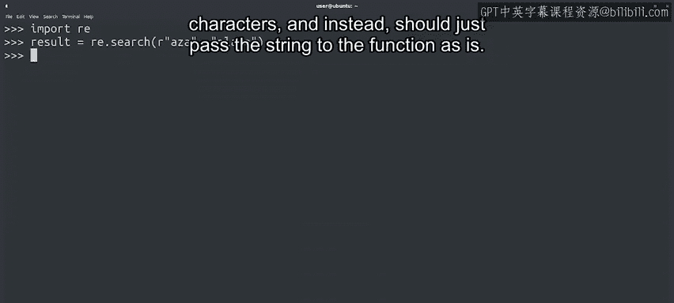
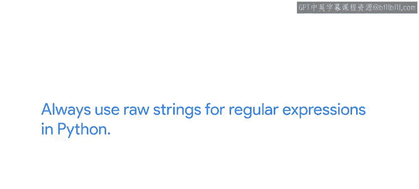
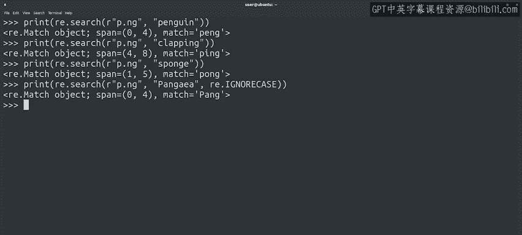

#  106：在Python中进行简单匹配 🐍


在本节课中，我们将学习如何在Python中使用`re`模块进行基本的正则表达式匹配。我们将从导入模块开始，逐步探索如何使用`search()`函数查找字符串中的模式，并理解返回的匹配对象。

---

## 概述

正则表达式是处理文本的强大工具。在Python中，我们使用`re`模块来应用正则表达式。本节课将介绍如何使用该模块进行基础的字符串匹配，包括如何编写模式、执行搜索以及解读结果。

---

## 导入re模块

首先，我们需要导入Python的`re`模块。这个模块包含了许多用于操作字符串的函数。

```python
import re
```

---

## 使用search()函数进行匹配

上一节我们介绍了`re`模块，本节中我们来看看如何使用它的`search()`函数进行基础匹配。

我们在`re`模块上调用`search()`函数，并让它对字符串“Plaza”使用模式“Aza”。然后将该函数的返回值存储在`result`变量中。



```python
result = re.search(r"Aza", "Plaza")
```

模式开头的`r`表示这是一个原始字符串。这意味着Python解释器不应尝试解释任何特殊字符，而应原样将字符串传递给函数。

在这个例子中，没有特殊字符。原始字符串和普通字符串完全相同，但在Python中为正则表达式始终使用原始字符串是一个好习惯。



因此，我们将在所有示例中使用原始字符串。

---

## 解读匹配结果

说完这些，让我们打印`result`变量的结果，看看我们得到了什么。

```python
print(result)
```

很好，我们的结果是一个匹配对象。调用`print`时得到的输出已经显示了一些有趣的信息，例如匹配在字符串中的位置以及实际匹配的字符串是什么。

让我们用另一个单词再试一次。

```python
result = re.search(r"Aza", "Plaza")
print(result)
```

在这种情况下，我们可以看到`span`属性不同。这是因为匹配的子字符串在字符串内部的位置不同。然而，匹配的子字符串仍然是相同的，因为我们是用纯字符串进行匹配，还没有使用特殊语法。

---

## 处理无匹配的情况

如果你传递一个与表达式不匹配的字符串，你认为会发生什么？让我们尝试找出答案。

```python
result = re.search(r"Aza", "mountain")
print(result)
```

你猜对了吗？如果表达式与我们传递的字符串不匹配，我们会得到`None`作为结果。请记住，`None`是Python使用的一个特殊值，用于表示那里没有实际值。

因此，当我们应用正则表达式时，我们现在知道，如果`search()`函数返回`None`，就意味着它没有找到匹配项。

---

## 练习特殊字符

让我们用几个例子来练习到目前为止我们见过的特殊字符。

以下是使用特殊字符的示例：

我们告诉`search()`函数在字符串“xenon”上使用模式`^X`。我们可以看到，正如我们预期的那样，它在行首匹配了我们的“X”。

```python
result = re.search(r"^X", "xenon")
print(result)
```

如果我们使用可以匹配任何字符的点`.`，会发生什么？

现在我们使用`P.ng`作为搜索模式。它匹配我们传递的单词“penguin”，在匹配对象中，我们看到匹配的字符串是“pen”。

```python
result = re.search(r"P.ng", "penguin")
print(result)
```

让我们用另外几个字符串试试看。

```python
print(re.search(r"P.ng", "clapping"))
print(re.search(r"P.ng", "sponge"))
```

很好，所以在这里我们可以看到，`match`属性始终具有与搜索模式匹配的实际子字符串的值，而`span`属性则指示该子字符串在我们传递的字符串中的查找范围。

---



## 使用搜索选项

我们还可以向`search()`函数传递额外的选项。例如，如果我们希望匹配不区分大小写，可以通过传递`re.IGNORECASE`选项来实现。

```python
result = re.search(r"p.ng", "Pangaea", re.IGNORECASE)
print(result)
```

---

## 总结

本节课中我们一起学习了如何在Python中应用基础的正则表达式。我们现在知道如何使用`re.search()`函数进行匹配，如何解读返回的匹配对象，以及如何处理无匹配的情况。我们还练习了使用`^`、`.`等特殊字符，并了解了如何通过`re.IGNORECASE`等选项使搜索不区分大小写。

你现在可以使用本地的Python安装来练习这些以及你能想到的任何其他正则表达式示例。不妨自己动手实验一下，直到你感到得心应手。慢慢来，你会掌握它的。

接下来，我们将更深入地研究正则表达式的语法以及我们可以用它们做些什么。