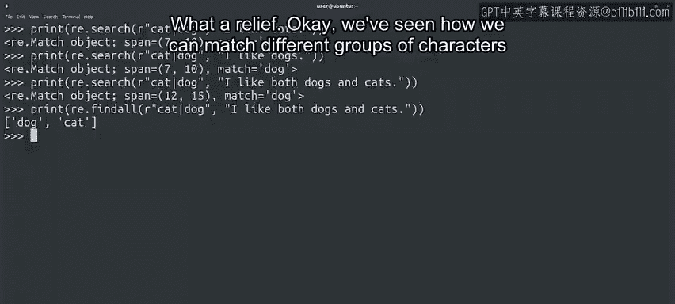

#  107：通配符与字符类 🧩


在本节课中，我们将要学习正则表达式中两个强大的功能：通配符和字符类。我们将了解如何使用点号（`.`）匹配任意字符，以及如何通过字符类（`[]`）精确匹配特定范围的字符。这些工具能帮助我们更灵活地处理文本数据，例如验证用户输入或筛选文件内容。

---

## 通配符：匹配任意字符

我们已经知道，在正则表达式中，点号（`.`）是一个特殊字符，可以匹配**任何单个字符**。

在正则表达式领域，这被称为**通配符**，因为它能匹配多种字符。

使用点号是最广泛的通配符，因为它能匹配**绝对任何字符**。

但如果我们想要更严格的匹配呢？例如，检查用户给出的答案是否包含有效字符，或者找出CSV文件中所有以元音字母开头的用户名。

为此，我们必须将通配符限制在特定字符范围内。为了实现这一目标，我们使用正则表达式的另一个功能：**字符类**。

---

## 字符类：匹配特定字符

字符类写在方括号（`[]`）内，允许我们列出想要匹配的字符。

例如，假设我们想匹配单词“Python”，但允许字母“P”既可以是小写也可以是大写。我们可以这样写：

```python
[Pp]ython
```

在方括号内，我们还可以使用连字符（`-`）定义字符范围。例如，我们可以使用`[a-z]`表示任何小写字母。

因此，如果我们想查找前面有任意字母的字符串“way”，可以这样编写表达式：

```python
[a-z]way
```

匹配成功！字符类定义的`[a-z]`被字母“h”匹配。

让我们尝试一个不同的字符串：

```python
" way"
```

这次没有匹配成功。这是因为字符串“way”前面是一个空格，而空格不在我们定义的范围内。

我们可以定义更多范围，例如`[A-Z]`匹配所有大写字母，或`[0-9]`匹配所有数字。

我们可以组合任意多个范围和符号，例如：

```python
[a-zA-Z0-9]
```

如你所见，我们可以匹配方括号内定义的任何内容。这非常有用，对吧？

---

## 排除字符类

虽然字符类非常有用，但有时我们可能想匹配**不在某个组内**的字符。为此，我们在方括号内使用脱字符（`^`）。

例如，让我们创建一个搜索模式，查找任何**不是字母**的字符：

```python
[^a-zA-Z]
```

在这个例子中，我们的模式匹配了句子中的第一个空格。

如果我们还想排除空格呢？你或许已经猜到了，因为我们在字符类中添加了空格，所以现在匹配的是句子末尾的句点，而句点不在排除的字符列表中。

---

## 使用管道符号匹配多个选项

如果我们想匹配一个表达式或另一个表达式，可以使用管道符号（`|`）来实现。这允许我们列出可以匹配的替代选项。

例如，我们可以编写一个表达式，匹配单词“cat”或“dog”：

```python
cat|dog
```

由于字符串包含子串“cat”，搜索函数可以找到它。

让我们尝试一个包含“dog”的例子：

```python
dog
```

这个表达式包含子串“dog”，所以我们找到了匹配。

让我们尝试一个同时包含“dogs”和“cats”的句子：

```python
"I like dogs and cats."
```

在这个字符串中，我们的搜索实际上有两个可能的匹配，但我们只得到第一个。这是搜索函数的工作方式。

如果我们想获取所有可能的匹配，可以使用`findall`函数，它也是`re`模块提供的：



```python
re.findall(r"cat|dog", "I like dogs and cats.")
```

使用`findall`，我们不需要在“cats”和“dogs”之间做出选择。真是松了一口气！

---

## 总结与过渡

好了，我们已经学习了如何匹配不同的字符组甚至完全不同的字符串。你是否开始理解这些概念了呢？正如我之前所说，这些东西有点棘手，请随时花时间自己练习这些函数。这些工具在IT领域非常有用，所以你肯定想熟练掌握它们。

现在，如果我们想多次匹配某个内容，你认为应该怎么做呢？一旦你准备好了，请在下一个视频中与我见面，一起找出答案。

---

本节课中，我们一起学习了正则表达式中的通配符和字符类。我们了解了如何使用点号匹配任意字符，如何通过字符类精确匹配特定范围的字符，以及如何使用管道符号匹配多个选项。这些技能将帮助你在IT自动化任务中更有效地处理文本数据。