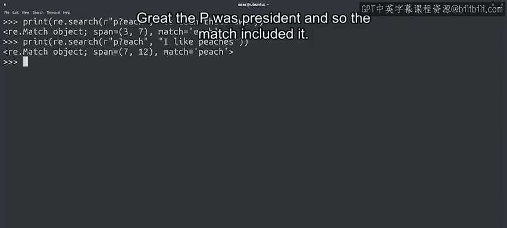

#  108：正则表达式重复修饰符详解 🧩


在本节课中，我们将要学习正则表达式中的重复修饰符。这些修饰符允许我们匹配字符的多次出现，从而更灵活地查找和提取文本中的模式。我们将探讨星号、加号和问号等修饰符的用法，并通过简单示例理解它们的工作原理。

---

## 匹配字符的多次出现

上一节我们介绍了如何匹配单个字符、字符组或任意字符。本节中，我们来看看如何匹配这些字符的多次出现。

假设我们想要在字符串中找到最长的单词，或者通过检查括号间的一串字母数字字符来查找日志文件中的主机名。我们可以使用正则表达式的另一个有趣概念——重复匹配来实现。

## 星号修饰符：匹配零次或多次

很常见的一种表达式是包含一个点号后跟一个星号：`.*`。这意味着匹配任意字符重复任意次数，包括零次。

以下是几个示例：

在纯英文中，你可以将这个模式解读为：匹配“pi”，后跟任意数量的其他字符，再后跟“n”。但通过我们的点星组合，我们将匹配范围扩展到了整个单词。

```python
import re
pattern = r'pi.*n'
text = 'pink'
result = re.search(pattern, text)
print(result.group())  # 输出：pink
```

点号如何为每个字母取不同的值？让我们尝试一个不同的字符串：“Python programming”。你认为模式会匹配什么？

```python
pattern = r'p.*n'
text = 'Python programming'
result = re.search(pattern, text)
print(result.group())  # 输出：Python programmin
```

你可能没有预料到这个结果。记住，星号会匹配尽可能多的字符。在编程术语中，我们称这种行为是“贪婪的”。可以修改重复修饰符使其不那么贪婪，但我们暂时不深入讨论。要了解更多信息，请查看后续阅读材料。

回到我们的例子，虽然我们的模式本可以匹配单词“Python”，但它一直扩展到了字符串中的最后一个“n”。如果我们只希望模式匹配字母，我们应该使用字符类来代替，像这样：

```python
pattern = r'p[a-z]*n'
text = 'Python programming'
result = re.search(pattern, text)
print(result.group())  # 输出：Python
```

记住，零次也是一种可能性。这将让字符串“pin”也匹配我们的模式。让我们试试看：

```python
pattern = r'pi.*n'
text = 'pin'
result = re.search(pattern, text)
print(result.group())  # 输出：pin
```

## 加号和问号修饰符

正如我们之前提到的，正则表达式的实现并不总是相同。重复修饰符是它们之间的一个差异点。一些实现（如GrP使用的）只包含我们刚刚讨论的星号修饰符。仅用星号修饰符就能做很多事情，所以这通常足够了。其他实现（如Python或EGp命令使用的）包括两个额外的重复修饰符：加号和问号，它们可以帮助我们构建更复杂的表达式。

### 加号修饰符：匹配一次或多次

加号字符匹配其前面字符的一次或多次出现。假设我们有模式 `O+L+`。让我们检查几个单词：

```python
pattern = r'O+L+'
texts = ['OL', 'OOLL', 'OoLL']
for text in texts:
    result = re.search(pattern, text)
    if result:
        print(f"匹配: {result.group()}")
    else:
        print(f"不匹配: {text}")
```

在这个例子中，每个字符出现了一次，匹配模式显示给我们最短的可能匹配字符串。这里，每个字符出现了两次。同样，我们可以看到匹配是整个满足条件的字符串。

让我们尝试一些不匹配的情况：

```python
pattern = r'O+L+'
text = 'OoLL'
result = re.search(pattern, text)
print(result)  # 输出：None
```

虽然我们的字符串中有一个“O”和一个“L”，但它们之间有另一个字符。因此，它不匹配搜索模式。这说得通吗？

### 问号修饰符：匹配零次或一次

问号符号是另一个乘数；它意味着其前面字符的零次或一次出现。让我们看看这是如何工作的：

```python
pattern = r'p?ython'
texts = ['ython', 'python']
for text in texts:
    result = re.search(pattern, text)
    if result:
        print(f"匹配: {result.group()}")
    else:
        print(f"不匹配: {text}")
```

“P”不存在，但使用问号，我们将其标记为可选的，所以我们仍然得到了匹配。让我们看看当“P”存在时会发生什么：

```python
pattern = r'p?ython'
text = 'python'
result = re.search(pattern, text)
print(result.group())  # 输出：python
```



很好，“P”存在，所以匹配包含了它。

---

## 总结

本节课中我们一起学习了正则表达式中的重复修饰符。我们探讨了星号（`*`）用于匹配零次或多次，加号（`+`）用于匹配一次或多次，以及问号（`?`）用于匹配零次或一次。这些修饰符使我们能够更精确地匹配文本中的模式，并理解贪婪匹配的概念。

如果你对任何内容不清楚，现在花些时间在你本地的Python环境中查看示例。我相信一旦你自己尝试过，你就会完全掌握它。

你刚刚学习了重复修饰符，我们看到了如何使用一堆特殊字符来匹配不同类型的字符串。但是，当我们想要实际匹配其中一个字符，比如美元符号或问号时，会发生什么？幸运的是，我们将在下一个视频中找出答案。