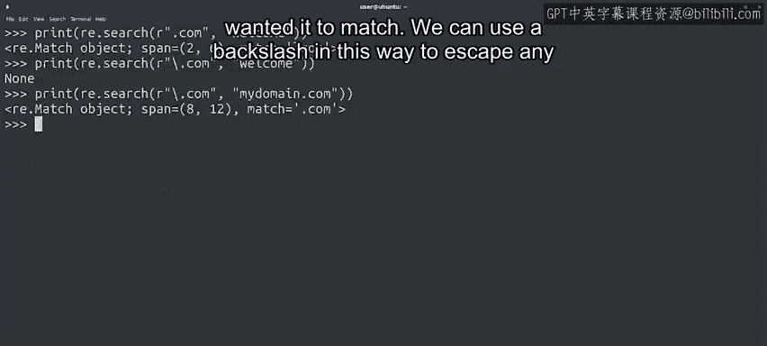
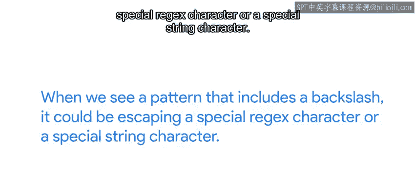
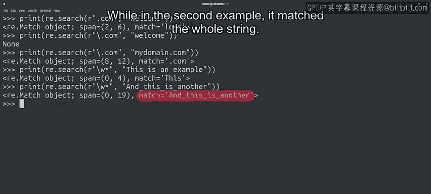
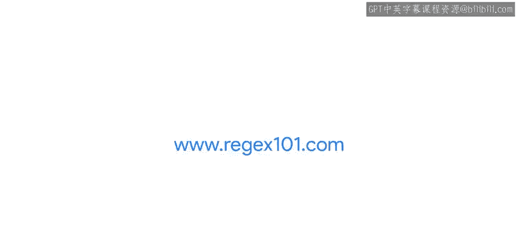

#  109：Python正则表达式中的转义字符 🧩


在本节课中，我们将要学习正则表达式中的一个重要概念：**转义字符**。我们将了解为什么需要转义特殊字符，以及如何使用反斜杠来匹配这些字符本身。此外，我们还会介绍一些由反斜杠引导的预定义字符集，并讨论如何避免因字符串转义而产生的混淆。

---

## 转义字符的必要性 🔍

上一节我们介绍了正则表达式中的多种特殊字符，如点号、星号、加号等。这些字符在正则表达式中有特殊含义，用于匹配不同类型的字符串。例如，点号 `.` 可以匹配**任何单个字符**。

但如果我们想要匹配这些特殊字符本身，比如匹配字符串中的实际点号，该怎么办呢？如果直接使用点号，它会匹配任意字符，而不是我们想要的实际点号。

以下是一个例子。假设我们想匹配包含“dotcom”的字符串，但直接使用点号会导致匹配到其他内容：

```python
import re
result = re.search(r".com", "welcome")
print(result)  # 输出匹配对象，因为它将 `.` 匹配为 `l`
```

为了匹配一个**实际的点号**，我们需要使用**转义字符**。在正则表达式中，转义字符是**反斜杠 `\`**。

```python
result = re.search(r"\.com", "welcome")
print(result)  # 输出 None，因为没有实际的 `.com`
```



通过转义点号，我们成功避免了错误匹配。现在，让我们尝试一个应该匹配的例子：

```python
result = re.search(r"\.com", "google.com")
print(result)  # 输出匹配对象，成功匹配 `.com`
```

通过添加反斜杠，我们让正则表达式正确地匹配了我们想要的内容。

---

## 转义其他特殊字符与潜在混淆 ⚠️



我们可以用同样的方式使用反斜杠来转义**任何特殊字符**，包括那些我们尚未讨论的字符。

但需要注意的是，反斜杠本身也可能引起混淆，因为它在Python字符串中也用于定义一些特殊字符序列。例如：
*   `\n` 表示换行符。
*   `\t` 表示制表符。

因此，当我们看到一个包含反斜杠的模式时，它可能是在转义正则表达式的特殊字符，也可能是在表示一个特殊的字符串字符。

---

## 使用原始字符串和预定义字符集 🛡️

为了避免这种潜在的混淆，我们一直使用**原始字符串**（在字符串前加 `r`）来定义正则表达式模式。在原始字符串中，反斜杠不会被Python解释为字符串转义字符，而只会被正则表达式引擎解释。

```python
# 使用原始字符串
pattern = r"\n"  # 这里 \n 会被正则表达式引擎解释为“匹配换行符”
# 而非原始字符串
pattern = "\n"   # 这里 \n 在字符串生成时就被解释为换行符，然后再传给正则表达式引擎
```



此外，Python的正则表达式还使用反斜杠定义了一些**预定义字符集**，这些序列代表了常用的字符类别：

以下是几个重要的预定义字符集示例：
*   `\w`：匹配任何字母、数字或下划线（等价于 `[a-zA-Z0-9_]`）。
    ```python
    re.search(r'\w+', 'hello world')  # 匹配 'hello'
    re.search(r'\w+', 'user_name123') # 匹配整个字符串 'user_name123'
    ```
*   `\d`：匹配任何数字（等价于 `[0-9]`）。
*   `\s`：匹配任何空白字符（如空格、制表符 `\t`、换行符 `\n`）。
*   `\b`：匹配单词边界。

---

## 学习资源与总结 📚

一下子接触这么多新字符和序列，你可能会觉得有些复杂。但请不用担心，你不需要记住所有内容。

以下是两个非常有用的资源：
1.  **速查表**：你可以随时查阅正则表达式速查表，来查找每个序列代表的含义。
2.  **在线测试工具**：例如 **regex101.com** 这类网站。你可以在这里测试你的正则表达式，分析模式的每个部分，并在表达式不工作时找出问题所在。



你已经掌握了非常多的知识，这些努力即将得到回报。接下来，我们将开始创建一些更复杂的模式，并将它们应用到实际场景中。

---

本节课中我们一起学习了：
1.  使用反斜杠 `\` 作为**转义字符**，来匹配正则表达式中的特殊字符本身（如 `\.` 匹配点号）。
2.  反斜杠在Python字符串和正则表达式中可能引起的**混淆**，以及使用**原始字符串**（`r"pattern"`）来避免它。
3.  由反斜杠引导的一些**预定义字符集**，如 `\w`（单词字符）、`\d`（数字）、`\s`（空白符）。
4.  利用在线工具和速查表来辅助学习和调试正则表达式。