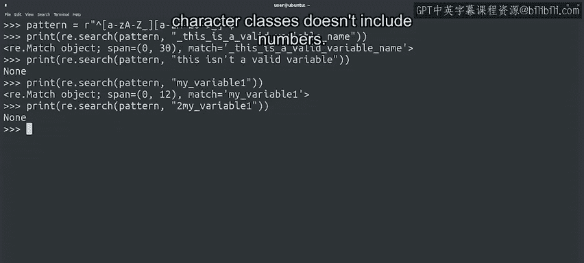

#  110：正则表达式实践 🧩

在本节课中，我们将学习如何组合使用正则表达式的特殊字符来构建匹配特定文本的模式。我们将通过两个具体示例——匹配以特定字母开头和结尾的国家名称，以及验证Python变量名的有效性——来巩固对正则表达式语法的理解。

---

上一节我们介绍了正则表达式的基本语法，本节中我们来看看如何将这些特殊字符组合起来，解决实际问题。

## 匹配特定模式的国家名称

假设我们有一个包含所有国家名称的列表，我们想找出哪些国家的名字以字母“A”开头并以字母“a”结尾。

我们最初尝试的模式可能是：`A.*a`。这个模式表示以大写字母“A”开头，中间是任意数量的任意字符（`.*`），最后以小写字母“a”结尾。

让我们测试一下这个模式。它似乎能匹配“Australia”。但当我们测试“Azerbaijan”时，它也被匹配了，尽管这个名字并非以“a”结尾。这是因为我们的模式没有限定必须匹配整个字符串。“Azerbaijan”内部包含字母“a”，因此被`.*a`部分匹配了。

我们需要通过添加行首（`^`）和行尾（`$`）锚点来使模式更严格。修改后的模式是：`^A.*a$`。这个模式明确表示，整行字符串必须严格以“A”开头并以“a”结尾。

以下是验证过程：
*   `^A.*a$` 匹配 “Australia”。
*   `^A.*a$` 不匹配 “Azerbaijan”。

## 验证Python变量名

使用正则表达式，我们还可以构建一个模式来验证一个字符串是否是有效的Python变量名。

Python变量名的规则是：
*   可以包含任意数量的字母、数字或下划线。
*   不能以数字开头。

基于这些规则，验证模式应如何构建？

1.  变量名必须以字母开头。因此，我们使用 `^` 表示字符串开始，然后是一个包含所有大小写字母和下划线的字符类：`[a-zA-Z_]`。
2.  变量的其余部分可以有任意数量的数字、字母或下划线。因此，我们添加另一个包含数字、字母和下划线的字符类，并在其后加上 `*` 表示零次或多次出现：`[a-zA-Z0-9_]*`。
3.  最后，我们使用 `$` 确保这是字符串的结尾，防止匹配到后面还跟着其他内容的字符串。

完整的验证模式是：`^[a-zA-Z_][a-zA-Z0-9_]*$`。

现在，让我们将这个模式应用到几个例子中，检查其匹配是否正确。

以下是测试示例：
*   `my_variable`：匹配。变量名中可以使用下划线。
*   `my variable`：不匹配。因为空格不是允许的字符。
*   `variable2`：匹配。变量名内部可以使用数字。
*   `2nd_variable`：不匹配。以数字开头的变量名无效，我们的模式第一个字符类不包含数字，因此不匹配。

---

## 总结与练习

本节课中我们一起学习了如何组合正则表达式的特殊字符来构建实用的文本匹配模式。我们实践了如何通过锚点精确匹配字符串的边界，以及如何根据规则（如Python变量名规则）构建复杂的验证模式。

正则表达式的基础知识我们已经涵盖。虽然还有更多特殊字符和高级用法可以探索，但相信你已经初步体会到正则表达式强大的文本处理能力，它是IT工具箱中又一个超级有用的工具。

这些内容有些复杂，但也充满乐趣。建议你花些时间，用刚学到的字符进行练习，看看能得到什么结果。记住，熟能生巧，这些小小的字符蕴含着强大的力量，它们能在你的IT工作中提供巨大帮助，值得你与之成为朋友。

接下来，我们提供了一份速查表，总结了目前学到的所有语法。之后，你可以通过一个小测验来检验所有这些新知识。完成后，我们下一个视频见。