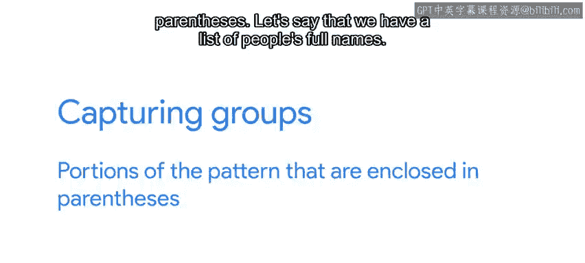
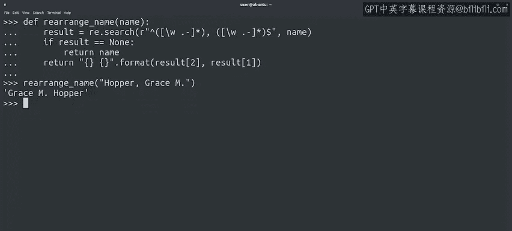

#  111：捕获组 🎯


在本节课中，我们将要学习正则表达式中一个非常实用的概念：**捕获组**。之前我们已经使用 `search()` 函数来检查字符串是否匹配特定模式，但通常我们不仅想知道是否匹配，更希望提取匹配到的信息并用于后续操作。本节将详细介绍如何使用捕获组来提取和重组字符串中的特定部分。

## 从匹配到提取：捕获组的作用 🔍

上一节我们介绍了如何使用正则表达式进行基本匹配。本节中我们来看看如何提取匹配到的具体内容。

到目前为止，我们使用 `search()` 函数检查字符串是否匹配特定模式，但仅将结果打印出来。打印有助于确认匹配，但更多时候我们需要提取匹配的信息并用于其他操作。例如，从日志行中提取主机名或进程ID，并用该值执行其他操作。为此，我们需要使用正则表达式的**捕获组**概念。

捕获组是模式中由**括号**括起来的部分。

## 实战：使用捕获组重组姓名 ✏️



假设我们有一个存储为“姓, 名”格式的全名列表，我们希望将其转换为“名 姓”的格式。这可以通过使用带有捕获组的正则表达式来实现。

以下是实现此功能的具体步骤：

1.  **创建匹配模式**：首先，创建一个匹配模式，该模式匹配一组字母，后跟逗号、空格，然后是另一组字母。
2.  **定义捕获组**：为了捕获两组字母，我们将每组字母放在括号内，例如 `(\w+), (\w+)`。
3.  **使用 `group()` 方法**：匹配成功后，`match` 对象的 `group()` 方法可以返回捕获的内容。

```python
import re

result = re.search(r"(\w+), (\w+)", "Lovelace, Ada")
print(result.groups())  # 输出：('Lovelace', 'Ada')
```

因为我们定义了两个独立的组，`groups()` 方法返回一个包含两个元素的元组。

我们也可以使用索引来访问这些组。索引 `0` 对应整个正则表达式匹配的字符串，后续索引则对应每个捕获组。

```python
print(result.group(0))  # 输出：Lovelace, Ada
print(result.group(1))  # 输出：Lovelace
print(result.group(2))  # 输出：Ada
```

利用这些索引，我们可以构造出想要的姓名格式。

## 构建重组姓名的函数 ⚙️

现在，让我们将上述逻辑封装成一个函数，以便重复使用。

我们定义一个名为 `rearrange_name` 的函数，它接收一个姓名作为参数。函数内部使用之前看到的模式进行搜索。如果结果为 `None`（即不匹配预期格式），则直接返回原姓名。如果匹配成功，则利用两个捕获组（逗号前的字符和逗号后的字符）返回重组后的字符串。

```python
import re

def rearrange_name(name):
    result = re.search(r"^(\w+), (\w+)$", name)
    if result is None:
        return name
    return f"{result.group(2)} {result.group(1)}"
```

让我们用几个名字测试这个函数。

```python
print(rearrange_name("Lovelace, Ada"))  # 输出：Ada Lovelace
print(rearrange_name("Ritchie, Dennis"))  # 输出：Dennis Ritchie
```

## 处理更复杂的情况：扩展字符集 🔧

上面的函数似乎运行良好，但如果输入更复杂的姓名呢？例如 `“Hopper, Grace M.”`。

此时，正则表达式无法匹配，因为我们使用了 `\w` 字符，它只匹配字母、数字和下划线，无法识别中间名缩写中的点和空格。

我们需要扩展模式中允许的字符集。对于这个例子，我们希望在名字部分允许空格和点号。对于其他情况，可能还需要包括连字符。

更新后的模式如下，我们在字符类 `[]` 中添加了空格和点号：

```python
def rearrange_name(name):
    result = re.search(r"^([\w \.-]*), ([\w \.-]*)$", name)
    if result is None:
        return name
    return f"{result.group(2)} {result.group(1)}"

print(rearrange_name("Hopper, Grace M."))  # 输出：Grace M. Hopper
```

通过更新模式，我们的函数现在可以处理更复杂的姓名格式了。

## 总结 📝



本节课中我们一起学习了正则表达式中**捕获组**的核心用法。我们了解到：

*   捕获组通过**括号 `()`** 定义，用于提取模式中匹配的特定部分。
*   匹配成功后，可以通过 `match` 对象的 `group()` 或 `groups()` 方法访问捕获的内容。
*   索引 `0` 返回整个匹配的字符串，索引 `1`, `2`... 依次返回各捕获组的内容。
*   通过组合这些捕获的内容，我们可以对字符串进行有效的重组和转换。
*   为了使模式更具包容性，可以使用字符类（如 `[\w \.-]`）来指定允许的字符集合。


捕获组是处理文本和提取信息的强大工具，相信你可以想出更多使用它的创意例子。下一节，我们将深入探讨重复限定符的更多用法。