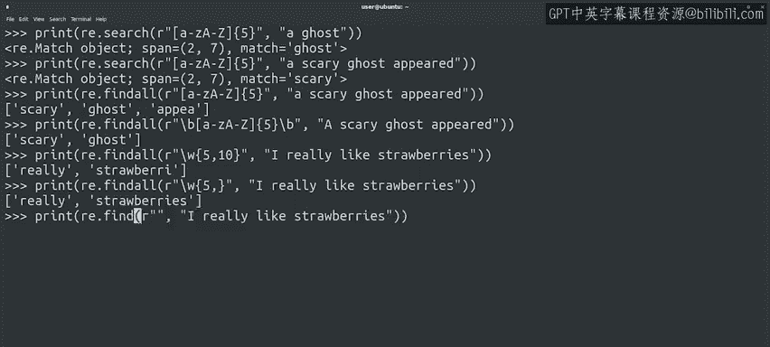

#  112：Python正则表达式进阶 🧩


在本节课中，我们将要学习Python正则表达式中更强大的重复修饰符。之前我们已经接触了星号、加号和问号，现在我们将探索如何精确控制模式重复的次数，这对于处理具有固定格式的数据非常有用。

## 回顾基础重复修饰符

上一节我们介绍了`*`、`+`和`?`这三种基本的重复修饰符。它们分别代表“零次或多次”、“一次或多次”以及“零次或一次”的重复。

本节中我们来看看如何指定更精确的重复次数。

## 使用花括号指定重复次数

当我们需要一个模式重复特定次数时，手动重复书写模式会降低代码的可读性和可维护性。因此，Python提供了数字重复修饰符，它们写在花括号`{}`中。

以下是数字重复修饰符的几种形式：

*   **`{n}`**：精确重复`n`次。
*   **`{n,}`**：至少重复`n`次，无上限。
*   **`{,m}`**：最多重复`m`次（从零次开始）。
*   **`{n,m}`**：重复`n`到`m`次。

### 精确匹配：`{n}`

例如，要匹配任何恰好由五个字母组成的字符串，我们可以使用这样的表达式：

```python
pattern = r'\w{5}'
```

> 表达式将匹配给定字符串中符合标准的任何部分。

在这个例子中，我们寻找重复五次的字母单词。字符串“ghost”有五个字母，因此是一个匹配项。在实际的字符串中，可能有更多匹配项，但默认只返回第一个。要找到所有匹配项，我们需要使用`findall`函数。

```python
import re
result = re.findall(r'\w{5}', 'I spotted a ghost in the hallway.')
print(result)  # 输出: ['ghost', 'hallw']
```

这里“hallway”的前五个字母“hallw”也被匹配了。如果我们只想匹配完整的五个字母的单词，可以使用`\b`（单词边界）来限定模式的开始和结束。

```python
result = re.findall(r'\b\w{5}\b', 'I spotted a ghost in the hallway.')
print(result)  # 输出: ['ghost']
```

### 指定范围：`{n,m}`

我们也可以在花括号中指定两个数字来表示一个范围。例如，要匹配5到10个字母或数字，可以使用：

```python
pattern = r'\w{5,10}'
```

### 无上限匹配：`{n,}`

范围也可以是开放式的。一个数字后面跟着逗号表示至少重复那么多次，没有上限，仅受源文本中最大重复次数的限制。

```python
pattern = r'\w{5,}'
```

### 零到指定次数：`{,m}`



最后，一个逗号后面跟着一个数字表示从零次到该次数的重复。让我们看一个例子：

```python
result = re.findall(r'S\w{,20}', 'I love strawberries and cream.')
print(result)  # 输出: ['Strawberries']
```

这里我们寻找的模式是字母“S”后面跟着最多20个字母数字字符。因此我们得到了“Strawberries”的匹配项，它以“S”开头，后面跟着11个字符。

## 总结

本节课中我们一起学习了Python正则表达式中强大的数字重复修饰符 `{}`。我们掌握了如何精确指定重复次数（`{n}`）、设定重复范围（`{n,m}`）、要求至少重复多次（`{n,}`）以及限定最多重复次数（`{,m}`）。这些工具使我们能更灵活、更精确地匹配具有特定长度或格式的文本模式。

虽然“ghost”和“strawberries”的例子很有趣，但我们现在已经准备好学习更多关于如何使用正则表达式解决实际问题的例子了。我们将在下一个视频中继续探索。