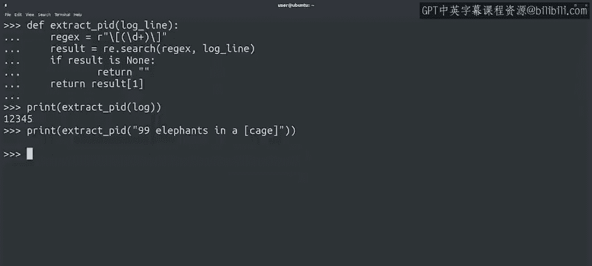

#  113：使用正则表达式从Python中提取PID 🆔


在本节课中，我们将学习如何运用正则表达式，从复杂的文本（如日志行）中提取特定信息，例如进程ID。我们将通过一个具体的例子，逐步解析正则表达式的构成，并编写一个健壮的Python函数来完成提取任务。

---

还记得我们在本模块第一个视频中讨论正则表达式时看到的例子吗？当时我们查看了日志行，并尝试提取其中的进程ID。现在，我们已经掌握了足够的知识来完全理解那个例子。让我们一步步来分析它。

## 解析正则表达式模式

首先，我们来看用于匹配进程ID的正则表达式模式：`\[(\d+)\]`。

*   模式的第一个字符是反斜杠 `\`，它被用作转义字符。
*   这意味着下一个字符——在这里是一个方括号 `[`——将被按字面意义进行匹配，而不是作为特殊字符。
*   在方括号之后是第一个圆括号 `(`。由于它没有被转义，我们知道它将用作一个**捕获组**。
*   捕获组的圆括号包裹着 `\d+` 符号。
*   根据我们对特殊字符和重复限定符的讨论，我们知道 `\d` 匹配任何数字字符，而 `+` 表示“一个或多个”。因此，这个表达式将匹配一个或多个数字字符。
*   在捕获组的闭括号之后，我们有一个闭方括号符号 `]`，它前面也有转义字符。

## 在Python中应用搜索

在调用 `re.search()` 函数后，我们知道，因为我们在表达式中定义了捕获组，所以可以通过访问索引 `1` 处的值来获取匹配的数据。

```python
import re

log_line = "July 31 07:51:48 mycomputer bad_process[12345]: ERROR Performing package upgrade"
regex = r"\[(\d+)\]"
result = re.search(regex, log_line)
print(result[1])  # 输出: 12345
```

让我们在一个不同的字符串上尝试我们的表达式，以验证无论其余文本是什么，它都能正常工作。

```python
print(re.search(r"\[(\d+)\]", "A completely different string with [12345] in it.")[1])  # 输出: 12345
```

## 处理匹配失败的情况

但是，如果我们的字符串的方括号之间实际上没有数字块呢？

```python
# 这将导致错误
# print(re.search(r"\[(\d+)\]", "99 elephants in a [cage]")[1])
```

程序出错了。发生了什么？我们试图访问一个值为 `None` 的变量的索引 `[1]`。正如Python告诉我们的，这是无法做到的。那么我们应该怎么做呢？

我们应该创建一个函数，在可能的情况下提取进程ID，如果无法提取则执行其他操作。思路如下：

## 创建健壮的提取函数

我们将定义一个名为 `extract_pid` 的函数。

1.  首先，我们使用之前相同的正则表达式，并将 `search` 函数的结果存储在 `result` 变量中。
2.  我们知道，如果搜索不成功，`result` 将是 `None`。因此，我们需要在这里做一些不同的处理。
3.  我们选择做什么取决于我们希望代码的其余部分如何运行。假设如果我们找不到PID，就返回一个空字符串。
4.  最后，如果程序执行到这一步，意味着 `result` 是一个匹配对象，因此我们可以访问第一个捕获组并返回它。

以下是该函数的实现：

```python
import re

def extract_pid(log_line):
    regex = r"\[(\d+)\]"
    result = re.search(regex, log_line)
    if result is None:
        return ""
    return result[1]
```

现在，我们可以用原始的日志行测试我们的函数，检查它是否仍然正常工作。

```python
print(extract_pid("July 31 07:51:48 mycomputer bad_process[12345]: ERROR Performing package upgrade"))
# 输出: 12345
```

最后，让我们用之前导致代码崩溃的字符串来测试它。

```python
print(extract_pid("99 elephants in a [cage]"))
# 输出: (一个空字符串)
```



太好了！它没有匹配到任何内容，因此返回了一个空字符串。这正是我们想要的。

---

## 总结

在本节课中，我们一起学习了如何构建一个健壮的函数，使用正则表达式从日志行中正确提取进程ID，而不会因为不匹配的文本行导致程序崩溃。我们解析了正则表达式 `\[(\d+)\]` 的每个部分，理解了转义字符、捕获组和特殊序列 `\d` 的作用。然后，我们编写了 `extract_pid` 函数，它通过检查 `re.search()` 的返回值是否为 `None` 来优雅地处理匹配失败的情况。

希望现在这一切都开始变得清晰了。请记住，如果还有不太明白的地方，你可以随时复习课程内容并进行练习，直到你感到得心应手。

接下来，在我们探索正则表达式的最后一步，我们将查看 `re` 模块提供的其他一些有用函数。