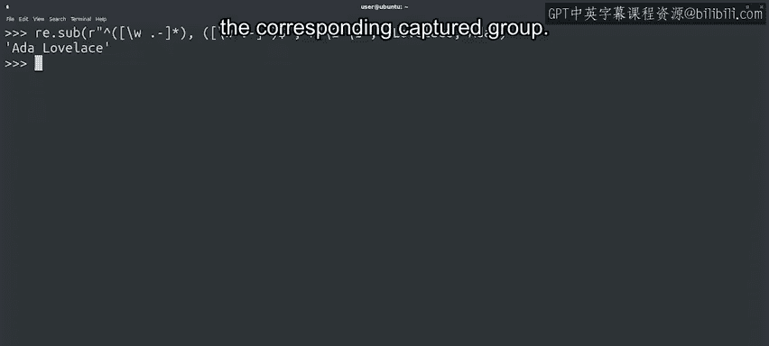

#  114：分割与替换 🧩


在本节课中，我们将要学习Python `re` 模块中两个非常实用的函数：`split` 和 `sub`。我们将了解如何使用正则表达式来分割字符串，以及如何查找并替换文本中的模式。掌握这些技能将帮助你更高效地处理和分析文本数据。

---

## 1. 使用 `split` 函数分割字符串

上一节我们介绍了 `search` 和 `findall` 函数，本节中我们来看看 `re` 模块中的 `split` 函数。

`split` 函数的工作方式与我们之前用于字符串的 `split` 方法类似，但关键区别在于，它可以使用任何正则表达式作为分隔符，而不仅仅是一个固定的字符串。

例如，我们可能希望将一段文本分割成独立的句子。为此，我们不仅需要匹配句点，还需要匹配问号或感叹号，因为它们也是有效的句子结尾。实现方式如下：

```python
import re

text = "Hello world! How are you? I'm fine."
sentences = re.split(r'[.!?]', text)
print(sentences)
# 输出: ['Hello world', ' How are you', " I'm fine", '']
```

请注意，我们写在方括号内的字符没有进行转义。这是因为在方括号内的任何内容都被视为字面字符，而不是其特殊含义。同时，分割符号本身不会出现在结果列表中。

如果我们希望分割后的列表包含用于分割的符号本身，可以使用捕获括号，如下所示：

```python
sentences_with_marks = re.split(r'([.!?])', text)
print(sentences_with_marks)
# 输出: ['Hello world', '!', ' How are you', '?', " I'm fine", '.', '']
```

这样，我们就得到了句子和标点符号共同组成的列表元素。

---

## 2. 使用 `sub` 函数替换文本

另一个由 `re` 模块提供的实用函数是 `sub`。它用于通过将匹配到的部分或全部模式替换为不同的字符串来创建新字符串。

它类似于字符串的 `replace` 方法，但区别在于它使用正则表达式进行匹配和替换。让我们通过一个例子来理解。

假设我们的系统日志中包含用户的电子邮件地址，我们需要通过移除所有地址来匿名化数据。我们可以使用一个正则表达式来实现：

```python
import re

log = "User contact: alice@example.com. Error reported by bob+test@company.co.uk."
anonymized_log = re.sub(r'[\w.%+-]+@[\w.-]+', '[REDACTED]', log)
print(anonymized_log)
# 输出: User contact: [REDACTED]. Error reported by [REDACTED].
```

我们用于识别电子邮件地址的表达式有两部分：`@` 符号前的部分和其后的部分。
*   `@` 符号前，我们包含了字母数字字符（用 `\w` 表示，包括字母、数字和下划线），以及点号、百分号、加号和短横线。
*   `@` 符号后，我们只允许字母数字字符、点号和短横线。

这个模式会匹配所有电子邮件地址，以及一些并非真正有效的地址（例如包含两个连续点号的地址）。在此场景下，我们宁愿“安全第一”，因此会屏蔽任何看起来像地址的内容。如果我们想验证地址是否真实有效，则需要制定严格得多的规则。

---

## 3. 在替换中使用捕获组

我们刚刚看了在纯字符串搜索和替换中使用正则表达式的例子。现在，让我们看一个在替换中也使用正则表达式的 `sub` 函数示例。

为此，我们回到之前调整人名顺序的代码，并使用 `sub` 来创建新字符串。

```python
import re



name = "Lovelace, Ada"
# 使用捕获组匹配“姓, 名”的格式
swapped_name = re.sub(r'(\w+), (\w+)', r'\2 \1', name)
print(swapped_name)
# 输出: Ada Lovelace
```

我们再次使用括号创建了捕获组。
*   在第一个参数（模式）中，我们有一个包含两个欲匹配组的表达式：逗号前的一组和逗号后的一组。
*   在第二个参数（替换字符串）中，我们使用 `\2` 来引用第二个捕获组（名字），后跟一个空格，再使用 `\1` 来引用第一个捕获组（姓氏）。

当引用捕获组时，反斜杠后跟一个数字表示对应的捕获组。这是正则表达式的通用表示法，不仅限于Python，许多支持正则表达式的工具都使用它。

我们还可以使用它们来匹配自身重复的模式，这被称为“反向引用”。我们在此不深入探讨，但如果你想了解更多，可以在网上找到大量相关信息。

---

## 总结

本节课中我们一起学习了Python正则表达式中两个强大的函数：`split` 和 `sub`。
*   `split` 函数允许我们使用复杂的正则表达式模式作为分隔符来分割字符串。
*   `sub` 函数则允许我们查找并替换文本中匹配特定模式的部分，并且在替换时可以利用捕获组来重组文本。

虽然正则表达式并不简单，但它们极其有用，因此值得投入精力去掌握。为了帮助你巩固所学，接下来有一个练习测验，之后你将可以进入下一个实验环节。