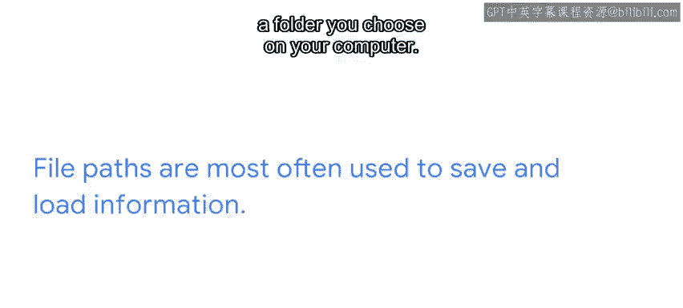

#  115：文件路径 📂

在本节课中，我们将要学习文件路径的概念、类型及其在Python编程中的重要性。理解文件路径是自动化处理文件和与操作系统交互的基础。

## 概述

程序员通过代码指挥计算机执行任务，正如驯犬师使用指令和零食引导犬只。为了让程序（包括Python程序）正常运行，应用程序需要调用存储在本地计算机或云端的一个或多个文件，而调用这些文件的关键就是使用它们的**文件路径**。

## 什么是文件路径？

文件路径是文件在计算机或网络服务器上的具体位置。在Python代码中，文件路径被写成一个字符串，该字符串复制了本地机器上的文件路径，或通过URL检索到的远程服务器上的文件位置。

你还可以使用文件路径来调用环境变量，例如库、应用程序，甚至其他语言（如C++或JavaScript）。

## 文件路径的两种类型

文件路径主要分为两种：相对路径和绝对路径。理解它们的区别对于编写可移植的代码至关重要。

以下是两种路径类型的核心区别：

*   **相对文件路径**：仅通过文件名来读写文件。它默认指向最初运行Python命令的特定目录。由于其灵活性，可以在任何计算机上调用所需文件，因此通常是首选。
    *   **示例**：`target_file.txt`
*   **绝对文件路径**：详细说明文件的确切位置，格式为：驱动器名 -> 目录 -> 文件名。Python程序员倾向于避免使用绝对路径，因为驱动器名称可能因计算机而异。
    *   **Windows示例**：`C:\my_directory\target_file.txt`
    *   **Mac/Linux示例**：`/home/username/my_directory/target_file.txt`

## 跨平台的注意事项

尽管Python脚本可以在任何能运行Python的计算机上执行，但依赖于Windows特定路径和文件系统的脚本可能无法在Mac或Linux上运行，反之亦然。不过，使用Mac和Linux文件路径的脚本可以无缝协作。

由于Windows与Mac/Linux之间的文件结构差异，许多Python程序员使用`os.path`命令来包装目录路径，以规避平台差异。

## 文件路径的常见用途

文件路径最常用于保存和加载信息。例如，在一个网络爬虫工具中，Python可以用来加载网页并将其内容保存到你计算机上选择的文件夹中。

## 常见错误与最佳实践

只要注意操作，文件路径的使用是非常直观的。最常见的错误发生在程序员混淆了“Python函数被调用的位置”与“调用该函数的脚本所在的位置”。

为了避免混淆，请记住：相对路径是相对于**当前工作目录**的，而当前工作目录可能因你运行脚本的方式而异。

## 总结

本节课我们一起学习了文件路径的核心知识。我们了解到，文件路径是文件在计算机或服务器上的具体位置，可用于调用环境变量。我们重点区分了**相对路径**和**绝对路径**，并明白了为何相对路径因其更好的可移植性而更受青睐。同时，我们也注意到了不同操作系统（Windows vs. Mac/Linux）在路径表示上的差异，以及使用`os.path`等工具处理这些差异的重要性。

回到驯犬师的类比，你使用零食和命令决定了狗的行为；同样地，你通过文件路径调用的应用程序、库和其他环境变量，决定了你的代码能做什么以及它完成任务的方式。

下一节，我们将探讨在具体的编程情境中如何使用文件路径。