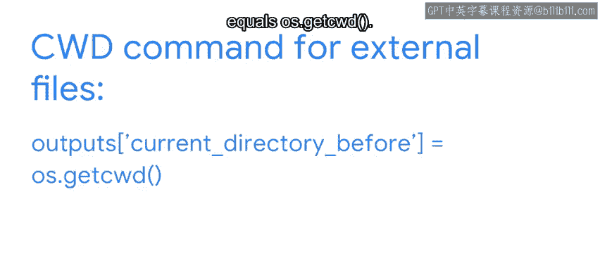
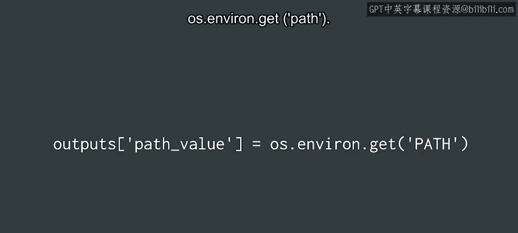
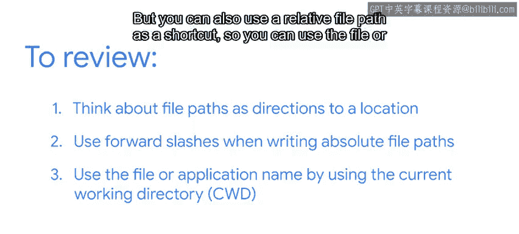

#  116：Python文件路径编写指南 🗺️


## 概述

在本节课中，我们将学习如何在Python代码中编写和使用文件路径。文件路径是程序定位和操作文件、目录或环境变量的“路线图”。理解并正确使用文件路径，对于实现文件读写、数据存储和加载外部资源等自动化任务至关重要。

---

## 文件路径的本质与用途

上一节我们介绍了文件路径的基本概念，本节中我们来看看如何在代码中实际运用它们。

文件路径最常见的用途是：将信息保存到目标位置，或者从特定位置加载信息、应用程序或环境变量。因此，将文件路径视为指向文件或目录的“指引”会很有帮助。

例如，假设你正在编写一个应用程序，用于从网站检索特定的归档内容，并按日期将其存储到历史文件中。你的代码需要包含归档内容的文件路径位置，这样应用程序才知道去哪里寻找你指定的内容参数。检索到内容后，另一行或另一段代码会告诉应用程序在何处创建历史文件并存储信息。

关键在于，一旦你提供了正确的“指引”，你的应用程序就能轻松地找到并操作信息，根据代码中的命令进行加载、复制和重新保存。

---

## 操作系统与文件路径结构

正如你所知，文件路径的具体结构取决于你编写代码所使用的操作系统。

以下是不同操作系统下文件路径的差异：

*   **Windows**：文件路径通常以驱动器名开头，如 `C:` 或 `D:`。
*   **macOS 和 Linux**：文件路径以斜杠 `/` 开头，这代表根目录。这个斜杠有时被称为正斜杠。

文件路径中的目录也由斜杠分隔。Windows 通常使用反斜杠 `\`，因此路径看起来像这样：
`C:\my-directory\target_file.txt`

但是，在 Python 中编写文件路径时，你可以使用正斜杠 `/`，路径看起来像这样：
`C:/my-directory/target_file.txt`

事实上，**推荐使用正斜杠**。因为反斜杠在 Python 中是特殊字符，如果你在文件路径中使用它，必须再次使用它来转义每一个实例，如下所示：
`C:\\my-directory\\target_file.txt`

---

## 绝对路径与相对路径

根斜杠和驱动器字母在使用**绝对文件路径**时很重要。但你也可以使用**相对文件路径**作为快捷方式，前提是使用当前工作目录作为文件路径的基础。

要使用当前目录，可以在代码中使用 `os.getcwd()` 命令，后接你想要访问的文件名。



以下是获取和设置当前目录命令的示例：

```python
outputs['current_directory_before'] = os.getcwd()
```

---

## 常用文件路径操作

获取和设置当前目录只是在 Python 中使用文件路径引用外部文件的方法之一。

以下是其他几种常用操作：

*   **列出文件和目录**：使用以下代码可以列出当前目录下的内容，以找到所需的文件路径。
    ```python
    outputs['files_and_directories'] = os.listdir()
    ```

*   **访问环境变量路径**：可以通过输入以下命令来获取环境变量的路径值。
    ```python
    outputs['path_value'] = os.environ.get('PATH')
    ```



在引用外部文件时，具体使用哪些命令，完全取决于你希望通过代码实现什么目标：创建或删除目录、创建、打开或删除文件、处理不同的文件路径，或是其他任务的组合。

---

## 实践与最佳实践

当然，学习文件路径及其工作原理的最佳方式，就是在你编写的代码以及更高级的 Python 训练项目中实际使用它们。

本视频仅涵盖了在代码中使用文件路径的基本原则。请记住，在代码中使用它们时，最好将文件路径简单地视为找到所需文件、应用程序或变量位置的“指引”。

以下是核心最佳实践总结：



1.  **使用正斜杠**：在代码中编写文件路径时使用正斜杠 `/`，应被视为最佳实践。
2.  **理解路径类型**：斜杠和驱动器字母或根目录在使用绝对文件路径时很重要。但你也可以使用相对文件路径作为快捷方式，通过当前工作目录直接使用文件或应用程序名。
3.  **多加练习**：文件路径对于代码通常是必需的。正确使用时，它们可以使你的 Python 代码和生成的应用程序更好、更高效。这一切都归结于熟悉和练习。

---

## 总结

本节课中我们一起学习了如何在 Python 代码中编写文件路径。我们了解了文件路径作为“指引”的核心作用，比较了不同操作系统下的路径格式差异，强调了使用正斜杠的最佳实践，并区分了绝对路径与相对路径的用法。最后，我们还介绍了几种通过 `os` 模块操作文件路径的常用方法。掌握这些知识，将帮助你更高效地处理文件操作，为自动化任务打下坚实基础。