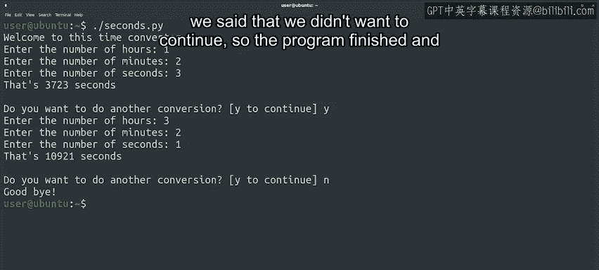

#  119：Python交互式读取用户输入 🖥️

## 课程编号：P119


在本节课中，我们将要学习如何在Python脚本中与用户进行交互，通过`input()`函数读取用户输入的数据，并将其用于自动化任务中。

---

我们之前已经讨论过文件的读取和写入操作。

使用文件存储信息，然后通过脚本处理这些数据，是实现自动化的有效方法。

但有时，我们需要与用户交互，询问一些无法存储在文件中的特定信息。

为此，Python提供了一个名为`input`的函数。

这个函数允许我们提示用户输入某个值，然后我们可以在脚本中使用这个值。

让我们看看具体是如何实现的。

---

### 一个简单的示例：问候脚本 👋

以下是一个名为`hello.py`的简单脚本。

它请求用户输入姓名，然后打印一条包含该姓名的问候语。

让我们执行这个脚本来看看效果。

```python
name = input("请输入你的名字：")
print("你好，" + name + "！")
```

`input`函数总是返回一个字符串。

如果我们希望读取的数据是其他数据类型，例如数字或日期，那么我们需要将字符串转换为我们想要的格式。

---

### 一个更复杂的示例：时间转换器 ⏱️

上一节我们介绍了简单的输入，本节中我们来看看一个更复杂的例子。

这个脚本执行多项操作，让我们逐段分析。

首先，我们定义一个函数，将小时、分钟和秒数转换为总秒数。

```python
def to_seconds(hours, minutes, seconds):
    return hours*3600 + minutes*60 + seconds
```

实际程序从打印欢迎信息开始，然后进入一个`while`循环。

注意，我们首先初始化了一个用于检查用户是否希望继续的变量`cont`。

```python
cont = "y"
while cont.lower() == "y":
```

在`while`循环的主体中，我们请求用户提供要转换的小时、分钟和秒数。

由于我们的`to_seconds`函数需要整数参数，我们使用`int()`函数来转换`input`函数返回的值。

```python
    hours = int(input("请输入小时数："))
    minutes = int(input("请输入分钟数："))
    seconds = int(input("请输入秒数："))
```

获得这三个值后，我们调用函数并打印结果。

```python
    print("总秒数是：" + str(to_seconds(hours, minutes, seconds)))
```

之后，我们询问用户是否希望进行另一次转换。

```python
    cont = input("是否继续？ (y/n): ")
```

让我们尝试运行这个脚本，看看会发生什么。

我们的代码似乎运行正常。

我们输入了三个数字，它正确地进行了转换。

现在它询问我们是否要继续。



我们回答“是”，就可以进行下一次转换。

当我们回答“否”时，程序结束并退出。

---

### 总结 📝

本节课中我们一起学习了如何通过`input()`函数与用户进行交互式对话。

虽然交互式地向用户请求输入并不总是解决问题的最佳方法，但它是一个强大的工具，现在已加入你的IT工具箱中。

在本模块开始仅几分钟的时间里，你已经掌握了一个新概念。

想象一下，到本模块结束时，你将学到多少知识。