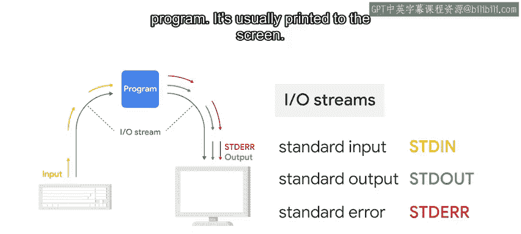
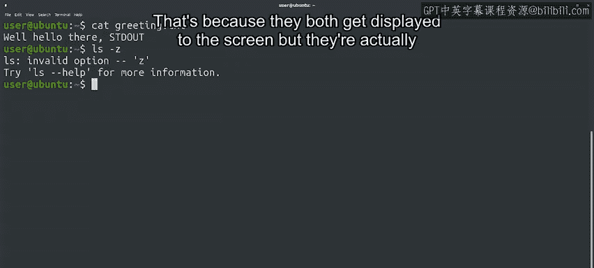

#  120：标准流 🖥️


## 概述

在本节课中，我们将要学习程序如何与外部世界进行信息交换。具体来说，我们将探讨输入/输出（IO）流的概念，了解标准输入、标准输出和标准错误这三种基本流的作用与区别。

---

## 什么是IO流？

上一节我们介绍了通过文件读写和键盘输入/屏幕输出的方式与程序交互。本节中我们来看看这些交互背后是如何实现的。

IO流是程序执行输入和输出操作的基本机制。你可以将这些流想象成程序与其输入源（如键盘）或输出目标（如屏幕）之间的通路。数据在这些通路中持续流动，因此被称为“流”。

## 三种标准IO流

大多数操作系统默认提供三种不同的IO流，每种都有其特定用途。

以下是三种标准流的详细介绍：

1.  **标准输入（STDIN）**
    *   这是程序与输入源（通常是键盘）之间的通道，数据通常以文本形式传递。
    *   在Python脚本中使用 `input()` 函数接收用户输入时，我们使用的就是标准输入流。

2.  **标准输出（STDOUT）**
    *   这是程序与输出目标（如显示器）之间的通路。
    *   它通常表现为在终端中显示的文本。当我们使用 `print()` 函数向屏幕写入信息时，就是在使用标准输出流。

3.  **标准错误（STDERR）**
    *   标准错误也用于显示输出，但它专门用作显示程序错误消息和诊断信息的通道。
    *   它通常也会被打印到屏幕上。如果你运行Python代码时收到错误信息，那么该信息很可能就是通过标准错误流打印的。



## 代码示例解析

让我们通过一个例子来巩固理解。

```python
# 第一行：从标准输入读取数据
data = input()
# 第二行：向标准输出写入数据
print(data)
# 第三行：制造一个错误（将字符串与整数拼接），该错误信息将通过标准错误输出
result = “hello” + 123
```

在这段脚本中：
*   第一行通过 `input()` 从标准输入（键盘）读取数据。
*   第二行通过 `print()` 将数据写入标准输出（屏幕）。
*   第三行尝试将字符串与整数拼接，这会引发一个 `TypeError`。这个错误信息将通过标准错误流输出。

## 系统命令中的IO流

需要强调的是，IO流并非Python程序独有。当我们运行系统命令时，同样在使用这些流。

例如，使用 `cat` 命令显示文件内容时，这些内容是通过标准输出流打印到终端的。
```bash
cat myfile.txt
```

而当命令产生错误时，错误信息则通过标准错误流显示。
```bash
ls --unsupported-flag
```
（此命令会因使用了不支持的标志而返回错误）



目前，标准输出和标准错误看起来都显示在屏幕上，所以似乎相同。但它们本质上是不同的通道，我们将在课程后续深入探讨它们的区别。

---

## 总结

本节课中我们一起学习了IO流的核心概念。我们了解到，IO流是程序提供和接收信息的途径，主要包括标准输入（STDIN）、标准输出（STDOUT）和标准错误（STDERR）三种。在接下来的课程中，我们将学习如何将这些流重定向到其他文件或进程，并探索向程序提供信息的其他方式，如环境变量和命令行参数。