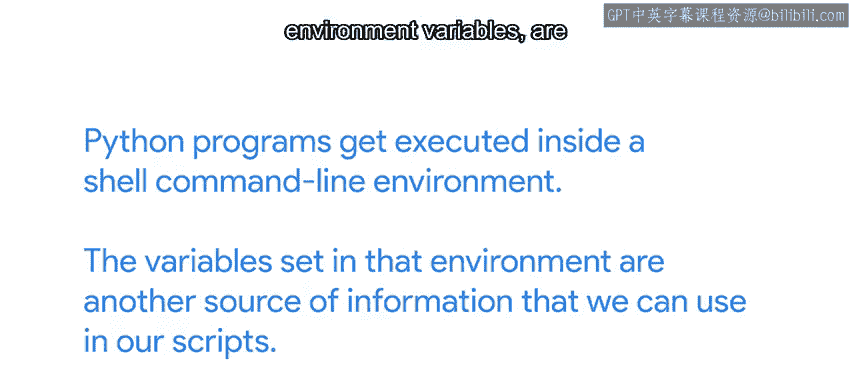
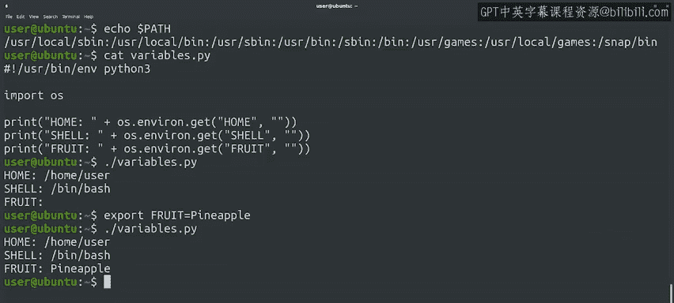

#  121：环境变量 🌍


在本节课中，我们将要学习什么是环境变量，以及如何在Linux命令行和Python脚本中读取和使用它们。环境变量是操作系统和程序之间传递信息的一种方式，理解它们可以帮助我们更好地控制程序的行为。

---

当我们打开Linux计算机上的终端应用程序时，无论是本地计算机还是远程机器，读取和执行我们命令的应用程序被称为**shell**。

shell是一种命令行界面，用于与操作系统进行交互。Linux上最常用的shell是**bash**。其他流行的shell包括ZSH和fish。尽管它们在操作方式上相似，但在接下来的视频中，当我们提到Linux shell时，我们指的是bash。

我们的Python程序在shell命令行环境中执行。在该环境中设置的变量，被称为**环境变量**，是我们在脚本中可以使用的另一个信息来源。

---

## 环境变量的作用与查看 🔍



理解并能够更改环境变量对于快速改变程序行为非常有用。通常，我们只需对程序运行的环境进行一些微小的更改即可实现这一点。

从命令行提示符中，我们可以使用`env`或`printenv`命令来检查这些变量。让我们来看一下。

```
$ env
```

哇，有很多不同的变量，但它们有什么用呢？这完全取决于变量本身。有些变量比其他变量更重要。例如，`PATH`变量就是一个非常重要的变量。让我们使用`echo`命令仅打印出该变量的内容。

作为复习，`echo`是我们在Linux shell中用于打印文本的命令。当我们想要访问shell中变量的值时，我们需要在变量名前加上美元符号`$`。

```
$ echo $PATH
```

这里我们打印了`PATH`变量的内容。shell使用这个环境变量来确定当我们调用可执行文件时，应该在哪里查找它们，而无需指定完整目录路径。

列出的所有目录都是shell将查找程序的地方。例如，当我们调用`python3`程序时，shell会按顺序检查`PATH`变量中列出的每个目录。当它找到一个名为`python3`的程序时，就会执行它。

---

## 在Python中读取环境变量 🐍

正如我们所说，我们可以从Python中读取这些变量的内容。让我们用一个Python脚本来验证一下。

为了访问环境变量，我们使用`os`模块提供的`environ`字典。在这种情况下，我们使用了一个之前未用过的字典方法：`.get()`方法。

`.get()`方法与我们迄今为止访问字典值的方式有些相似。区别在于当值不存在时会发生什么。

当我们使用键来检索字典中的值时（例如`os.environ['FRUIT']`），如果键不存在，我们会得到一个错误。如果我们改用`.get()`方法，则可以指定当键不存在时应返回什么值。换句话说，`.get()`方法允许我们在查找的键不在字典中时指定一个默认值。

以下脚本尝试检索与键关联的值，但如果键未定义，则返回一个空字符串。我们对三个不同的变量`HOME`、`SHELL`和`FRUIT`执行此操作。

```python
#!/usr/bin/env python3
import os

home = os.environ.get('HOME', '')
shell = os.environ.get('SHELL', '')
fruit = os.environ.get('FRUIT', '')

print(f"HOME: {home}")
print(f"SHELL: {shell}")
print(f"FRUIT: {fruit}")
```

让我们运行脚本看看会发生什么。

```
$ python3 script.py
```

我们得到了`HOME`和`SHELL`的值，但没有得到`FRUIT`的值。这是因为该变量在当前环境中没有定义。

---

## 设置环境变量 ⚙️

为了让我们的脚本能够看到`FRUIT`变量，我们需要在命令行中定义它。我们通过使用等号设置一个值来定义变量，并且等号前后不能有空格。此外，`export`关键字告诉shell，我们希望我们设置的值能被我们调用的任何命令看到。

```
$ export FRUIT=Pineapple
```

现在，让我们再次调用我们的脚本。

```
$ python3 script.py
```

很好！这次我们得到了我们想要的值。所以你现在知道了如何从Python脚本中获取任何环境变量的值。

---



## 总结 📝

在本节课中，我们一起学习了：
*   **Shell**是命令行接口，bash是Linux上常用的shell。
*   **环境变量**是存储在shell环境中的键值对，程序可以读取它们来获取配置信息。
*   可以使用`echo $VARIABLE_NAME`在命令行中查看环境变量的值。
*   在Python中，可以通过`os.environ`字典或更安全的`os.environ.get('KEY', 'default')`方法来访问环境变量。
*   可以使用`export VARIABLE_NAME=value`在命令行中设置环境变量，使其对后续命令可用。

理解环境变量是自动化和管理系统配置的基础。接下来，我们将深入探讨命令行如何告诉我们它们是成功还是失败了。