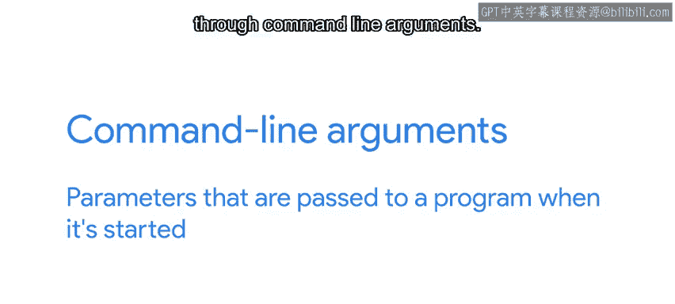
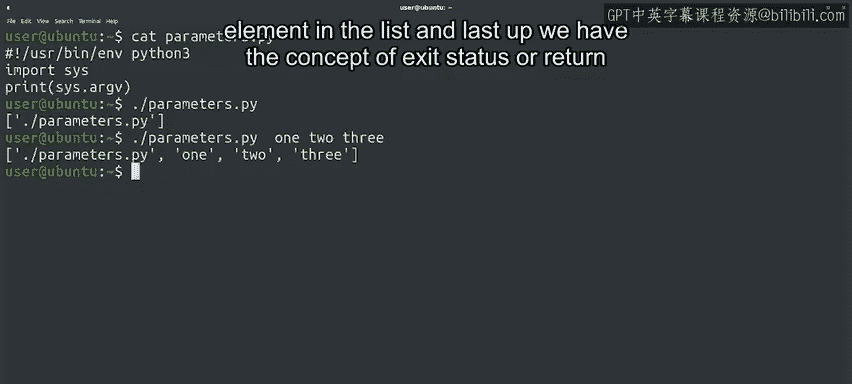
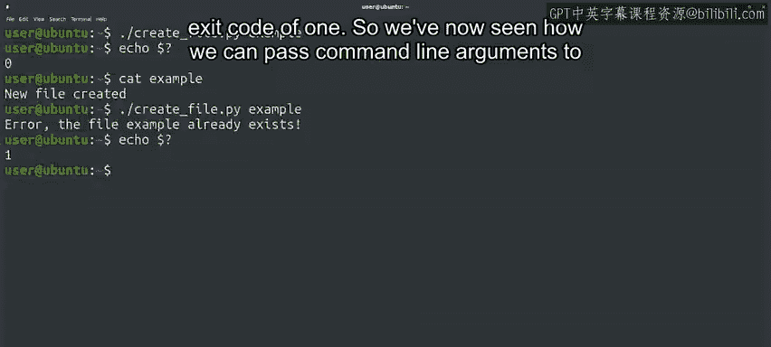

#  122：命令行参数与退出状态 🖥️


在本节课中，我们将要学习如何通过命令行参数向程序传递信息，以及如何利用退出状态来判断程序是否成功执行。这两个概念对于编写自动化脚本至关重要。

---



## 概述

到目前为止，我们已经了解了不同程序如何读写标准输入输出流，以及Shell环境如何影响程序的执行。另一种向程序提供信息的常见方式是通过命令行参数。

## 命令行参数

命令行参数是在程序启动时传递给它的参数。让脚本通过命令行参数接收特定值是一种非常常见的做法。这样做可以使脚本代码保持通用，同时允许我们自动运行脚本，无需任何交互式用户输入。这意味着这些参数对于系统管理任务非常有用，因为我们可以指定程序在启动前需要使用的信息，从而创建越来越多的自动化流程。

我们可以使用`sys`模块中的`argv`列表来访问这些值。让我们通过执行一个非常简单的脚本来查看这个列表的内容。

以下是`argv`脚本的代码：

```python
import sys
print(sys.argv)
```

现在，让我们看看调用程序时会发生什么。

首先，我们调用脚本时不带任何参数：

```bash
$ python3 argv.py
['argv.py']
```

列表包含一个元素，即我们刚刚执行的程序名称。

接下来，我们尝试传递几个参数：

```bash
$ python3 argv.py hello world 123
['argv.py', 'hello', 'world', '123']
```



现在我们可以看到，我们传递的每个参数都作为列表中的一个独立元素被包含进来。

## 退出状态

接下来，我们介绍退出状态（或返回码）的概念。它提供了Shell与其内部执行的程序之间的另一个信息源。


退出状态是程序返回给Shell的值。在所有类Unix操作系统中，进程成功时退出状态为0，失败时则不为0。返回的实际数字提供了关于程序遇到何种错误的额外信息。

了解命令是否成功完成是有用的信息，可以被调用该命令的程序使用。例如，如果命令失败，程序可以利用此信息重试该命令。

要检查程序的退出状态，我们可以使用一个特殊的变量来查看最后执行的命令的退出状态。这个变量是`$?`变量，因此要查看其内容，我们使用`echo $?`。

让我们使用`wc`命令来尝试一下，该命令用于统计文件中的行数、单词数和字符数。

首先，我们将其传递给我们的`variables.py`脚本并检查退出值：

```bash
$ wc variables.py
       5      13     105 variables.py
$ echo $?
0
```

在这里，我们首先运行了`wc`命令，它打印了Python脚本的行数、单词数和字符数。然后我们打印了`$?`变量的内容，可以看到退出值为0，这是因为`wc`成功运行了。

现在，我们尝试对一个不存在的文件运行`wc`：

```bash
$ wc non_existent_file.txt
wc: non_existent_file.txt: No such file or directory
$ echo $?
1
```

命令打印了一个错误，当我们打印`$?`变量的内容时，我们看到它以退出值1结束。

## Python脚本的退出状态

以上是针对系统命令的，那么Python脚本呢？当一个Python脚本成功完成时，它以退出值0退出。当它因错误（如`TypeError`或`ValueError`）而结束时，则以非零值退出。我们可以让它以任何相关的值退出。

让我们看一个例子。以下脚本接收一个文件名作为命令行参数。它首先检查文件名是否存在。当文件不存在时，它通过写入一行来创建该文件。当文件存在时，我们的脚本会打印一条错误消息并以退出值1退出。

以下是脚本代码：

```python
import sys
import os

filename = sys.argv[1]
if os.path.exists(filename):
    print(f"Error: The file '{filename}' already exists.")
    sys.exit(1)
else:
    with open(filename, 'w') as f:
        f.write("File created successfully.\n")
    print(f"File '{filename}' created.")
```

为了尝试这个脚本，我们首先执行它并传递一个不存在的文件：

```bash
$ python3 exit_status.py new_file.txt
File 'new_file.txt' created.
$ echo $?
0
```

很好，看起来成功了。请注意，它以退出代码0退出，即使我们在代码中没有明确指定这一点，因为这是默认行为。

让我们查看文件内容以确保它包含应有的内容：

```bash
$ cat new_file.txt
File created successfully.
```



现在，如果我们再次运行相同的命令，你认为会发生什么？

```bash
$ python3 exit_status.py new_file.txt
Error: The file 'new_file.txt' already exists.
$ echo $?
1
```

你猜对了，我们得到一个错误，因为文件已经存在，因此我们得到退出代码1。

## 总结

本节课中我们一起学习了如何向Python程序传递命令行参数，以及如何让程序告诉我们它们是否成功完成。这两个都是创建自动化时将使用的重要工具。

我们将使用命令行参数来告诉我们的程序我们希望它们做什么，而无需与它们交互。我们将使用退出值来了解命令是成功还是失败，然后记录失败并在需要时自动重试命令。

在过去的几个视频中，我们肯定学到了很多。有时可能会有点棘手，但你在不让这些复杂概念阻止你前进方面做得非常出色。😊 既然你已经走到这一步，你必将掌握所有让我们的代码与Shell环境交互的方法。


一如既往，请花时间复习，然后前往测验，将你的新知识付诸实践。