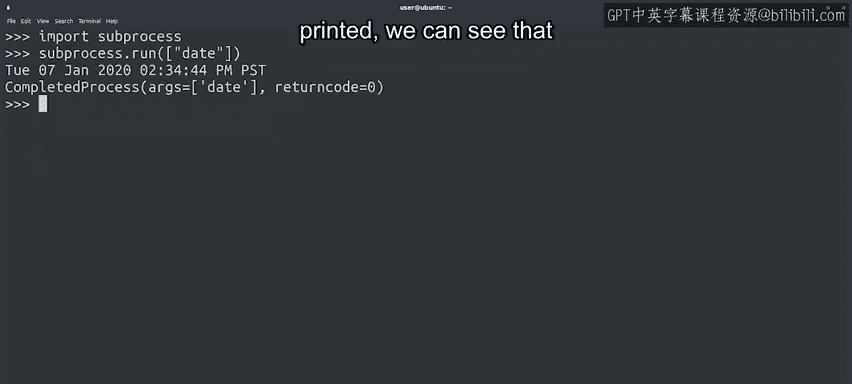
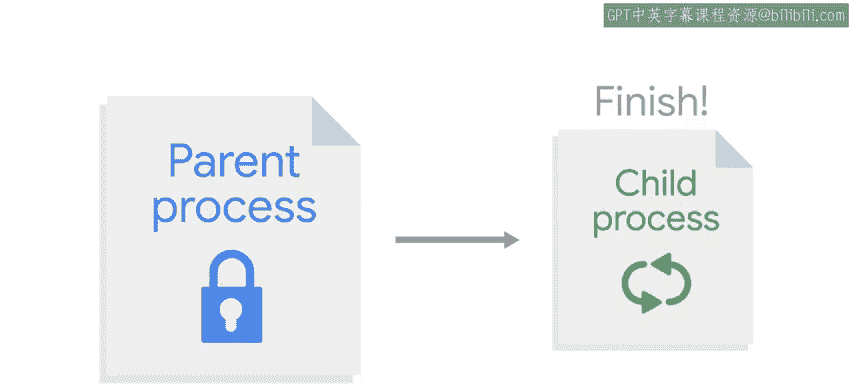
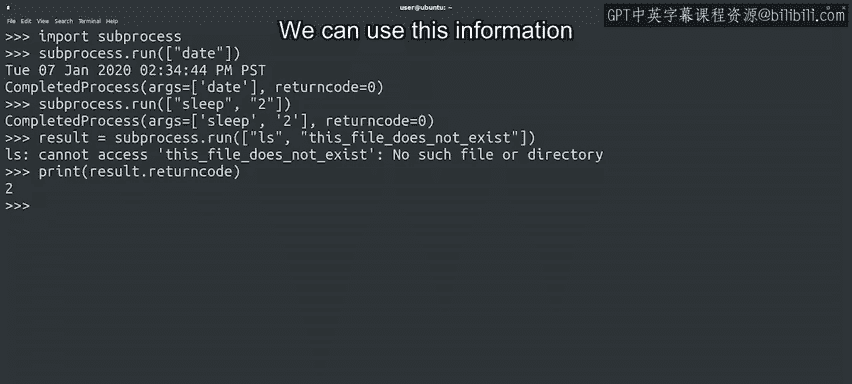

#  123：在Python中运行系统命令 🖥️


在本节课中，我们将学习如何在Python脚本中执行系统命令。我们将探索`subprocess`模块，了解如何运行外部程序、处理其输出，以及根据命令的执行结果做出决策。

---

## 概述

到目前为止，我们主要通过Python的内置功能与操作系统交互。例如，我们使用文件对象读取文件内容，使用`os`模块检查磁盘空间，或使用`sys`模块处理标准输入和退出代码。

然而，有时我们需要从Python脚本中直接运行系统程序。例如，你可能需要在脚本中发送ICMP数据包来检查主机是否响应。与其寻找提供此功能的外部Python模块，不如直接运行系统自带的`ping`命令。

在某些情况下，使用系统命令来完成特定任务或利用Python模块（无论是内置还是第三方）中不存在的功能，可能更简单、更快捷。为此，Python的`subprocess`模块提供了在脚本中执行系统命令的方法。

## 运行简单命令

让我们看一个例子。首先，我们导入`subprocess`模块，然后使用`subprocess.run()`函数调用显示当前日期的`date`命令。

```python
import subprocess
subprocess.run(["date"])
```

`run`函数返回一个`CompletedProcess`类型的对象。该对象包含与命令执行相关的信息。从打印的信息中，我们可以看到命令的返回代码是`0`。

## 理解子进程

为了运行外部命令，会为子进程（或称为subprocess）创建一个独立的环境来执行该命令。




当父进程（即我们的脚本）等待子进程完成时，它会被**阻塞**。这意味着在子进程结束之前，父进程无法执行任何其他工作。




许多为人父母者可能会对此深有体会。

外部命令完成其工作后，子进程退出，控制流返回到父进程。然后，脚本可以继续正常执行。

让我们通过调用`sleep`命令来观察这个过程，该命令会等待我们指定的秒数后再返回。

```python
subprocess.run(["sleep", "2"])
```

你可能已经注意到，当`sleep`命令运行时，Python解释器被阻塞，我们无法与其交互。这正是我们所说的父进程在子进程完成前被阻塞的含义。

## 传递命令行参数

请注意我们是如何调用命令的。`run`函数接收一个列表，列表的第一个元素是我们想要调用的命令名称，后面跟着任何我们想要传递给该命令的参数。

因此，程序名之后的任何元素都是它的命令行参数。在上面的例子中，我们请求`sleep`等待两秒钟。

## 处理命令失败

在前两个例子中，命令都成功执行，因此`CompletedProcess`实例中的返回代码是`0`。

让我们看一个退出状态不为零的例子。如果我们用一个不存在的文件名调用`ls`命令，`ls`会打印一个错误并返回一个非零的退出状态。

```python
result = subprocess.run(["ls", "non_existent_file"])
print("返回代码:", result.returncode)
```



这个非零的退出状态将存储在`CompletedProcess`实例的`returncode`属性中，我们可以在代码中访问这个值。我们可以看到命令失败了，存储的返回代码是`2`，这告诉我们发生了错误。我们可以在脚本中利用这些信息，在失败时执行不同的操作。

## 何时使用 `run` 函数

如果我们只想运行一个命令，并且只关心它是否成功，那么像这样使用`run`函数非常有用。命令的输出会直接打印到屏幕上，这意味着我们的脚本无法控制它。

这对于以下情况很方便：
*   没有有用输出的系统命令，如`cp`、`chmod`、`sleep`等。
*   当我们不关心进一步处理该输出时。换句话说，当输出直接打印到屏幕上就足够了。

例如，如果我们正在编写一个脚本，用于更改目录树中一堆文件的权限，我们并不关心`chmod`命令的输出，我们只想知道它是否成功。

## 总结

本节课中，我们一起学习了如何使用Python的`subprocess`模块来运行系统命令。我们了解了如何执行简单的命令、传递参数，以及如何通过检查`returncode`属性来处理命令的成功与失败。我们还探讨了子进程的执行机制和父进程的阻塞状态。

然而，如果我们想要捕获外部命令的输出，然后对结果进行操作，就需要不同的策略。我们将在下一个视频中深入探讨这个问题。