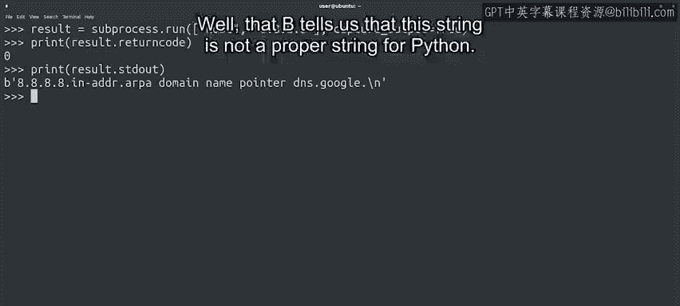
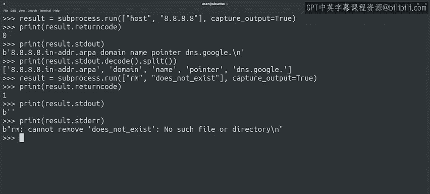

#  124：获取系统命令的输出 📥


在本节课中，我们将学习如何在Python脚本中执行系统命令，并捕获其输出以便进一步处理。这对于需要从命令输出中提取信息并在脚本中使用的场景非常有用。

---

## 概述

上一节我们介绍了如何使用`subprocess.run()`函数执行系统命令。本节中，我们来看看如何捕获这些命令的输出，以便在Python脚本中进行处理和分析。

---

## 捕获命令输出

如果希望Python脚本能够处理所执行系统命令的输出，我们需要告诉`run`函数捕获该输出。当需要从命令中提取信息并在脚本中用于其他目的时，这可能会很有帮助。

例如，假设您想创建一些关于一天中哪些用户登录到服务器的统计信息。您可以使用一个调用`who`命令的脚本来实现，该命令会打印当前登录到计算机的用户。脚本可以解析命令的输出，每小时存储一次登录用户列表，并在一天结束时生成每日报告。

为了能够处理命令的输出，我们将在调用`run`函数时设置一个名为`capture_output`的参数，并将其值设为`True`。

---

## 示例：使用`host`命令

以下是使用`host`命令的示例，该命令可以将主机名转换为IP地址，反之亦然。调用时，我们将传递`capture_output=True`参数，并将结果存储在一个变量中以便访问。

```python
import subprocess

result = subprocess.run(["host", "8.8.8.8"], capture_output=True)
```

我们知道`result`变量是一个可以访问的`CompletedProcess`实例。我们可以像之前一样检查`returncode`属性。



```python
print(result.returncode)
```

我们还可以打印和操作命令生成的输出，该输出存储在`stdout`属性中。

```python
print(result.stdout)
```

---

## 理解字节数组

输出字符串开头的`b`是什么？这个`b`告诉我们，这个字符串在Python中不是一个普通的字符串，它实际上是一个**字节数组**。


这是一个复杂的主题，请仔细听。计算机中的数据以字节形式存储和传输，每个字节最多可以表示256个字符。但世界上有成千上万种可能的字符，用于书写各种语言。例如，中文需要超过10000个不同的字符。

为了能够用这些语言书写，人们随着时间的推移创建了几种称为**编码**的规范，以指示哪些字节序列代表哪些字符。如今，大多数人使用UTF-8编码，它是Unicode标准的一部分，该标准列出了所有可以表示的字符。

回到我们的例子，当我们使用`run`执行命令时，Python不知道使用哪种编码来处理命令的输出，因此它只是将其表示为一串字节。

---

## 将字节解码为字符串

如果我们希望将其转换为正确的字符串，可以调用`decode`方法。此方法应用编码将字节转换为字符串。默认情况下，它使用UTF-8编码，这正是我们想要的。

综上所述，让我们将字节数组转换为字符串，然后将其拆分成几个部分。

```python
output_string = result.stdout.decode()
print(output_string.split())
```

通过这种方式，我们可以操作所运行命令的输出，并对其进行任何需要的处理。例如，我们可以选择保留列表的最后一个元素，即对应我们查找的IP地址的名称。

```python
print(output_string.split()[-1])
```

---

## 捕获标准错误输出

我们刚刚查看了捕获的标准输出。但标准错误呢？😊

如果我们使用`capture_output`参数，并且命令向标准错误写入任何输出，它将被存储在`CompletedProcess`实例的`stderr`属性中。

让我们看一个例子。我们将尝试执行用于删除文件的`rm`命令，并传递一个不存在的文件名。

```python
result = subprocess.run(["rm", "does_not_exist.txt"], capture_output=True)
```



检查命令的返回码。

```python
print(result.returncode)
```

它如我们预期的那样失败了。现在检查`stdout`和`stderr`属性的内容。

```python
print(result.stdout)
print(result.stderr)
```

在这种情况下，标准输出为空，但有一个错误打印到了标准错误，我们可以通过`stderr`属性访问它。这是一个很好的例子，说明了标准输出和标准错误实际上是不同的流，因此Python会分别捕获它们。

---

## 总结

本节课中，我们一起学习了如何从Python执行系统命令并检查它们是否成功或失败。我们还学习了如何捕获它们的标准输出和标准错误流，以便在脚本中使用其内容。这些技能在编写使用系统命令执行某些复杂任务，并让我们的Python脚本覆盖更广泛任务的脚本时非常有用。

在下一个视频中，我们将通过了解调用外部命令时可以执行的一些更高级操作，来结束对`subprocess`模块的讨论。