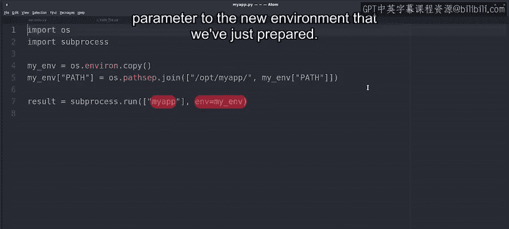
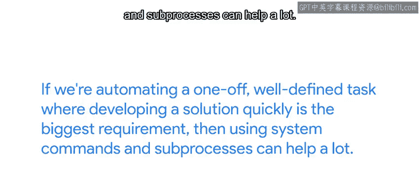

#  125：高级子进程管理 🚀


在本节课中，我们将学习如何使用Python的`subprocess`模块进行更高级的系统命令管理。我们将探讨如何修改子进程的环境变量、使用`run`函数的其他参数，并了解直接调用系统命令的潜在风险与替代方案。

---

## 修改子进程环境变量 🌍

上一节我们介绍了如何运行系统命令并检查其输出。本节中，我们来看看如何通过修改环境变量来影响子进程的行为。

一种常见的方法是为子进程提供特定的环境变量。通过这种方式，我们可以改变进程查找可执行文件的位置、命令与系统交互的方式，以及生成的输出类型等。

修改子进程环境的通常策略是：首先复制当前进程的环境变量，进行必要的修改，然后将修改后的环境传递给子进程。

以下是具体步骤：

```python
import os, subprocess

# 复制当前环境变量
my_env = os.environ.copy()

# 修改PATH变量，添加一个新目录
my_env["PATH"] = os.pathsep.join(["/opt/myapp", my_env["PATH"]])

# 使用修改后的环境运行命令
result = subprocess.run(["myapp"], env=my_env)
```



在这段代码中：
1.  我们首先调用`os.environ.copy()`来复制当前的环境变量字典，这样可以在不修改原始环境的情况下进行更改。
2.  然后，我们修改`PATH`变量，添加了`/opt/myapp`目录。`PATH`变量指示操作系统在哪些位置查找可执行程序。
3.  我们使用`os.pathsep.join()`方法将新目录与旧的`PATH`值连接起来，`os.pathsep`会根据当前操作系统提供正确的路径分隔符。
4.  最后，我们调用`myapp`命令，并通过`env`参数传入我们刚刚准备好的新环境。

总结来说，这个脚本通过添加一个目录来修改`PATH`环境变量的内容，然后使用这个修改后的变量运行`myapp`命令。这样，命令将在更新了`PATH`值的修改环境中运行。

---

## `run`函数的其他选项 ⚙️

除了环境变量，`subprocess.run()`函数还提供了许多其他有用的选项。

以下是几个关键参数：

*   **`cwd`参数**：用于更改命令执行时的当前工作目录。当您需要在一组目录中的每一个上运行命令时，这非常有用。
*   **`timeout`参数**：如果进程完成所需时间超过给定的秒数，此参数会导致`run`函数终止该进程。例如，当您运行的命令可能因尝试连接网络而卡住时，这很有用。
*   **`shell`参数**：如果将其设置为`True`，Python将首先执行默认系统shell的一个实例，然后在其中运行给定的命令。这意味着我们的命令行可以包含变量扩展和其他shell操作。如果不设置此参数，这是不可能的。我们将在本课程后面学习更多关于shell的功能。目前请记住，如果您需要扩展变量或通配符，就需要设置此参数。但使用此功能可能存在安全风险，因此请确保您确实需要它，并在使用时小心谨慎。

---

## 使用系统命令的注意事项 ⚠️

在Python脚本中通过子进程和系统命令直接与底层系统交互可能很有用，尤其是在需要快速完成特定任务时，但这也会带来一些缺点。

使用这些系统级命令会在我们的脚本中构建关于自动化运行基础设施的假设。如果这些假设发生变化，就可能导致意外效果或故障。

这些假设可能以多种方式改变：
*   如果终端命令的标志发生变化，而我们的脚本继续使用旧的标志，我们的自动化会发生什么？
*   如果我们将操作系统从Linux切换到Windows，会发生什么？我们的脚本是会完全失败，还是会以意想不到的、可能有害的方式成功？
*   系统或我们脚本使用的外部命令的任何更改都会增加某些环节出问题的可能性。有时这种故障可能很明显，有时可能难以察觉。

如果我们正在自动化一个一次性的、定义明确的任务，而快速开发解决方案是最大的需求，那么使用系统命令和子进程会很有帮助。

但是，如果我们正在做更复杂或长期运行的事情，通常最好使用Python内置的或外部提供的模块。



因此，在决定使用子进程之前，最好检查标准库或PyPI存储库，看看是否可以使用原生Python完成任务，并检查是否已经有人创建了我们想要编写的自动化脚本。请记住，我们永远不想重新发明轮子。

---

## 总结与练习 📝

本节课中我们一起学习了`subprocess`模块的高级用法。我们探讨了如何通过修改环境变量来定制子进程的执行环境，了解了`run`函数的`cwd`、`timeout`和`shell`等参数，并讨论了直接调用系统命令的利弊。

这些关于高级子进程管理的信息量很大，可能需要一些时间才能完全消化。现在是一个好时机，使用您本地的Python安装尝试一些我们看到的函数和命令。

请查看下一份阅读材料中的速查表，它总结了如何使用`subprocess`模块。看看您是否能想出其他可以与系统命令一起完成的想法和事情，并尝试一下。当您准备好深入实践时，后面还有一个快速测验等着您。