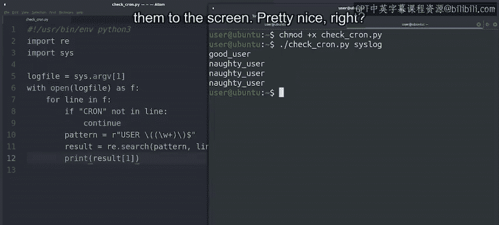

#  127：使用正则表达式过滤日志文件 📝

在本节课中，我们将学习如何编写一个Python脚本，用于读取和分析日志文件。我们将重点介绍如何打开文件、逐行读取内容，以及如何使用正则表达式从特定格式的日志行中提取关键信息（例如，启动定时任务的用户名）。通过本教程，你将掌握处理文本日志文件的基本流程和技巧。


---

## 打开和读取日志文件

上一节我们介绍了课程目标，本节中我们来看看如何操作日志文件。

在脚本中处理日志文件时，第一步通常是打开文件，以便代码能够访问其内容。

我们讨论过多种操作文件的方法。通常的技术是调用 `open` 函数，该函数返回一个文件对象，然后使用 `for` 循环遍历其每一行。

例如，要打开一个作为脚本参数接收的文件，我们可以使用如下代码：

```python
import sys

def main():
    # 假设日志文件路径是第一个命令行参数
    log_file_path = sys.argv[1]
    with open(log_file_path, 'r') as file:
        for line in file:
            # 在这里处理每一行
            process_line(line)

def process_line(line):
    # 处理行的逻辑将在这里实现
    pass

if __name__ == "__main__":
    main()
```

出于性能考虑，当文件很大时，通常最好逐行读取，而不是将整个内容加载到内存中。

---

## 分析日志内容

上一节我们介绍了如何打开文件，本节中我们来看看如何分析其内容。

假设日志文件包含以下消息：

```
Jan 31 00:09:39 ubuntu.local ticky: INFO Created ticket [#4217] (mdouglas)
Jan 31 00:16:25 ubuntu.local ticky: INFO Closed ticket [#1754] (noel)
Jan 31 00:21:30 ubuntu.local ticky: ERROR The ticket was modified while updating (breee)
Jan 31 00:44:34 ubuntu.local ticky: ERROR Permission denied while closing ticket (ac)
Jan 31 01:00:50 ubuntu.local ticky: INFO Commented on ticket [#4709] (blossom)
Jan 31 01:29:16 ubuntu.local ticky: INFO Commented on ticket [#6518] (rr.robinson)
Jan 31 01:33:12 ubuntu.local cron: ERROR Failed to start session due to low disk space (user: sri)
Jan 31 01:33:18 ubuntu.local cron: ERROR Failed to start session due to low disk space (user: sri)
Jan 31 01:43:22 ubuntu.local ticky: ERROR Tried to add information to closed ticket (mcintosh)
```

生成此日志文件的服务器运行异常，我们怀疑是由系统管理员启动的某个Cron作业引起的。你可能记得，Cron作业用于在基于Unix的操作系统上调度脚本。

为了查明服务器发生了什么，我们需要审计日志文件，并准确查看是谁启动了Cron作业。

通过查看示例日志，我们可以看到最感兴趣的行是那些包含“cron”子字符串的行。这些行还显示了启动Cron作业的用户名，用户名被包裹在括号中。

有了这些信息，我们可以忽略任何不包含“cron”子字符串的行。我们可以使用 `in` 关键字来检查这一点。

以下是实现此过滤的步骤：

首先，我们使用 `continue` 关键字，它告诉我们的循环跳转到下一个元素。因此，如果该行不包含我们要查找的字符串，我们将跳过它并转到下一行。

```python
def process_line(line):
    if "cron" not in line:
        return  # 或者使用 continue，如果在一个循环中
    # 继续处理包含 "cron" 的行
```

---

## 使用正则表达式提取用户名

上一节我们过滤出了相关日志行，本节中我们来看看如何从中提取具体的用户名。

一旦确定我们正在处理正确的日志行，就可以使用正则表达式的知识来提取用户名。

我们可以通过多种不同的方式实现。在本例中，我们将使用转义字符、捕获组和字符串结尾锚点。

在将表达式添加到脚本之前，我们先在解释器中构建并测试它。

让我们仔细看看这个表达式：

由于用户名位于日志行的末尾，我们使用美元符号锚点 `$` 来仅匹配行尾的文本。为了找到用户名，我们查找单词“user”，后跟一个包裹在括号中的字符串，因为这些行就是这种结构。这意味着我们需要用反斜杠 `\` 来转义这些括号。

因为我们想要提取实际的用户名，所以我们使用另一对括号来创建一个捕获组。

对于用户名本身，我们使用 `\w+` 来匹配任何字母数字字符。

因此，完整的正则表达式模式是：`user:\s*\((\w+)\)$`

让我们用示例行测试一下：

```python
import re

sample_line = "Jan 31 01:33:12 ubuntu.local cron: ERROR Failed to start session due to low disk space (user: sri)"
pattern = r"user:\s*\((\w+)\)$"
match = re.search(pattern, sample_line)
if match:
    print(f"Found user: {match.group(1)}")
else:
    print("No match found.")
```

看起来我们找到了一个“淘气”的用户。好消息是，我们的正则表达式运行正确。

---

## 整合脚本并运行

上一节我们成功构建了正则表达式，本节中我们将它整合到完整的脚本中并运行。

现在，我们可以在代码中使用这个表达式了。让我们将其添加到脚本中：

```python
import sys
import re

def main():
    log_file_path = sys.argv[1]
    pattern = r"user:\s*\((\w+)\)$"

    with open(log_file_path, 'r') as file:
        for line in file:
            line = line.strip()
            # 1. 过滤出包含 "cron" 的行
            if "cron" not in line:
                continue
            # 2. 使用正则表达式提取用户名
            match = re.search(pattern, line)
            if match:
                username = match.group(1)
                print(f"Found cron job started by user: {username}")
            else:
                # 这行包含cron但没有匹配用户模式，可能格式有误
                print(f"Line contains 'cron' but no user found: {line}")

if __name__ == "__main__":
    main()
```

我们的脚本应该能够处理之前显示的日志文件了。让我们保存它，使其可执行并运行它，传入我们展示的示例syslog文件。

```bash
chmod +x analyze_log.py
python3 analyze_log.py sample_syslog.log
```

我们的脚本进展顺利。我们已经定位了日志文件中启动Cron作业的每个用户，并将他们打印到屏幕上。



---

## 总结与回顾 🎯

本节课中我们一起学习了如何编写一个Python脚本来处理日志文件。我们涵盖了以下关键步骤：

1.  **打开和逐行读取文件**：使用 `open()` 函数和 `for` 循环高效处理大文件。
2.  **过滤相关行**：使用 `in` 关键字检查行中是否包含特定子字符串（如“cron”）。
3.  **应用正则表达式**：构建并使用正则表达式模式（`r"user:\s*\((\w+)\)$"`）从格式化的字符串中精确提取信息（如用户名）。
4.  **整合与执行**：将以上步骤组合成一个完整的、可执行的脚本。

我们采取了一些步骤来编写这个脚本。如果其中任何步骤不清楚，请回顾视频并自行练习，直到掌握为止。接下来，我们将对这些结果进行更多的处理。