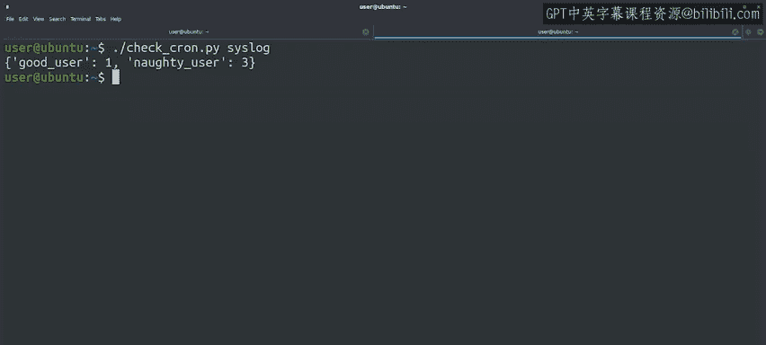

#  128：理解数据 📊


## 概述

在本节课中，我们将学习如何通过Python脚本处理日志文件，并统计每个用户启动Chon作业的频率。我们将使用字典数据结构来存储和计数用户名出现的次数，从而更高效地分析数据。

---

## 回顾与目标

上一节中，我们编写了一个脚本，用于处理日志文件并提取启动Chon作业的用户名。虽然这很有帮助，但我们可能需要更多信息来改进输出。本节中，我们将学习如何统计每个用户名在日志中出现的次数。

## 使用字典计数

为了统计每个用户名出现的次数，我们可以使用字典数据结构。字典允许我们将用户名作为键，将出现次数作为值进行存储。以下是如何实现这一功能：

首先，我们创建一个空字典：
```python
user_counts = {}
```

接下来，我们使用`get`方法来获取当前值，并更新字典：
```python
username = "good_user"
user_counts[username] = user_counts.get(username, 0) + 1
```

这段代码的作用是：如果`username`已经在字典中，则获取其当前值并加1；如果不在字典中，则使用默认值0并加1。

## 整合到脚本中

现在，我们将上述逻辑整合到之前的脚本中。以下是需要修改的步骤：

1. 在代码开头初始化一个空字典。
2. 在处理文件时，检查正则表达式是否匹配成功。
3. 如果匹配成功，将用户名作为键，更新字典中的值。
4. 处理完文件后，打印最终的字典。

以下是修改后的代码示例：
```python
import re

user_counts = {}
pattern = r"启动Chon作业的用户：(\w+)"

with open("logfile.txt", "r") as file:
    for line in file:
        result = re.search(pattern, line)
        if result is None:
            continue
        username = result.group(1)
        user_counts[username] = user_counts.get(username, 0) + 1

print(user_counts)
```

## 测试脚本

让我们用测试文件运行修改后的脚本。运行结果将显示每个用户名及其在日志中出现的次数。例如：
```python
{'user1': 5, 'user2': 3, 'user3': 7}
```

这样，我们可以快速了解哪些用户在服务器上启动了Chon作业，以及它们的频率。

## 实际应用



通过这种方式，我们可以更深入地调查问题。例如，如果某个用户频繁启动作业，可能需要进一步检查其操作是否合理。这些数据处理技巧在实际工作中非常有用，尤其是在调试和分析日志时。

## 总结

本节课中，我们一起学习了如何使用字典统计日志中用户名的出现次数。通过整合正则表达式和字典，我们能够高效地提取和分析数据，从而更好地理解服务器上的作业情况。希望这些示例能帮助你掌握如何用Python快速获取所需信息，并在实际工作中应用这些技能。

---

接下来，我们将通过一个小测验来巩固本节课的知识。祝你学习愉快！ 🎉