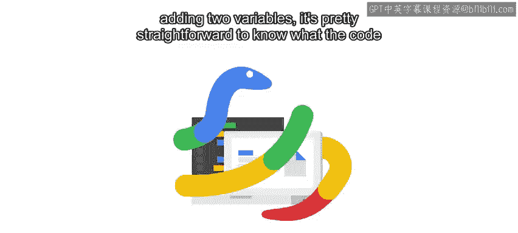
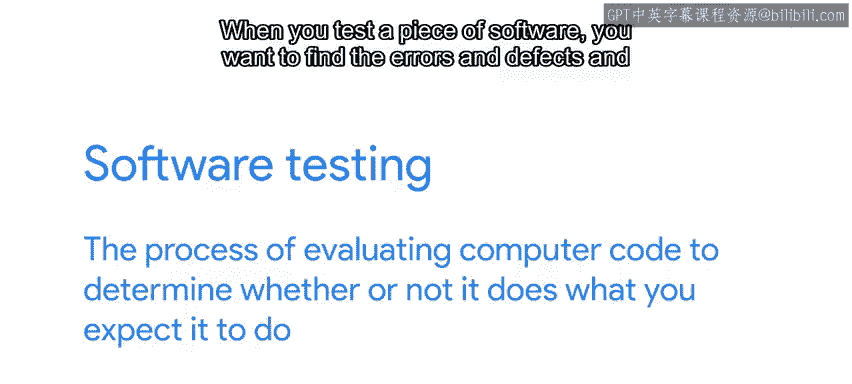
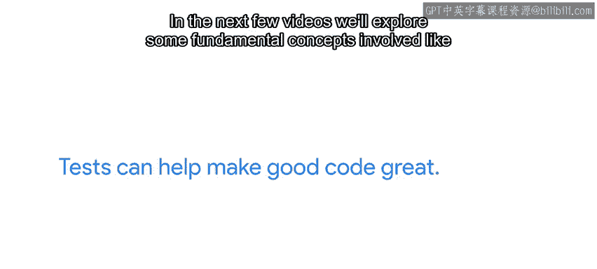

#  131：什么是软件测试？🧪

在本节课中，我们将学习软件测试的基本概念。我们将了解为什么测试对编写可靠代码至关重要，并初步探索测试的不同类型。

---

当我们编写一段非常简单的代码时，例如将两个变量相加，我们很容易理解代码的功能并确信它能正确执行。

随着操作变得更加复杂，例如使用了循环、条件判断，并调用了越来越多的函数，我们便更难完全确信代码会按预期执行。

这时，软件测试就派上用场了。软件测试是一个评估计算机代码的过程，目的是确定它是否能在测试时执行你期望它执行的操作。当你测试一个软件时，你希望发现其中的错误和缺陷，并找出问题所在。

软件测试在许多方面类似于新机器制造过程中进行的测试。

---

当一辆新车下线时，你需要确保踩下油门时车会前进，踩下刹车时车会停止。

软件测试的理念与此相同。你需要确保当你运行一个程序时，它的行为符合预期。这样，你才能真正“踩下油门”，放心使用。

---

脚本和程序可能会以各种奇怪的方式失败，尤其是当它们变得越来越复杂时。除了最简单的程序，几乎不可能测试所有可能出错的情况。

尽管这意味着你的脚本中可能存在一定数量的、你尚未意识到的错误，但别担心，编写测试可以帮助你消除大量错误，从而提高自动化的可靠性和质量。测试能让好代码变得出色。

---

软件测试的领域相当广泛。在接下来的几个视频中，我们将探讨一些基本概念，例如**自动化测试**、**单元测试**、**集成测试**和**测试驱动开发**。

与课程中涵盖的许多主题一样，我们将快速概述围绕测试的众多概念。这不足以让你成为测试专家，但应该能帮助你自动测试自己的脚本。

接下来，我们将讨论手动测试与自动化测试的区别。现在，让我们转换思路，开始学习。

---

本节课中，我们一起学习了软件测试的重要性及其基本目标。我们了解到，测试是验证代码行为是否符合预期的关键过程，它能帮助我们发现错误、提升代码质量。下一节，我们将深入探讨手动测试与自动化测试的具体区别。