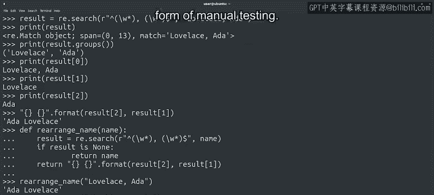

#  132：手动测试与自动化测试 🧪

## 概述

在本节课中，我们将学习软件测试的基本概念，包括手动测试和自动化测试的区别与重要性。我们将了解为什么编写测试代码是开发过程中不可或缺的一环，并初步认识单元测试。

---

程序员在编写代码时，必须进行测试以确保其行为符合预期。

为我们的软件编写良好的测试，有助于在将脚本部署到实际自动化任务之前，发现错误和缺陷。

测试脚本最基本的方法是使用不同的参数运行它，并检查是否返回预期值。

在本课程中，我们已经为编写的一些代码进行过这种手动测试。

例如，使用不同的命令行参数执行脚本以观察其行为变化，就是手动测试的一个例子。

使用解释器在将代码放入脚本之前进行尝试，是手动测试的另一种形式。

正式的软件测试将这一过程更进一步，将测试本身编码成可以运行的软件和代码，以验证我们的程序是否按预期工作。

这被称为自动化测试。

自动化测试的目标是自动化检查返回值是否符合预期的过程。

与其让我们人类用不同的参数反复运行一个函数并检查结果是否符合预期，不如让计算机为我们完成这项工作。

自动化测试意味着我们将编写代码来执行测试。

你可能会问，为什么要编写更多的代码来测试已有的代码？因为当你测试代码时，你需要检查它是否能为许多不同的值执行预期的操作。

你需要验证它在许多可能的值（称为测试用例）下的行为是否符合你的预期。

假设你正在编写一个脚本，用于更新电子邮件地址列表以使用新域名，类似于我们之前编写的一个脚本。

你需要测试当电子邮件列表有一个元素、两个元素或十个元素时会发生什么。

你需要测试新域名长度为1个字符、20个字符甚至是空字符串时会发生什么。

你还需要测试列表仅包含需要更新的电子邮件、仅包含不需要更新的电子邮件或两者混合时会发生什么。

正如你所见，需要测试的事项列表会迅速变得非常庞大。

测试中包含的测试用例越多，代码的测试就越充分，你也就越能保证代码按预期执行。

如果我们手动进行测试，每当更改代码时，我们不太可能遍历所有情况。

我们可能只测试少数几种情况，这可能导致错误被遗漏，这并不理想。

这就是为什么我们不希望手动执行这些测试，而是希望让计算机为我们完成。

就像任何自动化示例一样，自动化测试的优势在于我们可以根据需要多次运行它们，并且总能获得相同的结果。

计算机会一遍又一遍地执行相同的检查，并始终确保返回值符合我们的预期。

当由于某种原因，结果不符合预期时，代码将引发错误，以便我们检查代码并找出问题所在。

我们可以编写多种不同类型的测试来执行自动化测试。

在接下来的几个视频中，我们将重点讨论一种称为单元测试的测试方法。

在介绍了单元测试之后，我们将讨论其他类型的测试及其各自的用途。

但在那之前，让我们确认一下学习进度。关于测试的讨论是否让你想快速做个小测验？

---

## 总结

本节课中，我们一起学习了软件测试的基础。我们明确了手动测试与自动化测试的区别，理解了自动化测试（特别是单元测试）在确保代码质量、提高效率和减少人为错误方面的重要性。下一节，我们将开始深入探讨单元测试的具体实现。